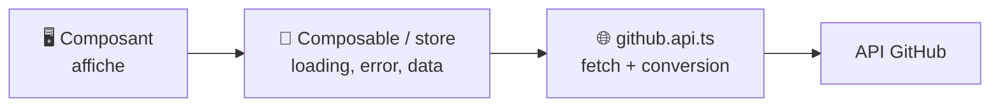

# Appels API Vue.js

> [!abstract] En bref
> Vue ne fournit pas d'outil pour appeler une API : on utilise `fetch`. La bonne organisation : un fichier **api** qui fait les appels, un **composable** ou un **store** qui gère le chargement et les erreurs, et le composant qui affiche. Ton exemple concret : le bloc « Activité GitHub / GitLab » du Portfolio.

## Les 3 couches



## 1. Le fichier API : seulement les appels

```ts
// features/activity/data/github.api.ts
const BASE = 'https://api.github.com';

interface RepoDto { name: string; html_url: string; pushed_at: string; language: string | null }
export interface Repo { name: string; url: string; updatedAt: Date; language: string }

const toRepo = (d: RepoDto): Repo => ({
  name: d.name,
  url: d.html_url,
  updatedAt: new Date(d.pushed_at),
  language: d.language ?? '—',
});

export const githubApi = {
  async lastRepos(user: string, signal?: AbortSignal): Promise<Repo[]> {
    const r = await fetch(`${BASE}/users/${user}/repos?sort=pushed&per_page=5`, { signal });
    if (!r.ok) throw new Error(`GitHub : erreur ${r.status}`);
    const data: RepoDto[] = await r.json();
    return data.map(toRepo);
  },
};
```

La conversion (`toRepo`) isole ton application du format de l'API : si GitHub change un nom de champ, tu ne modifies qu'ici.

## 2. Le composable : les états

```ts
// features/activity/composables/useRepos.ts
export function useRepos(user: string) {
  const repos = ref<Repo[]>([]);
  const loading = ref(false);
  const error = ref<string | null>(null);
  let controller: AbortController | undefined;

  async function load() {
    controller?.abort();                 // annule l'appel précédent s'il est en cours
    controller = new AbortController();
    loading.value = true;
    error.value = null;
    try {
      repos.value = await githubApi.lastRepos(user, controller.signal);
    } catch (e) {
      if ((e as Error).name !== 'AbortError') error.value = 'Impossible de charger l\'activité';
    } finally {
      loading.value = false;
    }
  }

  onMounted(load);
  onUnmounted(() => controller?.abort());
  return { repos, loading, error, reload: load };
}
```

## 3. Le composant : affiche chaque état

```vue
<script setup lang="ts">
const { repos, loading, error, reload } = useRepos('ton-nom');
</script>

<template>
  <BaseLoader v-if="loading" />
  <div v-else-if="error">
    {{ error }} <button type="button" @click="reload">Réessayer</button>
  </div>
  <p v-else-if="repos.length === 0">Aucun dépôt public.</p>
  <ul v-else>
    <li v-for="r in repos" :key="r.name">
      <a :href="r.url">{{ r.name }}</a> · {{ r.language }}
    </li>
  </ul>
</template>
```

**Les 4 états à toujours prévoir :** chargement, erreur, vide, données.

## L'URL de l'API selon l'environnement

```bash
# .env.development
VITE_API_URL=http://localhost:3000
# .env.production
VITE_API_URL=https://api.ton-site.fr
```

```ts
const API = import.meta.env.VITE_API_URL;
```

Seules les variables qui commencent par `VITE_` sont accessibles dans le front, et **elles sont visibles par tout le monde** : n'y mets jamais de secret.

## Pour aller plus loin

Sur un projet avec beaucoup d'appels (CinéTrack-Vue), **TanStack Query** (`@tanstack/vue-query`) gère le cache, le rechargement et les états pour toi.

## Pièges

- **Appeler l'API directement dans un composant d'affichage** : impossible à réutiliser et à tester.
- **Oublier l'état d'erreur** : l'écran reste vide sans explication.
- **Une clé d'API secrète dans une variable `VITE_`** : elle finit dans le JavaScript envoyé au navigateur.
