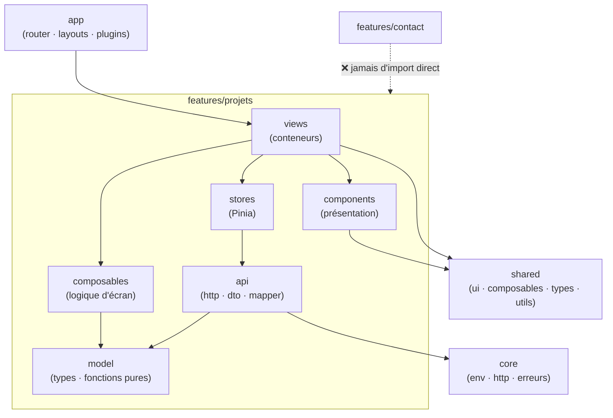

# Template d'Architecture Vue

> [!abstract] Introduction
> Un modèle de projet Vue 3 + TypeScript prêt à copier — arborescence, rôle de chaque dossier, règles de dépendances et code de chaque couche — pour compenser la liberté de Vue par une structure claire, testable et évolutive.

> [!warning]- Prérequis
> [[VUE-03-Composants-SFC|Composants & SFC Vue.js]], [[VUE-07-Composition-API|Composition API & Composables Vue.js]], [[VUE-09-Pinia-State-Management|Pinia (State Management Vue.js)]], [[VUE-08-Vue-Router|Vue Router]], [[VUE-10-TypeScript-avec-Vue|TypeScript avec Vue.js]]

---

## Théorie

> [!question]- C'est quoi ?
> ```text
> src/
> ├── app/                              # Assemblage de l'application
> │   ├── router.ts                     # Router + routes lazy des features
> │   ├── layouts/DefaultLayout.vue     # En-tête, menu, pied de page
> │   └── plugins/primevue.ts           # Configuration des librairies
> ├── core/                             # Transverse, instancié une fois
> │   ├── config/env.ts                 # Variables d'environnement validées (Zod)
> │   ├── http/http.ts                  # Client HTTP (fetch/axios) : base URL, en-têtes, erreurs
> │   └── errors/errorHandler.ts        # app.config.errorHandler
> ├── shared/                           # Réutilisable, SANS logique métier
> │   ├── ui/                           # Composants génériques (préfixe Base / App)
> │   │   ├── BaseEmptyState.vue
> │   │   └── BaseLoader.vue
> │   ├── composables/useAsync.ts       # Composables génériques
> │   ├── types/async.ts                # EtatChargement<T>, Page<T>
> │   └── utils/                        # Fonctions pures testées
> ├── features/                         # Un dossier par domaine
> │   └── projets/
> │       ├── api/
> │       │   ├── projet.dto.ts         # Forme brute de l'API / des données
> │       │   ├── projet.mapper.ts      # DTO → modèle
> │       │   └── projets.api.ts        # Appels HTTP uniquement
> │       ├── model/projet.ts           # Type métier + fonctions pures (filtres…)
> │       ├── stores/projets.store.ts   # Pinia (état partagé)
> │       ├── composables/useFiltreProjets.ts
> │       ├── components/               # Présentation : props / emits
> │       │   ├── ProjetCard.vue
> │       │   └── ProjetGrid.vue
> │       ├── views/                    # Composants routés (conteneurs)
> │       │   ├── ProjetsView.vue
> │       │   └── ProjetDetailView.vue
> │       └── routes.ts
> ├── styles/                           # tokens, thème, Tailwind
> ├── App.vue
> └── main.ts
> ```
> Tests `*.spec.ts` à côté des fichiers testés.

> [!example]- Analogie
> Vue te donne un terrain constructible sans plan d'urbanisme : ce template EST le plan. Chacun sait où construire (features), où sont les réseaux communs (core) et le mobilier standard (shared/ui).

> [!question]- Pourquoi l'utiliser ?
> Vue n'impose aucune structure : sans convention, chaque développeur organise différemment et le projet devient illisible. Ce modèle apporte les mêmes garanties qu'en Angular (et la même logique, ce qui facilite le passage d'une stack à l'autre) : features autonomes, API isolée par un mapper, composants de présentation purs, état centralisé.

> [!question]- Comment ça marche ?
> **1. Environnement validé (core)** :
> ```typescript
> // core/config/env.ts
> const schema = z.object({ VITE_API_URL: z.string().url(), VITE_GITLAB_USER: z.string().min(1) });
> export const env = schema.parse(import.meta.env);   // plante au démarrage si mal configuré
> ```
> **2. Client HTTP (core)** :
> ```typescript
> // core/http/http.ts
> export class ApiError extends Error { constructor(public status: number, message: string) { super(message); } }
> export async function http<T>(chemin: string, init: RequestInit = {}): Promise<T> {
>   const r = await fetch(`${env.VITE_API_URL}${chemin}`, { ...init, headers: { Accept: 'application/json', ...init.headers } });
>   if (!r.ok) throw new ApiError(r.status, `Erreur ${r.status} sur ${chemin}`);
>   return r.json() as Promise<T>;
> }
> ```
> **3. DTO, mapper, API (feature)** :
> ```typescript
> // features/projets/api/projet.dto.ts
> export interface ProjetDto { id: number; name: string; description: string | null; web_url: string; topics: string[]; last_activity_at: string }
> // features/projets/model/projet.ts
> export interface Projet { id: number; nom: string; description: string; url: string; technos: string[]; misAJour: Date }
> export const filtrerParTechno = (projets: Projet[], techno: string | null) =>
>   techno ? projets.filter(p => p.technos.includes(techno)) : projets;
> // features/projets/api/projet.mapper.ts
> export const versProjet = (d: ProjetDto): Projet => ({
>   id: d.id, nom: d.name, description: d.description ?? '', url: d.web_url, technos: d.topics, misAJour: new Date(d.last_activity_at),
> });
> // features/projets/api/projets.api.ts
> export const projetsApi = {
>   liste: async (): Promise<Projet[]> =>
>     (await http<ProjetDto[]>(`/users/${env.VITE_GITLAB_USER}/projects`)).map(versProjet),
> };
> ```
> **4. Store Pinia (état partagé)** :
> ```typescript
> // features/projets/stores/projets.store.ts
> export const useProjetsStore = defineStore('projets', () => {
>   const etat = ref<EtatChargement<Projet[]>>({ statut: 'idle' });
>   const projets = computed(() => (etat.value.statut === 'success' ? etat.value.data : []));
>   const chargement = computed(() => etat.value.statut === 'loading');
>   async function charger() {
>     etat.value = { statut: 'loading' };
>     try { etat.value = { statut: 'success', data: await projetsApi.liste() }; }
>     catch { etat.value = { statut: 'error', erreur: 'Impossible de charger les projets' }; }
>   }
>   return { etat, projets, chargement, charger };
> });
> ```
> **5. Composable de logique d'écran** :
> ```typescript
> // features/projets/composables/useFiltreProjets.ts
> export function useFiltreProjets(projets: Ref<Projet[]>) {
>   const techno = ref<string | null>(null);
>   const technos = computed(() => [...new Set(projets.value.flatMap(p => p.technos))].sort());
>   const filtres = computed(() => filtrerParTechno(projets.value, techno.value));
>   return { techno, technos, filtres };
> }
> ```
> **6. Composant de présentation** :
> ```vue
> <!-- features/projets/components/ProjetCard.vue -->
> <script setup lang="ts">
> import type { Projet } from '../model/projet';
> defineProps<{ projet: Projet }>();
> const emit = defineEmits<{ ouvrir: [id: number] }>();
> </script>
> <template>
>   <article class="projet-card">
>     <h3>{{ projet.nom }}</h3>
>     <p>{{ projet.description }}</p>
>     <ul><li v-for="t in projet.technos" :key="t">{{ t }}</li></ul>
>     <button type="button" @click="emit('ouvrir', projet.id)">Voir le projet</button>
>   </article>
> </template>
> ```
> **7. Vue (conteneur)** :
> ```vue
> <!-- features/projets/views/ProjetsView.vue -->
> <script setup lang="ts">
> import { storeToRefs } from 'pinia';
> const store = useProjetsStore();
> const { projets, chargement, etat } = storeToRefs(store);
> const { techno, technos, filtres } = useFiltreProjets(projets);
> const router = useRouter();
> onMounted(() => { if (etat.value.statut === 'idle') store.charger(); });
> </script>
> <template>
>   <BaseLoader v-if="chargement" />
>   <BaseEmptyState v-else-if="etat.statut === 'error'" :message="etat.erreur" />
>   <template v-else>
>     <Select v-model="techno" :options="technos" placeholder="Toutes les technos" showClear />
>     <ProjetGrid :projets="filtres" @ouvrir="id => router.push({ name: 'projet-detail', params: { id } })" />
>   </template>
> </template>
> ```
> **8. Routes lazy + assemblage** :
> ```typescript
> // features/projets/routes.ts
> export const projetsRoutes: RouteRecordRaw[] = [
>   { path: '/projets', name: 'projets', component: () => import('./views/ProjetsView.vue'), meta: { titre: 'Projets' } },
>   { path: '/projets/:id', name: 'projet-detail', component: () => import('./views/ProjetDetailView.vue'), props: true },
> ];
> // app/router.ts
> export const router = createRouter({
>   history: createWebHistory(),
>   routes: [
>     { path: '/', component: DefaultLayout, children: [...accueilRoutes, ...projetsRoutes, ...contactRoutes] },
>     { path: '/:pathMatch(.*)*', component: () => import('@/app/NotFoundView.vue') },
>   ],
> });
> router.afterEach(to => { document.title = `${to.meta.titre ?? 'Portfolio'} — Mon nom`; });
> // main.ts
> const app = createApp(App);
> app.use(createPinia()).use(router).use(PrimeVue, { theme: { preset: Aura } });
> app.config.errorHandler = errorHandler;
> app.mount('#app');
> ```

> [!question]- Quand l'utiliser ?
> Dès la création du Portfolio. Pour un tout petit projet, commencer par `core/`, `shared/` et une feature, et ajouter les sous-dossiers quand ils deviennent utiles.

> [!danger]- Quand NE PAS l'utiliser / Limites
> - Un composable n'est PAS un singleton : l'état partagé entre écrans va dans un store Pinia
> - Pour des données serveur avec beaucoup de cache/rafraîchissement, TanStack Query peut remplacer une partie des stores
> - Les auto-imports (unplugin) rendent les dépendances moins visibles : les éviter, ou les limiter aux APIs de Vue

### Schéma



---

## Vocabulaire

| Terme | Définition en une ligne |
|-------|--------------------------|
| View | Composant associé à une route (conteneur) |
| Composable | Fonction `useXxx` qui encapsule une logique réactive |
| Store | État partagé Pinia (singleton) |
| DTO / mapper | Format brut de l'API / conversion vers le modèle |
| Base component | Composant générique sans logique métier |

---

## Points clés

- Organiser par feature
- API isolée par DTO + mapper
- Pinia pour l'état partagé, composables pour la logique d'écran
- Composants de présentation : `defineProps`/`defineEmits` typés, aucune dépendance au store
- Routes lazy par feature
- Environnement validé au démarrage

---

## Pièges courants

> [!bug]- Erreurs fréquentes
> - Appeler `fetch` directement dans un composant
> - Composant de présentation qui utilise `useProjetsStore()`
> - Déstructurer un store sans `storeToRefs`
> - Tout mettre dans `components/` à plat
> - Types de l'API utilisés partout dans les templates

---

## Paramètres / Configuration

| Règle | Pourquoi |
|---|---|
| `views` → `components`, `composables`, `stores`, `shared` | Les vues orchestrent |
| `components` → `shared` + types du `model` uniquement | Présentation pure (props/emits) |
| `stores` → `api`, `model` | L'état ne dépend pas de l'affichage |
| `api` → `core/http` + `model` | Un seul endroit pour les appels et le mapping |
| Une feature n'importe jamais une autre feature | Autonomie |
| Alias `@/` → `src/` (vite.config + tsconfig) | Imports lisibles |
| Nommage : composants PascalCase multi-mots, `useXxx`, `useXxxStore`, `Base*` pour le générique | Conventions du style guide Vue |
| `vue-tsc --noEmit` + ESLint (`eslint-plugin-vue`, `eslint-plugin-boundaries`) en CI | Règles automatiques |

---

## Exemple minimal

```typescript
// vite.config.ts (extrait)
resolve: { alias: { '@': fileURLToPath(new URL('./src', import.meta.url)) } }
// tsconfig.app.json (extrait)
"paths": { "@/*": ["./src/*"] }
```
```typescript
import { http } from '@/core/http/http';
import BaseLoader from '@/shared/ui/BaseLoader.vue';
```

> [!note] Ce que j'en retiens
> Mêmes couches qu'en Angular (core, shared, features, api + mapper, état, conteneur/présentation) : un seul modèle mental pour tes deux frameworks.

---

## Pour aller plus loin (niveau senior)

> [!tip]- Ce qui distingue un dev expérimenté
> - Monorepo (pnpm workspaces / Nx) avec un package `shared-types` commun au front Vue, au front Angular et à l'API NestJS
> - Remplacer les stores de données serveur par TanStack Query si le cache devient complexe

---

## Connexions

**Arbre théorique :**
- Sujet parent → [[Vue]]
- Sous-sujets → (aucun pour l'instant)
- À comparer avec → [[ANG-30-Template-Architecture-Angular|Template d'Architecture Angular]]

**Pratique :**
- Extrait de code → [[04_Snippets/vue-22-template-architecture-vue]]
- Projet → [[02_Projects/Portfolio]]

---

## Auto-vérification

> [!check]- Est-ce que je maîtrise vraiment ?
> - Pourquoi un composant de présentation ne doit-il pas utiliser un store ?
> - Où placer une logique de filtre utilisée par une seule vue ? et partagée entre deux vues ?

> [!faq]- Questions d'entretien
> - Vue n'impose pas de structure : comment organisez-vous un projet d'équipe ?

---

## Tâches

- [ ] #task Créer ce squelette dans le Portfolio avant la première page
- [ ] #task Écrire les tests du mapper et de `filtrerParTechno`
- [ ] #task Mettre à jour `status` une fois maîtrisé

---

## Notes brutes

- ?
