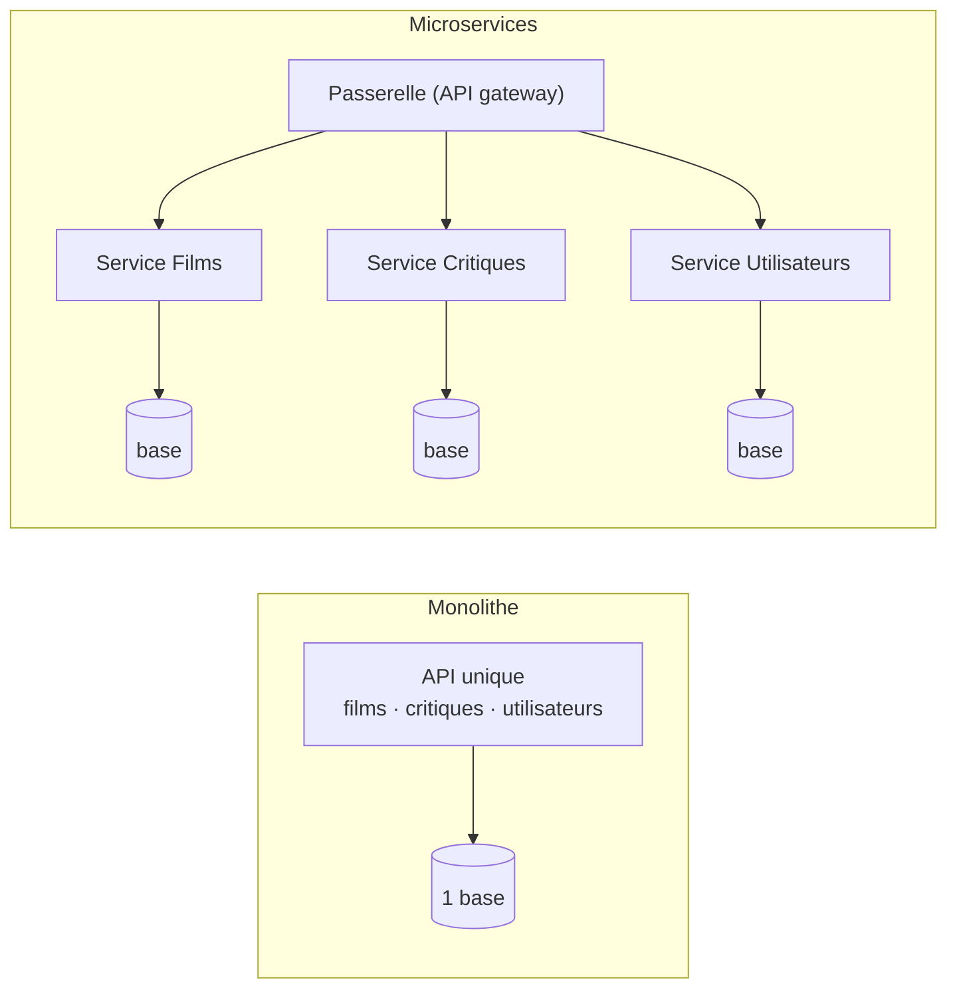

# Monolithe vs Microservices

> [!abstract] En bref
> Un **monolithe** est une application d'**un seul bloc** : un seul projet, un seul déploiement. Les **microservices** découpent l'application en **plusieurs petits services indépendants** qui communiquent par le réseau. Les microservices sont à la mode, mais pour la grande majorité des projets, **un monolithe bien organisé est le meilleur choix**.

## L'image

- **Monolithe** : un **restaurant** avec une seule cuisine. Simple à gérer ; si la cuisine grossit trop, ça devient encombré.
- **Microservices** : une **aire de food trucks**. Chacun est indépendant (on peut changer de camion sans fermer les autres), mais il faut gérer la coordination, les allées, l'électricité pour tous.

## La comparaison



| | Monolithe | Microservices |
|---|---|---|
| Démarrer | **simple** | complexe (réseau, déploiements multiples) |
| Déployer | un seul déploiement | chaque service séparément |
| Déboguer | une seule pile d'appels | la requête traverse plusieurs services (traçage nécessaire) |
| Transactions | faciles (une seule base) | difficiles entre services |
| Faire grossir une partie | tout ensemble | service par service |
| Équipes | une équipe, ou plusieurs sur le même code | une équipe par service, indépendantes |
| Coût d'exploitation | faible | **élevé** (monitoring, orchestration) |

## Le bon chemin : le monolithe modulaire

Un monolithe **découpé en modules bien séparés** (exactement ce que fait NestJS avec ses modules) : la simplicité du monolithe, et une organisation qui permettra plus tard, **si besoin**, d'extraire un module en service.

```text
cinetrack-api/src/modules/
├── movies/     ← pourrait devenir un service un jour
├── reviews/
├── users/
└── auth/
```

## Quand passer aux microservices ?

Quand on a **vraiment** ces problèmes :
- plusieurs équipes se bloquent en travaillant sur le même code ;
- une partie doit tenir une charge bien plus forte que le reste ;
- des parties ont besoin de technologies différentes (un service d'IA en Python).

Pas pour un projet perso, ni pour « faire comme les grandes entreprises ».

## Pièges

- **Commencer en microservices** : tu paies toute la complexité sans en avoir les bénéfices.
- **Des microservices qui partagent la même base** : ils ne sont pas vraiment indépendants.
- **Un monolithe sans organisation interne** : le « plat de spaghettis » qui donne une mauvaise réputation aux monolithes.
