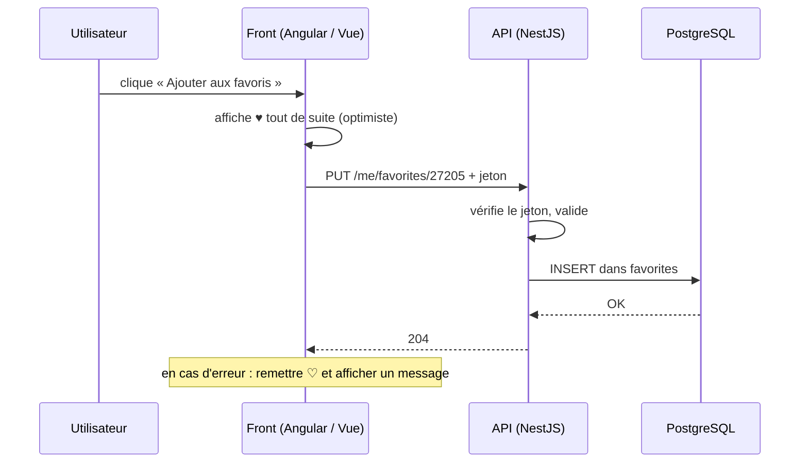

# Client-Serveur et Communication

> [!abstract] En bref
> Une application web moderne = un **client** (le front Angular / Vue, dans le navigateur) qui **demande**, et un **serveur** (l'API NestJS) qui **répond**. Le client affiche, le serveur décide et garde les données. Cette note fait le lien entre tout ce que tu construis : du clic à la base de données, et retour.

## Le trajet complet d'un clic

## Qui fait quoi

| | Client (front) | Serveur (API) |
|---|---|---|
| Rôle | afficher, réagir vite, guider l'utilisateur | **décider**, protéger, stocker |
| Valide les données | pour le confort (messages immédiats) | **pour de vrai** |
| Vérifie les droits | cache les boutons | **refuse** les requêtes |
| Garde | l'état de l'écran (filtres, formulaire) | les données durables |
| Visible par l'utilisateur | **tout** (le code est téléchargé) | rien |

## Les stratégies d'affichage

| Stratégie | Principe | Pour |
|---|---|---|
| **Attendre la réponse** | spinner, puis résultat | création, paiement, actions importantes |
| **Optimiste** | on affiche le résultat tout de suite, on annule en cas d'erreur | favoris, « j'aime » : l'app paraît instantanée |
| **Cache + mise à jour** | on affiche la version en cache, puis on rafraîchit | listes consultées souvent |

## Les 4 états de tout écran qui charge

Chaque appel API a quatre issues possibles, et l'écran doit toutes les prévoir :

| État | Affichage |
|---|---|
| chargement | squelette ou spinner |
| erreur | message clair + bouton « Réessayer » |
| vide | « Aucun favori pour l'instant » + action suggérée |
| données | le contenu |

Voir le type `LoadState` dans [[TS-18-Patterns-TypeScript-Pro|Patterns TypeScript]].

## Les façons de communiquer

| Technique | Pour |
|---|---|
| **REST** (JSON sur HTTP) | 95 % des besoins (voir [[ARCH-04-API-REST-Design\|Design REST]]) |
| SSE | le serveur envoie des mises à jour |
| WebSocket | échanges en temps réel dans les deux sens |
| Polling | redemander régulièrement (simple, mais coûteux) |

## Partager les types entre front et back

Dans un monorepo, un paquet `shared-types` (ou les types générés depuis OpenAPI) permet au front de connaître **exactement** la forme des réponses de l'API. Si le back change un champ, le front ne compile plus : l'erreur est vue tout de suite.

## Pièges

- **Mettre de la logique importante seulement dans le front** (calcul d'un prix, vérification d'un droit).
- **Oublier les états d'erreur et de chargement** : écran blanc, utilisateur perdu.
- **Faire 15 appels API pour afficher un écran** : prévois une route qui renvoie ce dont l'écran a besoin.
