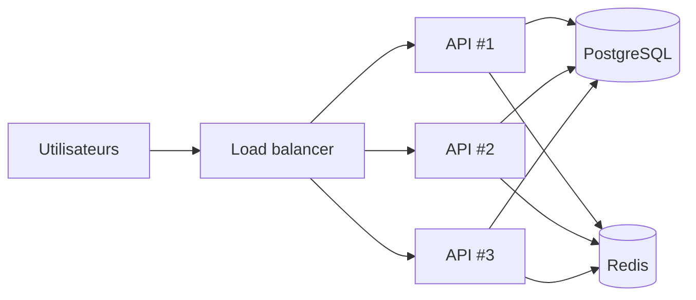

# Scalabilité

> [!abstract] En bref
> La **scalabilité**, c'est la capacité d'une application à supporter **plus d'utilisateurs** sans s'effondrer. Deux façons : une **machine plus puissante** (verticale) ou **plus de machines** (horizontale). Pour ajouter des machines, l'API doit être **sans état** : n'importe quelle instance doit pouvoir traiter n'importe quelle requête.

## Les deux directions

| | Verticale (*scale up*) | Horizontale (*scale out*) |
|---|---|---|
| Principe | un serveur plus gros (CPU, RAM) | plus de serveurs identiques |
| Image | un camion plus grand | plus de camions |
| Simplicité | **très simple** | demande une architecture adaptée |
| Limite | la plus grosse machine disponible, et un seul point de panne | presque aucune |

## La condition : une API sans état (*stateless*)

Si l'instance #1 garde en mémoire la session d'un utilisateur, et que sa requête suivante arrive sur l'instance #2, la session est perdue.

| Ne pas garder dans l'API | Mettre à la place |
|---|---|
| les sessions en mémoire | un JWT, ou les sessions dans Redis |
| les fichiers envoyés sur le disque local | un stockage objet (S3 et équivalents) |
| un cache en mémoire | Redis |
| les tâches planifiées lancées par chaque instance | une file de tâches, ou une seule instance dédiée |

NestJS avec JWT, Prisma et Redis est déjà sans état : CinéTrack-API peut être multiplié tel quel.

## Où ça coince vraiment

Presque toujours, la limite n'est pas l'API mais **la base de données**. Dans l'ordre :

1. **Optimiser les requêtes** : index, N+1, pagination (voir [[BDD-04-Indexation-Performance|Index]]).
2. **Mettre en cache** ce qui est lu souvent (voir [[ARCH-09-Cache-Performance|Cache]]).
3. **Déporter les traitements longs** dans des files de tâches.
4. **Des copies en lecture** de la base (*read replicas*).
5. Seulement ensuite : découper la base, les microservices…

## Mesurer avant d'agir

- **Tests de charge** (k6, Artillery) : simuler 500 utilisateurs et regarder où ça casse.
- **Monitoring** : temps de réponse, CPU, mémoire, requêtes lentes (voir [[MON-02-Metriques-Alerting|Métriques]]).

## Pièges

- **Optimiser pour un million d'utilisateurs** quand il y en a 50 : complexité inutile.
- **Multiplier les instances de l'API** alors que c'est la base qui sature : aucun effet, voire pire.
- **Garder des états en mémoire** « parce que ça marche en local » : ça casse dès la deuxième instance.
