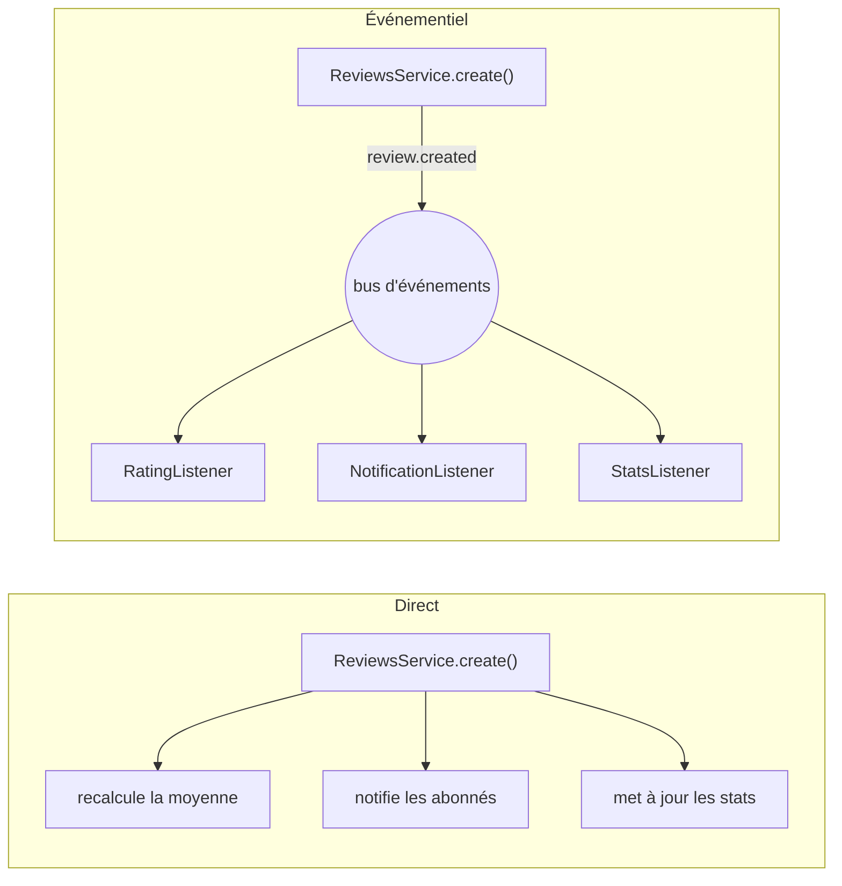

# Architecture Événementielle

> [!abstract] En bref
> Dans une architecture **événementielle**, au lieu qu'un service **appelle** directement tous les autres, il **annonce** qu'il s'est passé quelque chose (« une critique a été publiée ») et ceux que ça intéresse **réagissent** de leur côté. Les parties de l'application sont ainsi moins liées entre elles.

## L'image

- **Appel direct** : tu téléphones à chaque personne une par une pour annoncer une nouvelle. Si l'une ne répond pas, tu restes bloqué.
- **Événement** : tu publies l'annonce sur un **panneau d'affichage**. Chacun la lit quand il peut et fait ce qu'il a à faire.

## Avant / après



En direct, `ReviewsService` doit connaître tous les autres services. En événementiel, il ne connaît **personne** : on peut ajouter un nouveau réacteur sans le modifier.

## Dans NestJS (au sein de l'application)

```bash
npm i @nestjs/event-emitter
```

```ts
// publier
this.events.emit('review.created', { reviewId: review.id, movieId: review.movieId });

// réagir, ailleurs
@Injectable()
export class RatingListener {
  @OnEvent('review.created')
  async updateAverage({ movieId }: { movieId: number }) {
    await this.movies.recomputeAverage(movieId);
  }
}
```

## Entre plusieurs services

Pour des services séparés, les événements passent par un **broker** (un intermédiaire) :

| Outil | Pour |
|---|---|
| **Redis** (Pub/Sub, Streams) + BullMQ | simple, souvent déjà présent |
| **RabbitMQ** | files de messages classiques |
| **Kafka** | très gros volumes, historique des événements |

## Ce qu'il faut accepter

| Avantage | Contrepartie |
|---|---|
| services découplés | plus difficile de suivre « qui fait quoi » |
| réactions en arrière-plan : réponse plus rapide | le résultat n'est pas immédiat (cohérence **à terme**) |
| on ajoute des réactions sans toucher l'existant | il faut gérer les échecs (réessais, événements traités deux fois) |

## Quand l'utiliser

- Une action déclenche **plusieurs conséquences secondaires** (e-mail, statistiques, notifications).
- Des traitements **longs** qui ne doivent pas ralentir la réponse.
- Des **services séparés** qui doivent rester indépendants.

Pour CinéTrack : les événements internes de NestJS suffisent, si le besoin apparaît.

## Pièges

- **Tout transformer en événements** : un simple appel de fonction est plus lisible quand il n'y a qu'une conséquence.
- **Un réacteur qui échoue en silence** : log et réessai obligatoires.
- **Un événement traité deux fois** : les réacteurs doivent le supporter (ne pas créditer deux fois un compte).
