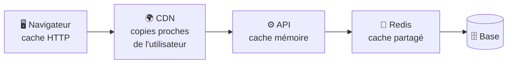

# Cache et Performance

> [!abstract] En bref
> Un **cache** garde une copie d'un résultat coûteux pour le resservir instantanément. Il en existe à **tous les étages** : dans le navigateur, dans un CDN, dans l'application, dans Redis, dans la base. Le cache est l'outil de performance le plus puissant… et la source de bugs la plus sournoise (« pourquoi je vois encore l'ancienne version ? »).

## Les étages du cache



| Étage | Garde | Exemple CinéTrack |
|---|---|---|
| **Navigateur** | fichiers, réponses HTTP | JS / CSS du build (1 an), images d'affiches |
| **CDN** | fichiers statiques, parfois réponses d'API | le front, les images |
| **Front** (store, TanStack Query) | données déjà chargées | revenir sur la liste sans recharger |
| **Redis** | résultats coûteux, partagés entre instances | films populaires de TMDB (10 min) |
| **Base** | ses propres caches internes | automatique |

## La stratégie la plus courante : « cache-aside »

```ts
async function getPopular(page: number) {
  const key = `popular:${page}`;
  const cached = await redis.get(key);
  if (cached) return JSON.parse(cached);          // 1. déjà en cache ?

  const movies = await tmdb.popular(page);       // 2. sinon, on va chercher
  await redis.set(key, JSON.stringify(movies), 'EX', 600);   // 3. on garde 10 min
  return movies;
}
```

## La vraie difficulté : l'invalidation

> « Il y a deux choses difficiles en informatique : l'invalidation de cache et nommer les choses. »

Quand la donnée change, la copie en cache devient **fausse**. Solutions :

| Solution | Principe | Pour |
|---|---|---|
| **Durée de vie (TTL)** | la copie expire toute seule | données qui peuvent être un peu en retard (films populaires) |
| **Suppression à la modification** | on efface la clé quand on écrit | la note moyenne après une nouvelle critique |
| **Nom versionné** | un nouveau nom = une nouvelle copie | `main-4f3a2b.js` |

## Que mettre en cache ?

| Oui | Non |
|---|---|
| lu souvent, change rarement | change à chaque requête |
| coûteux à calculer ou à récupérer (API externe) | déjà très rapide |
| identique pour beaucoup d'utilisateurs | données personnelles avec une clé commune |

## La performance avant le cache

Le cache peut masquer un vrai problème. D'abord : **mesurer** (temps de réponse, `EXPLAIN ANALYZE`), puis corriger les requêtes lentes, le N+1, l'absence de pagination. Ensuite seulement : mettre en cache.

## Pièges

- **Oublier d'invalider** : les utilisateurs voient des données périmées.
- **Mettre en cache des données personnelles** sans l'identifiant de l'utilisateur dans la clé : fuite de données.
- **`index.html` en cache long** : les utilisateurs gardent l'ancienne version de l'application (voir [[NET-06-Cookies-Cache-HTTP|Cache HTTP]]).
