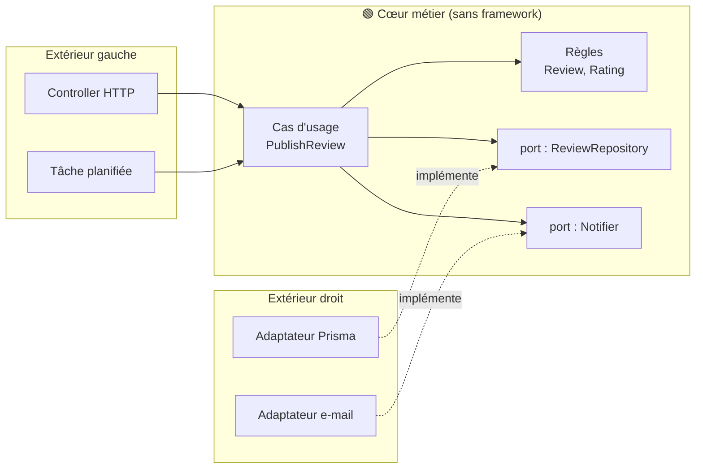

# Clean Architecture et Hexagonale

> [!abstract] En bref
> L'idée : mettre les **règles métier au centre**, et tout le reste (le framework, la base de données, les API externes, l'interface) **autour**, branché par des « prises ». Le cœur ne dépend de rien de technique. On peut alors changer de base ou de framework sans toucher aux règles. Utile pour les applications métier complexes, **trop lourd** pour un petit projet.

## L'image : l'hexagone et ses prises

Le **cœur métier** est un appareil avec des **prises** normalisées (les *ports*). Autour, des **adaptateurs** se branchent : une prise « base de données » reçoit un adaptateur Prisma aujourd'hui, MongoDB demain ; la prise « notifications » reçoit un adaptateur e-mail ou SMS.



**La règle de dépendance :** les flèches pointent **vers le cœur**. Le cœur ne connaît ni NestJS, ni Prisma, ni HTTP.

## En code

```ts
// ── cœur : aucune dépendance technique ──
export interface ReviewRepository {                  // un port
  findByUserAndMovie(userId: number, movieId: number): Promise<Review | null>;
  save(review: Review): Promise<Review>;
}

export class PublishReview {                          // un cas d'usage
  constructor(private reviews: ReviewRepository, private notifier: Notifier) {}

  async execute(input: { userId: number; movieId: number; rating: number; comment: string }) {
    if (input.rating < 1 || input.rating > 10) throw new InvalidRatingError();
    if (await this.reviews.findByUserAndMovie(input.userId, input.movieId)) throw new AlreadyReviewedError();
    const review = await this.reviews.save(Review.create(input));
    await this.notifier.reviewPublished(review);
    return review;
  }
}

// ── extérieur : l'adaptateur ──
@Injectable()
export class PrismaReviewRepository implements ReviewRepository {
  constructor(private prisma: PrismaService) {}
  findByUserAndMovie(userId: number, movieId: number) { /* Prisma */ }
  save(review: Review) { /* Prisma */ }
}
```

Le cas d'usage se teste avec de **faux** adaptateurs, sans base ni serveur.

## Couches classiques vs hexagonale

| | [[ARCH-03-Architecture-en-Couches\|Couches]] | Hexagonale / Clean |
|---|---|---|
| Le métier dépend de | la couche données (Prisma) | **rien** : c'est l'inverse |
| Changer de base | on modifie les repositories | on écrit un nouvel adaptateur |
| Quantité de code | moins | plus (interfaces, adaptateurs, conversions) |
| Idéal pour | la plupart des API | métier riche et durable, plusieurs entrées / sorties |

## Quand l'utiliser ?

- **Oui** : application métier complexe qui vivra des années, règles nombreuses, plusieurs façons d'entrer (API, tâches, messages).
- **Non** : CRUD simple, projet perso, prototype. CinéTrack-API n'en a pas besoin (mais c'est un excellent exercice sur un module).

## Pièges

- **Tout le cérémonial pour une table et trois routes**.
- **Un « cœur » qui importe Prisma ou NestJS** : la règle de dépendance est cassée, on paie la complexité sans le bénéfice.
