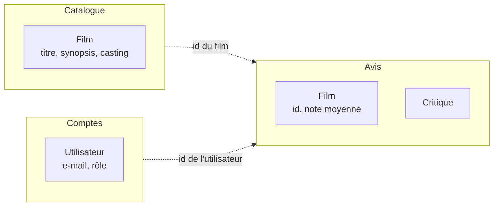

# Domain-Driven Design

> [!abstract] En bref
> Le **DDD** (*Domain-Driven Design*) est une façon de concevoir un logiciel **à partir du métier** : on parle le **même vocabulaire** que les experts, on découpe l'application selon les **domaines** du métier, et les règles vivent dans le code métier plutôt qu'éparpillées. Utile pour les gros logiciels métier ; à connaître pour comprendre les discussions d'architecture en entreprise.

## Les idées principales

### 1. Un langage commun (*ubiquitous language*)

Les mots du code sont **les mots du métier**. Si les experts parlent de « critique » et de « liste à voir », le code dit `Review` et `Watchlist`, pas `Comment` et `SavedItems`. Fini les traductions et les malentendus.

### 2. Découper par domaine (*bounded contexts*)

Un même mot peut avoir des sens différents selon le contexte. On découpe l'application en **zones** qui ont chacune leur modèle :



Dans « Catalogue », un film a tout son détail ; dans « Avis », seul son identifiant et sa note comptent. Les contextes communiquent par identifiants ou par événements.

Ces zones correspondent souvent aux **modules** NestJS ou aux **features** du front.

### 3. Les briques du modèle

| Brique | Idée | Exemple |
|---|---|---|
| **Entité** | a une **identité** qui dure | un utilisateur (même s'il change d'e-mail) |
| **Objet valeur** | défini par sa **valeur**, non modifiable | une note (`Rating`) de 1 à 10, une adresse e-mail valide |
| **Agrégat** | un groupe d'objets modifiés ensemble, avec **une porte d'entrée** | une commande et ses lignes |
| **Événement de domaine** | un fait métier qui s'est produit | `ReviewPublished` |
| **Repository** | charge et sauvegarde les agrégats | `ReviewRepository` |

### 4. Les règles dans le modèle

```ts
class Rating {
  private constructor(readonly value: number) {}
  static of(value: number) {
    if (!Number.isInteger(value) || value < 1 || value > 10) throw new InvalidRatingError(value);
    return new Rating(value);
  }
}
```

Impossible de créer une note invalide **où que ce soit** dans le code : la règle vit à un seul endroit.

## Quand l'utiliser ?

| Oui | Non |
|---|---|
| métier riche et complexe (assurance, banque, logistique, planification) | CRUD simple |
| logiciel qui vivra longtemps, avec des experts métier disponibles | projet perso, prototype |

Même sans faire du DDD complet, deux idées sont utiles **partout** : **le vocabulaire du métier dans le code**, et **les règles au plus près des données** (objets valeurs).

## Pièges

- **Appliquer tout le DDD à une petite application** : beaucoup de concepts pour peu de bénéfice.
- **Un modèle « anémique »** : des classes qui ne contiennent que des données, toutes les règles étant éparpillées dans des services.
