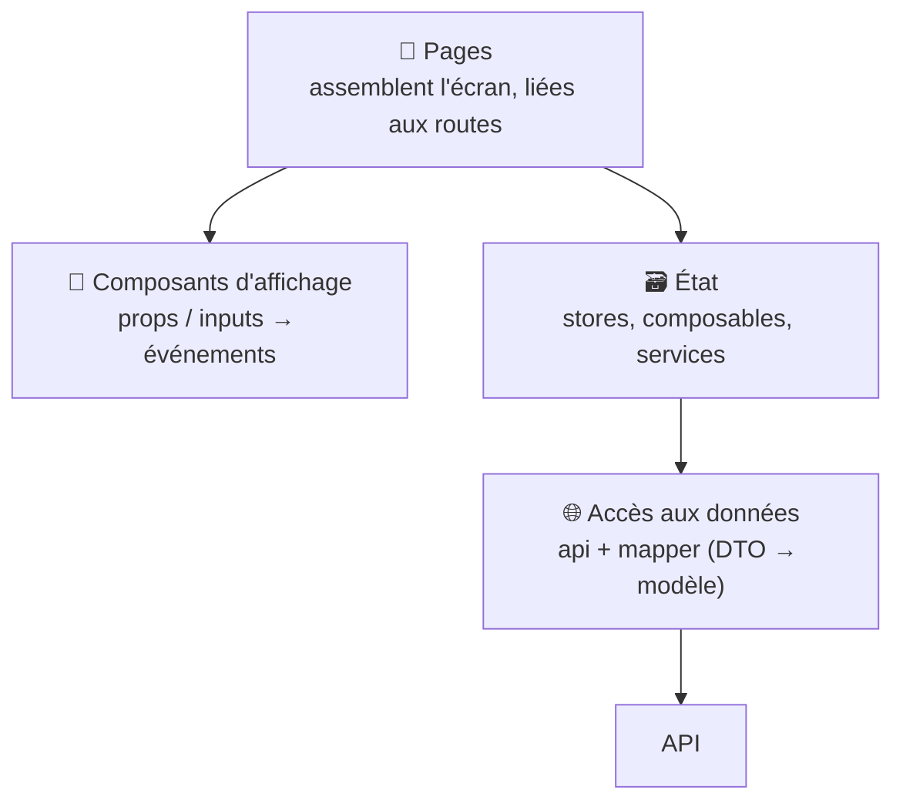

# Architecture Frontend

> [!abstract] En bref
> Un front Angular ou Vue, c'est aussi une vraie application qui mérite une architecture : où ranger les fichiers, où vit l'état, comment isoler l'API, comment découper les composants. Les principes sont les **mêmes dans les deux frameworks**. L'arborescence concrète est dans [[ARCH-15-Structure-de-Projet|Structure de projet]].

## Les couches d'un front

| Couche | Rôle | Angular | Vue |
|---|---|---|---|
| Pages | écran d'une route, branche l'état sur les composants | `movies-list.page.ts` | `MoviesPage.vue` |
| Composants d'affichage | afficher, émettre des événements | `movie-card.component.ts` | `MovieCard.vue` |
| État | données de l'écran ou partagées | service + signals | composable, Pinia |
| Accès aux données | appels HTTP, conversion | `movies.api.ts` + mapper | `movies.api.ts` + mapper |

## Les 6 principes

1. **Ranger par fonctionnalité** (`features/movies`), pas par type de fichier.
2. **Des composants d'affichage « bêtes »** : ils reçoivent et émettent, sans service ni appel HTTP. Réutilisables et faciles à tester.
3. **Isoler l'API** : un mapper convertit le DTO en modèle. L'API change ? Un seul fichier bouge.
4. **Choisir où vit chaque état** : local au composant, dans un store partagé, ou **dans l'URL** (filtres, page) pour pouvoir partager le lien.
5. **Prévoir les 4 états** de chaque chargement : chargement, erreur, vide, données.
6. **Charger à la demande** : chaque feature dans sa route lazy.

## Les grandes approches de rendu

| Approche | Principe | Pour |
|---|---|---|
| **SPA** (Angular / Vue classiques) | le navigateur construit les pages | applications, tableaux de bord |
| **SSR** (Angular SSR, Nuxt) | le serveur envoie la page remplie | sites publics, référencement |
| **SSG** | pages générées au build | vitrine, blog, portfolio |

Voir [[ANG-26-SSR-Hydratation|Angular SSR]] et [[VUE-18-Nuxt-SSR|Nuxt]].

## Les grosses applications

- **Monorepo** (Nx) : plusieurs applications et librairies partagées dans un dépôt, avec des règles d'import vérifiées.
- **Design system** : une librairie de composants communs à toutes les applications de l'entreprise.
- **Micro-frontends** : plusieurs équipes livrent chacune une partie de l'interface indépendamment. Puissant, mais complexe : seulement pour de très grosses organisations.

## Les notes détaillées

- Angular : [[ANG-28-Architecture-Projet-Angular|Principes]] · [[ANG-30-Template-Architecture-Angular|Template]]
- Vue : [[VUE-19-Architecture-Projet-Vue|Principes]] · [[VUE-22-Template-Architecture-Vue|Template]]

## Pièges

- **Tout l'état dans un store global** : un filtre de page reste dans la page (ou l'URL).
- **Des composants qui appellent l'API** directement : impossible à réutiliser.
- **Des micro-frontends pour une application d'une équipe** : complexité énorme sans bénéfice.
