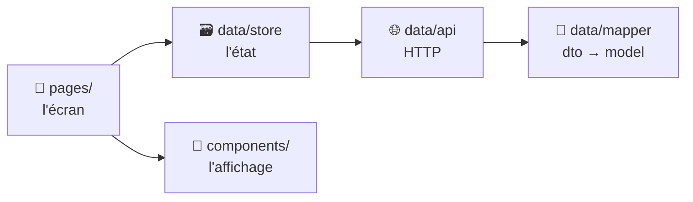

# Structure de Projet

> [!abstract] En bref
> Un **modèle général** de dossiers (en anglais) valable pour tous tes projets : front Angular ou Vue, back NestJS, ou les deux ensemble. Ce n'est pas une règle figée : **c'est un point de départ que tu adaptes** à la taille et au besoin du projet.

## L'idée en une image

Pense à une **ville** :
- des **quartiers** autonomes : les fonctionnalités (`features`) ;
- des **services publics** communs à toute la ville : le `core` (configuration, gestion des erreurs, mise en page) ;
- du **mobilier urbain** standard réutilisé partout : le `shared` (boutons, utilitaires).

Quand tu cherches quelque chose, tu sais dans quel quartier aller. Et quand tu ajoutes un quartier, tu ne casses pas les autres.

## Les 3 zones

| Dossier | Contient | Question à se poser |
|---|---|---|
| `core/` | ce qui existe **une seule fois** dans l'app : config, intercepteurs HTTP, gestion d'erreurs, layout (en-tête, menu) | « Est-ce que l'app entière en a besoin, en un seul exemplaire ? » |
| `shared/` | ce qui est **réutilisable** et **sans métier** : composants UI génériques, utilitaires, types communs | « Est-ce que je pourrais le copier dans un autre projet tel quel ? » |
| `features/` | **un dossier par fonctionnalité** métier : `movies/`, `auth/`, `contact/` | « À quelle fonctionnalité ça appartient ? » |

**La règle d'or : on range par fonctionnalité, pas par type de fichier.** Tout ce qui concerne les films est dans `features/movies/`, pas éparpillé dans un dossier `components/` géant, un dossier `services/` géant, etc.

## Front-end (Angular ou Vue)

```text
src/
├── app/                      # (Vue : directement dans src/)
│   ├── core/
│   │   ├── config/           # URL de l'API, constantes d'environnement
│   │   ├── http/             # intercepteurs : token, erreurs
│   │   ├── layout/           # header, footer, menu, page 404
│   │   └── errors/           # gestion globale des erreurs
│   ├── shared/
│   │   ├── ui/               # composants génériques : button, loader, empty-state
│   │   ├── utils/            # fonctions pures (formatDate, slugify…)
│   │   └── types/            # types communs (Page<T>, LoadState<T>)
│   ├── features/
│   │   └── movies/           # une fonctionnalité
│   │       ├── data/         # accès aux données
│   │       │   ├── movie.model.ts     # le type utilisé dans l'app
│   │       │   ├── movie.dto.ts       # la forme brute renvoyée par l'API
│   │       │   ├── movie.mapper.ts    # dto → model
│   │       │   ├── movies.api.ts      # les appels HTTP
│   │       │   └── movies.store.ts    # l'état (liste, chargement, erreur)
│   │       ├── components/   # les composants d'affichage de cette feature
│   │       ├── pages/        # les écrans liés à une route
│   │       └── movies.routes.ts
│   └── app.routes.ts         # routes principales
├── assets/                   # images, polices, icônes
└── styles/                   # variables CSS, thème, styles globaux
```

### Les 3 types de fichiers dans une feature



- **`pages/`** : l'écran. Il récupère les données du store et les passe aux composants.
- **`components/`** : l'affichage pur. Il reçoit des données (props / inputs) et émet des événements. **Il ne fait jamais d'appel HTTP.**
- **`data/`** : tout ce qui touche aux données. Le reste de l'app ne voit **jamais** la forme brute de l'API : si l'API change, tu modifies seulement `dto` et `mapper`.

### Ce qui change entre Angular et Vue

| Rôle | Angular | Vue |
|---|---|---|
| Racine du code | `src/app/` | `src/` |
| État d'une feature | service avec signals (`movies.store.ts`) | store Pinia (`movies.store.ts`) |
| Logique réutilisable | service injectable | composable (`useMovies.ts`) |
| Routes d'une feature | `movies.routes.ts` (lazy) | `movies.routes.ts` importé dans `router/` |
| Fichier composant | `movie-card.component.ts` | `MovieCard.vue` |

Détail et code : [[ANG-30-Template-Architecture-Angular|Angular]] · [[VUE-22-Template-Architecture-Vue|Vue]].

## Back-end (NestJS)

```text
src/
├── main.ts                   # démarrage de l'app
├── app.module.ts
├── config/                   # lecture et validation des variables d'environnement
├── common/                   # partagé : guards, filtres d'erreurs, pipes, decorators
├── database/                 # connexion Prisma
└── modules/
    └── movies/               # un module par fonctionnalité
        ├── dto/              # formes des données reçues / renvoyées (validées)
        ├── movies.controller.ts   # routes HTTP : reçoit, valide, répond
        ├── movies.service.ts      # la logique métier
        ├── movies.repository.ts   # accès à la base (optionnel au début)
        └── movies.module.ts
prisma/
├── schema.prisma             # le modèle de la base
└── migrations/
test/                         # tests end-to-end
```

Le chemin d'une requête : **controller** (entrée) → **service** (règles métier) → **repository / Prisma** (base de données).

## Full stack (monorepo)

Quand front et back vivent dans le même dépôt :

```text
apps/
├── web/                      # le front (Angular ou Vue)
└── api/                      # le back NestJS
packages/
└── shared-types/             # types communs front + back (ex. MovieDto)
docker/                       # Dockerfiles, docker-compose
.gitlab-ci.yml
```

## Les règles de dépendance

| Qui | Peut utiliser | Ne doit pas utiliser |
|---|---|---|
| `features/x` | `core`, `shared`, lui-même | une autre feature directement |
| `shared` | `shared` uniquement | `core`, `features` |
| `core` | `shared` | `features` |
| `components/` | ses props / inputs | un service HTTP ou un store |

Si deux features ont besoin du même code, **déplace ce code dans `shared/`** plutôt que de les faire s'importer l'une l'autre.

## Comment l'adapter

| Taille du projet | Ce que tu gardes |
|---|---|
| **Petit** (Portfolio, quelques écrans) | `core/layout`, `shared/ui`, 2-3 features. Pas de store si un composable ou un service suffit. |
| **Moyen** (CinéTrack) | La structure complète, un store par feature qui a un état partagé. |
| **Gros** (plusieurs équipes ou applis) | Monorepo (Nx) avec des librairies et des règles d'import vérifiées automatiquement. |

- **Pas de dossier vide « au cas où »** : crée `utils/` le jour où tu as un utilitaire.
- **Noms de fichiers en `kebab-case`** (`movie-card.component.ts`), sauf composants Vue en `PascalCase` (`MovieCard.vue`).
- **Alias d'import** pour éviter les `../../../` : `@core/…`, `@shared/…`, `@features/…` (Angular) ou `@/…` (Vue).
- **Au travail** : suis la convention déjà en place dans le projet, même si elle diffère de ce modèle.
