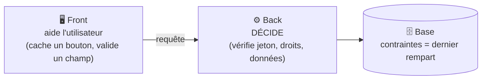

# Fondamentaux de la Sécurité

> [!abstract] En bref
> La sécurité, c'est protéger les **données** et les **utilisateurs** de ton application. Pas besoin d'être expert : quelques principes simples, appliqués systématiquement, évitent l'immense majorité des failles. Le premier : **ne jamais faire confiance à ce qui vient du client**.

## Les 3 objectifs (CIA)

| Objectif | Question | Exemple d'attaque |
|---|---|---|
| **Confidentialité** | seules les bonnes personnes voient les données ? | lire les favoris d'un autre utilisateur |
| **Intégrité** | les données ne sont pas modifiées sans droit ? | modifier la critique de quelqu'un d'autre |
| **Disponibilité** | le service reste accessible ? | saturer l'API de requêtes |

## Les 7 principes à appliquer partout

1. **Ne jamais faire confiance au client.** Le front peut être modifié, les requêtes forgées avec Postman. Tout est **revérifié côté serveur** : données (DTO), identité (jeton), droits.
2. **Le moindre privilège.** Chacun a seulement les droits nécessaires : l'utilisateur de la base n'est pas administrateur, un compte « lecteur » ne peut pas supprimer.
3. **Défense en profondeur.** Plusieurs protections successives : validation dans l'API **et** contraintes en base **et** pare-feu. Si l'une échoue, les autres tiennent.
4. **Sécurisé par défaut.** Toutes les routes protégées, sauf celles explicitement publiques.
5. **Pas de secrets dans le code.** Variables d'environnement (voir [[SEC-10-Gestion-des-Secrets|Secrets]]).
6. **Des dépendances à jour.** La plupart des failles viennent de librairies anciennes (`npm audit`).
7. **Des erreurs discrètes.** Le client reçoit « Erreur interne », les détails vont dans les logs.

## Front ou back : qui protège quoi ?

**Cacher un bouton « Supprimer » ne protège rien** : n'importe qui peut envoyer `DELETE /reviews/7` directement. C'est le back qui doit vérifier que la critique appartient à l'utilisateur.

## La carte des sujets

| Sujet | Note |
|---|---|
| Les 10 risques les plus courants | [[SEC-02-OWASP-Top-10\|OWASP Top 10]] |
| Qui est l'utilisateur ? | [[SEC-03-Authentification-Sessions-JWT\|Authentification]] |
| A-t-il le droit ? | [[SEC-11-Autorisation-RBAC\|Autorisation]] |
| Mots de passe | [[SEC-05-Hachage-Mots-de-Passe\|Hachage]] |
| Scripts injectés, requêtes forcées | [[SEC-06-XSS-CSRF\|XSS et CSRF]] |
| Appels entre domaines | [[SEC-07-CORS-Same-Origin\|CORS]] |
| Injections dans la base | [[SEC-08-Injection-SQL-Validation\|Injection SQL]] |
| Chiffrement des échanges | [[SEC-09-HTTPS-TLS\|HTTPS]] |

## Pièges

- **« Personne ne va attaquer mon petit projet »** : des robots scannent Internet en continu, sans distinction.
- **Sécurité seulement côté front** : elle se contourne en quelques secondes.
