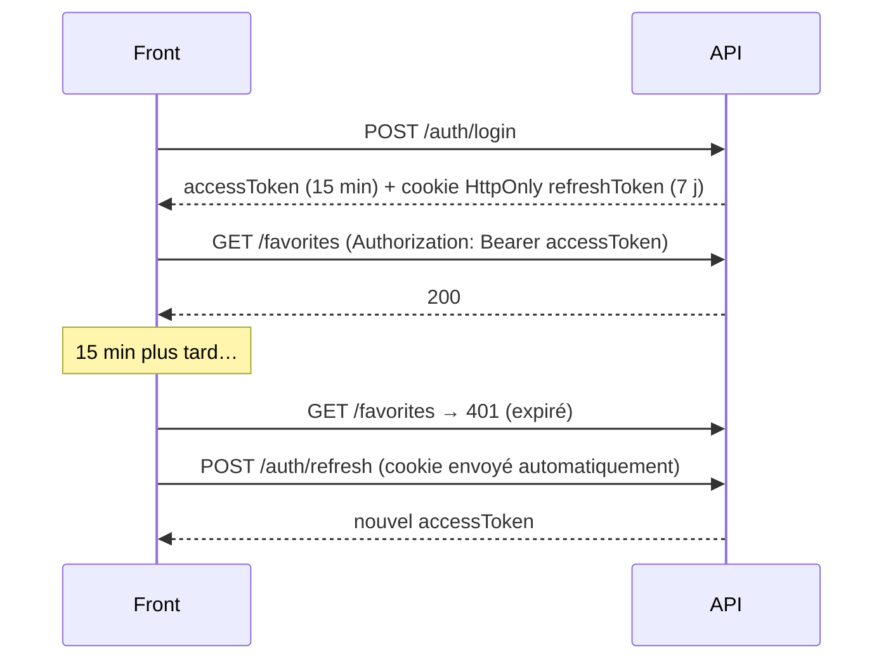

# Authentification Sessions et JWT

> [!abstract] En bref
> HTTP ne se souvient de rien entre deux requêtes. Pour savoir **qui** fait la requête, il y a deux grandes méthodes : la **session** (le serveur garde une fiche, le navigateur garde un numéro dans un cookie) et le **JWT** (le serveur donne un jeton signé que le client présente à chaque fois). Les deux sont valables ; l'important est de bien les stocker.

## Les deux approches

| | Session | JWT |
|---|---|---|
| Image | un **ticket de vestiaire** : le numéro ne dit rien, le vestiaire garde ton manteau | un **badge signé** : tout est écrit dessus, le gardien vérifie la signature |
| Où est l'info | sur le **serveur** (mémoire, Redis, base) | **dans le jeton** |
| Le client garde | un identifiant de session (cookie) | le jeton |
| Déconnecter quelqu'un immédiatement | facile (on supprime la session) | difficile (le jeton reste valide jusqu'à expiration) |
| Plusieurs serveurs | il faut un stockage partagé (Redis) | rien à partager |

## Un JWT de près

Un JWT est composé de 3 parties séparées par des points : `en-tête.contenu.signature`.

```json
// contenu (décodé) : LISIBLE PAR TOUS, il est seulement signé
{ "sub": 42, "role": "USER", "iat": 1790000000, "exp": 1790000900 }
```

- `sub` : l'identifiant de l'utilisateur.
- `exp` : la date d'expiration.
- La **signature** prouve que c'est bien ton serveur qui l'a créé : impossible de changer `role` en `ADMIN` sans connaître le secret.

Essaie sur jwt.io avec un de tes jetons : tu verras que le contenu est lisible. **Jamais de donnée sensible dedans.**

## Le duo jeton court + jeton de rafraîchissement



- **Jeton d'accès court** (15 min) : s'il est volé, il ne sert pas longtemps.
- **Jeton de rafraîchissement long**, dans un **cookie `HttpOnly`** : JavaScript ne peut pas le lire, donc un script malveillant ne peut pas le voler. On peut le révoquer côté serveur.

## Où stocker le jeton côté front ?

| Emplacement | Risque |
|---|---|
| `localStorage` | lisible par tout script de la page → volable en cas de faille XSS |
| mémoire (variable, signal) | disparaît au rechargement (d'où le refresh token) |
| **cookie `HttpOnly` + `Secure` + `SameSite`** | illisible par JavaScript ; protège bien si CSRF géré |

Recommandation pour tes projets : jeton d'accès **en mémoire**, jeton de rafraîchissement en **cookie `HttpOnly`**. Mise en œuvre : [[NEST-10-Authentification-JWT|Authentification JWT NestJS]].

## Pièges

- **Un JWT qui ne expire jamais** : s'il fuit, il est valable pour toujours.
- **Un secret faible ou commité** : n'importe qui peut fabriquer des jetons.
- **Accepter l'algorithme `none`** ou ne pas vérifier la signature : utilise les librairies officielles (`@nestjs/jwt`), jamais un décodage maison.
- **Oublier que « connecté » ≠ « autorisé »** : voir [[SEC-11-Autorisation-RBAC|Autorisation]].
