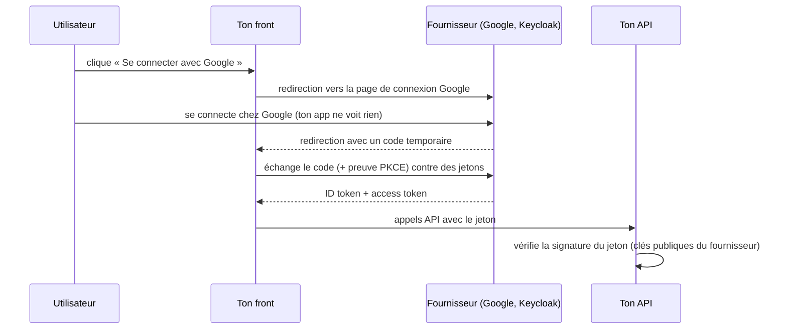

# OAuth2 et OpenID Connect

> [!abstract] En bref
> Le bouton « **Se connecter avec Google** » (ou avec le compte de l'entreprise), c'est **OpenID Connect**, construit sur **OAuth2**. Ton application ne voit jamais le mot de passe : l'utilisateur se connecte chez le fournisseur (Google, Microsoft, Keycloak), qui te renvoie la preuve de son identité. En entreprise, c'est souvent ainsi que fonctionne la connexion unique (SSO).

## La différence

| | OAuth2 | OpenID Connect (OIDC) |
|---|---|---|
| Répond à | « cette application a-t-elle le **droit d'accéder** à mes données ? » (autorisation) | « **qui** est cet utilisateur ? » (authentification) |
| Donne | un *access token* | un *access token* + un **ID token** (JWT avec l'identité) |
| Exemple | une app qui lit ton agenda Google | « Se connecter avec Google » |

## L'image

À l'hôtel, tu ne donnes pas ta carte d'identité au bar : la **réception** (le fournisseur) vérifie ton identité et te donne un **badge** (le jeton) que le bar (ton application) accepte.

## Le déroulé (Authorization Code + PKCE)

C'est le flux recommandé pour les applications web et mobiles :

**PKCE** (« pixy ») est une protection qui empêche qu'un code intercepté soit utilisé par quelqu'un d'autre.

## Les mots à connaître

| Mot | Sens |
|---|---|
| **Fournisseur d'identité** (IdP) | celui qui vérifie l'identité : Google, Microsoft Entra ID, Keycloak, Auth0 |
| **Client** | ton application, enregistrée chez le fournisseur (avec un *client id*) |
| **Redirect URI** | l'adresse où le fournisseur renvoie l'utilisateur après connexion |
| **Scope** | ce que tu demandes : `openid email profile` |
| **ID token** | un JWT qui décrit l'utilisateur |
| **SSO** | se connecter une fois pour toutes les applications de l'entreprise |

## Dans tes projets

- Pour CinéTrack : ta propre authentification JWT suffit (et t'apprend le fonctionnement).
- Pour ajouter « Se connecter avec Google » : une librairie (`passport-google-oauth20` côté NestJS, ou un service comme Auth0 / Keycloak).
- En entreprise : l'authentification passe souvent par un fournisseur central (Keycloak, Entra ID) ; les fronts utilisent une librairie OIDC (`angular-oauth2-oidc`, `oidc-client-ts`).

## Pièges

- **Coder le flux toi-même** : utilise une librairie reconnue, les détails sont piégeux.
- **Une `redirect URI` trop large** (`https://*`) : un attaquant peut récupérer le code.
- **Faire confiance à un jeton sans vérifier sa signature, son émetteur (`iss`) et son destinataire (`aud`)**.
