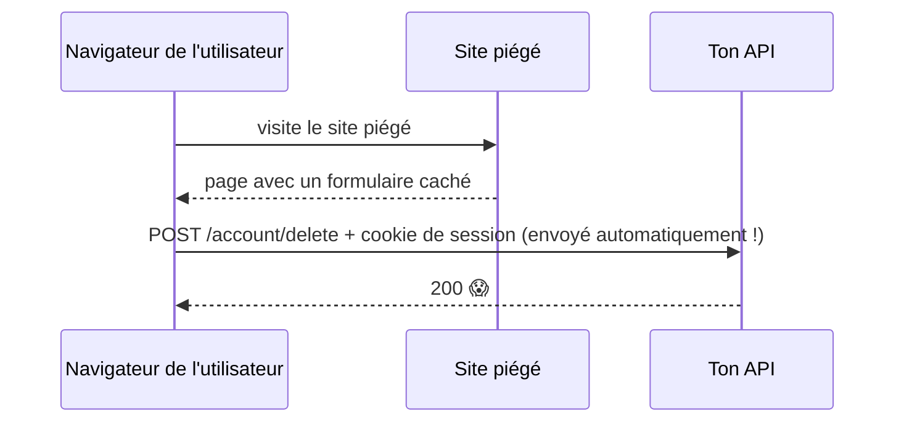

# XSS et CSRF

> [!abstract] En bref
> Deux attaques classiques contre les applications web. **XSS** : un attaquant fait exécuter **son script** dans la page de tes utilisateurs (par exemple via une critique contenant du code). **CSRF** : un site piégé fait envoyer une **requête à ton API** avec les cookies de l'utilisateur, à son insu. Angular et Vue te protègent beaucoup, à condition de ne pas contourner leurs protections.

## XSS (Cross-Site Scripting)

Un utilisateur publie cette « critique » :

```html
Super film ! 
```

Si ton site l'affiche comme du HTML, le script s'exécute **chez chaque visiteur** qui lit la critique, et envoie leur jeton à l'attaquant.

### Comment tu es protégé

Angular et Vue **échappent** automatiquement ce que tu affiches : `{{ review.comment }}` affiche le texte tel quel, le `` devient du texte inoffensif.

**Les seuls moments où tu te mets en danger :**

| Dangereux | À la place |
|---|---|
| `element.innerHTML = texte` | `element.textContent = texte` |
| Vue : `v-html="review.comment"` | `{{ review.comment }}` |
| Angular : `[innerHTML]` avec `bypassSecurityTrustHtml` | laisser Angular nettoyer, ou `{{ }}` |
| construire du HTML en concaténant des textes | les templates du framework |

Si tu dois vraiment afficher du HTML (texte riche), nettoie-le avec **DOMPurify**.

**Protections supplémentaires :** jeton de connexion hors de `localStorage` (cookie `HttpOnly`), et un en-tête **Content-Security-Policy** qui interdit les scripts venant d'ailleurs.

## CSRF (Cross-Site Request Forgery)

L'utilisateur est connecté à ton site (cookie de session). Il visite un site piégé qui contient :

```html
<form action="https://api.cinetrack.fr/account/delete" method="POST" id="f"></form>
<script>document.getElementById('f').submit()</script>
```

Le navigateur envoie la requête **avec le cookie** de l'utilisateur : le compte est supprimé.



### Comment tu es protégé

| Protection | Effet |
|---|---|
| **`SameSite=Lax` ou `Strict`** sur les cookies | le cookie n'est pas envoyé depuis un autre site |
| jeton dans l'en-tête `Authorization` (pas en cookie) | le site piégé ne peut pas l'ajouter |
| jeton anti-CSRF | une valeur secrète que le site piégé ne connaît pas |
| ne jamais modifier de données avec un `GET` | |

Avec un JWT envoyé dans `Authorization: Bearer`, le CSRF n'est pas possible sur ces routes. Il faut y penser pour les routes qui utilisent un cookie (le rafraîchissement du jeton) : `SameSite` suffit en général.

## Résumé

| | XSS | CSRF |
|---|---|---|
| L'attaquant… | exécute **son code** dans ta page | fait envoyer **une requête** en ton nom |
| Protection principale | ne jamais afficher de HTML non nettoyé | cookies `SameSite`, jeton dans l'en-tête |
