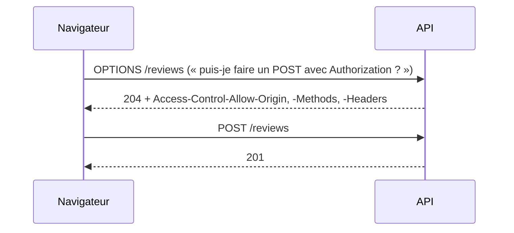

# CORS et Same-Origin Policy

> [!abstract] En bref
> Par sécurité, un navigateur empêche une page de lire les réponses d'un **autre site** : c'est la *Same-Origin Policy*. Quand ton front (`localhost:4200`) appelle ton API (`localhost:3000`), ce sont deux « origines » différentes : l'API doit **autoriser** explicitement ton front. C'est le rôle de **CORS**. L'erreur CORS est l'une des premières que tu rencontreras en full stack.

## Une origine = protocole + domaine + port

| URL A | URL B | Même origine ? |
|---|---|---|
| `http://localhost:4200` | `http://localhost:3000` | ❌ port différent |
| `https://cinetrack.fr` | `https://api.cinetrack.fr` | ❌ domaine différent |
| `https://cinetrack.fr` | `http://cinetrack.fr` | ❌ protocole différent |
| `https://cinetrack.fr/movies` | `https://cinetrack.fr/api` | ✅ |

## L'erreur typique

```text
Access to fetch at 'http://localhost:3000/movies' from origin 'http://localhost:4200'
has been blocked by CORS policy: No 'Access-Control-Allow-Origin' header is present.
```

**Ce n'est pas un bug de ton front.** La requête est partie, le serveur a même répondu, mais le **navigateur** refuse de te donner la réponse parce que le serveur n'a pas dit « j'autorise `localhost:4200` ».

## La solution : côté serveur

```ts
// main.ts (NestJS)
app.enableCors({
  origin: ['http://localhost:4200', 'http://localhost:5173', 'https://cinetrack.fr'],
  credentials: true,       // si tu utilises des cookies
});
```

Le serveur ajoute alors l'en-tête `Access-Control-Allow-Origin: http://localhost:4200` à ses réponses.

## La requête préalable (preflight)

Pour une requête « non simple » (JSON, en-tête `Authorization`, méthode `PUT` / `DELETE`), le navigateur envoie d'abord une requête **OPTIONS** pour demander la permission :



Dans l'onglet Network, tu verras donc parfois **deux** requêtes pour une.

## Éviter CORS en développement

Un **proxy** fait croire au navigateur que tout vient de la même origine :

```ts
// vite.config.ts
server: { proxy: { '/api': 'http://localhost:3000' } }
```

```json
// Angular : proxy.conf.json (ng serve --proxy-config proxy.conf.json)
{ "/api": { "target": "http://localhost:3000", "secure": false } }
```

En production, un reverse proxy qui sert le front et l'API sous le **même domaine** supprime le problème (voir [[NET-09-Proxy-Reverse-Proxy-Load-Balancer|Reverse proxy]]).

## Pièges

- **`origin: '*'`** en production : n'importe quel site peut appeler ton API avec les droits de l'utilisateur (et c'est interdit avec `credentials: true`).
- **Chercher à corriger CORS dans le front** (en-têtes ajoutés à la requête) : ça ne sert à rien, c'est le serveur qui autorise.
- **CORS n'est pas une protection de ton API** : Postman ou un script serveur l'ignorent. Il protège les **utilisateurs** dans leur navigateur.
