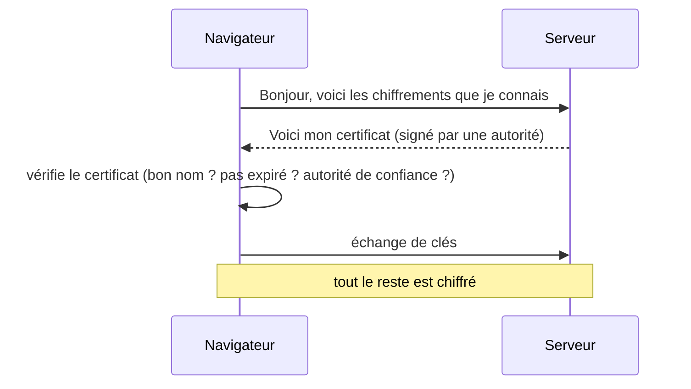

# HTTPS et TLS

> [!abstract] En bref
> **HTTPS**, c'est HTTP **chiffré** grâce à **TLS**. Il garantit trois choses : personne ne peut **lire** les échanges (le mot de passe sur le Wi-Fi du café), personne ne peut les **modifier**, et tu parles bien au **vrai** site (grâce au certificat). Aujourd'hui, c'est obligatoire partout, et gratuit.

## Ce que HTTPS protège

| Sans HTTPS | Avec HTTPS |
|---|---|
| le mot de passe circule en clair | chiffré |
| un intermédiaire peut injecter une publicité ou un script | impossible |
| un faux site peut se faire passer pour le tien | le certificat prouve l'identité |
| le navigateur affiche « Non sécurisé » | cadenas |

## Comment ça marche, simplement



Le **certificat** est comme une **carte d'identité** du site, délivrée par une **autorité de certification** reconnue par les navigateurs (Let's Encrypt, par exemple). Il contient le nom de domaine et une date d'expiration.

## Mettre HTTPS en place

| Hébergement | HTTPS |
|---|---|
| GitLab Pages, Netlify, Vercel, Cloudflare | **automatique**, rien à faire |
| ton propre serveur avec Nginx | **Let's Encrypt** gratuit, avec renouvellement automatique (`certbot`) |
| Kubernetes | cert-manager |

```bash
sudo certbot --nginx -d cinetrack.fr -d www.cinetrack.fr
```

## Les bons réglages

- **Rediriger HTTP vers HTTPS** (port 80 → 443).
- **HSTS** : un en-tête qui dit au navigateur « utilise toujours HTTPS pour ce site » :
  ```http
  Strict-Transport-Security: max-age=31536000; includeSubDomains
  ```
- **Cookies `Secure`** : envoyés seulement en HTTPS.
- Derrière un reverse proxy : l'application reçoit du HTTP simple, mais doit savoir que l'origine était HTTPS (`X-Forwarded-Proto`, voir [[NET-09-Proxy-Reverse-Proxy-Load-Balancer|Reverse proxy]]).

## Pièges

- **Un certificat expiré** : site bloqué pour tous les visiteurs. Automatise le renouvellement.
- **Du contenu mixte** : une page HTTPS qui charge une image ou un script en HTTP. Le navigateur le bloque.
- **Désactiver la vérification des certificats** (`rejectUnauthorized: false`) pour « faire marcher » un appel : tu supprimes toute la protection.
