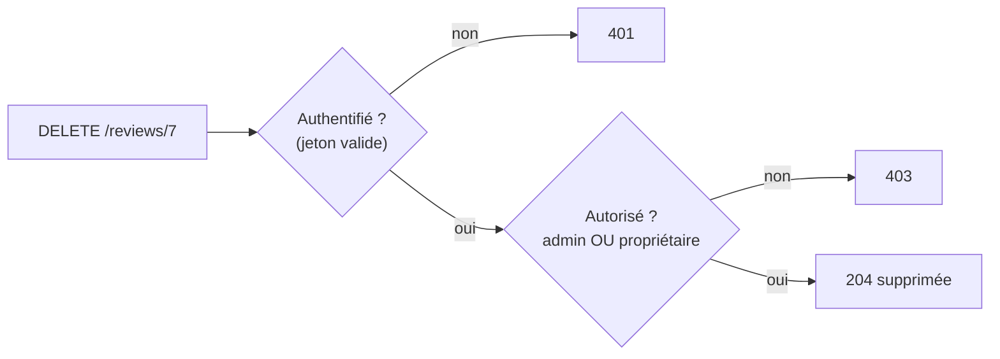

# Autorisation et RBAC

> [!abstract] En bref
> L'**authentification** répond à « **qui** es-tu ? ». L'**autorisation** répond à « **as-tu le droit** de faire ça ? ». Deux niveaux à vérifier côté serveur : le **rôle** (un admin peut modérer toutes les critiques) et la **propriété** (un utilisateur peut modifier **sa** critique, pas celle des autres). C'est la faille n°1 de l'OWASP.

## Les deux questions



## Par rôle : RBAC

**RBAC** (*Role-Based Access Control*) : chaque utilisateur a un rôle, chaque rôle a des droits.

| Action | USER | MODERATOR | ADMIN |
|---|---|---|---|
| lire les critiques | ✅ | ✅ | ✅ |
| écrire une critique | ✅ | ✅ | ✅ |
| modifier **sa** critique | ✅ | ✅ | ✅ |
| masquer **n'importe quelle** critique | ❌ | ✅ | ✅ |
| gérer les utilisateurs | ❌ | ❌ | ✅ |

```ts
@Patch(':id/hide')
@Roles('MODERATOR', 'ADMIN')           // vérifié par un RolesGuard
hide(@Param('id', ParseIntPipe) id: number) {}
```

Mise en œuvre du guard : [[NEST-06-Middleware-Guards-Interceptors|Guards]].

## Par propriété : le plus oublié

Le rôle ne suffit pas : un USER a le droit de modifier **une** critique, mais seulement **la sienne**. Cette vérification se fait **dans le service**, car il faut lire la ressource :

```ts
async update(id: number, dto: UpdateReviewDto, user: AuthUser) {
  const review = await this.prisma.review.findUnique({ where: { id } });
  if (!review) throw new NotFoundException();

  const isOwner = review.userId === user.id;
  const isModerator = ['MODERATOR', 'ADMIN'].includes(user.role);
  if (!isOwner && !isModerator) throw new ForbiddenException();

  return this.prisma.review.update({ where: { id }, data: dto });
}
```

Pour les listes, **filtre dès la requête** :

```ts
prisma.favorite.findMany({ where: { userId: user.id } });   // jamais « tous », puis filtrer
```

## Et le front ?

Le front **adapte l'affichage** (cacher le bouton « Supprimer » sur les critiques des autres, cacher le menu admin) : c'est du **confort**, pas de la sécurité. La décision est **toujours** prise par l'API.

## Pour aller plus loin

Quand les règles se compliquent (« un éditeur peut modifier les articles de son équipe, s'ils ne sont pas publiés »), on passe à des **permissions fines** ou à des règles par attributs (ABAC), avec des librairies comme **CASL**.

## Pièges

- **Vérifier seulement que l'utilisateur est connecté** : il peut modifier les données des autres en changeant l'id dans l'URL.
- **Prendre l'`userId` dans le corps de la requête** : il vient toujours du jeton.
- **Tester uniquement avec son propre compte** : teste avec deux comptes, et essaie d'accéder aux ressources de l'autre.
