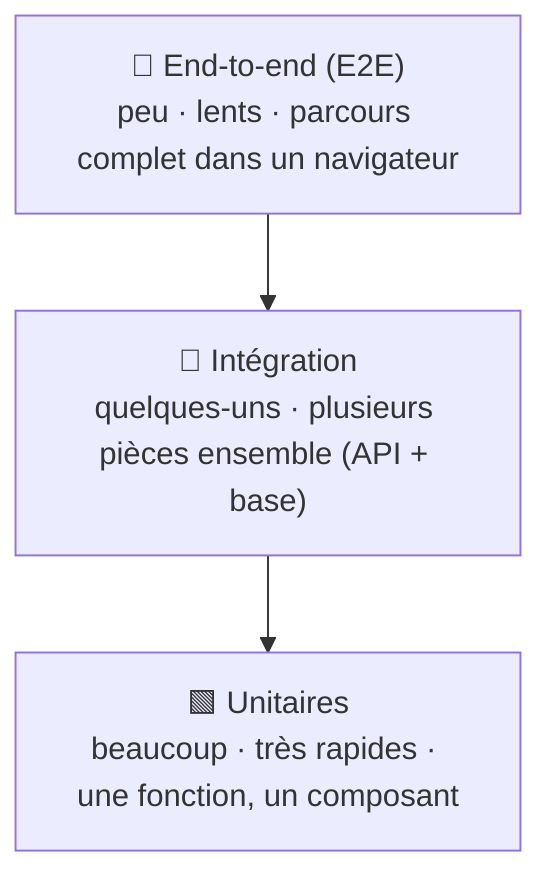

# Pyramide des Tests

> [!abstract] En bref
> Il existe plusieurs sortes de tests, du plus petit (une fonction) au plus gros (l'application complète dans un navigateur). La **pyramide** dit combien écrire de chaque : **beaucoup** de petits tests rapides, **quelques** tests d'intégration, **peu** de tests de bout en bout. Les tests te permettent de modifier ton code **sans peur de tout casser**.

## La pyramide

| Niveau | Teste | Exemple CinéTrack | Durée | Outil |
|---|---|---|---|---|
| **Unitaire** | une fonction, un service, un composant, **isolés** | le mapper `toMovie`, le filtre, le store | millisecondes | Vitest |
| **Intégration** | plusieurs pièces **ensemble** | `POST /reviews` avec la vraie base | secondes | Supertest, Testcontainers |
| **E2E** | l'application **entière** comme un utilisateur | « je cherche un film, je l'ajoute en favori » | dizaines de secondes | Playwright |

## Pourquoi cette forme

- Les tests unitaires sont **rapides** (des centaines en quelques secondes) et disent **précisément** ce qui casse.
- Les tests E2E sont **proches de la réalité** mais **lents** et plus **fragiles** (un bouton déplacé les casse).
- On couvre donc la logique en détail avec des unitaires, et on vérifie les **parcours essentiels** avec quelques E2E.

## Ce qu'il faut tester en priorité

1. **La logique métier** : calculs, règles (« une seule critique par film »), filtres, conversions.
2. **Les droits** : un utilisateur ne peut pas modifier la critique d'un autre.
3. **Les cas d'erreur** : données invalides, ressource introuvable, API qui ne répond pas.
4. **Le parcours principal** de l'application, en E2E.
5. **Chaque bug corrigé** : un test qui l'aurait détecté, pour qu'il ne revienne jamais.

Ce qu'on teste peu : le code qui ne fait qu'afficher, le code des librairies (déjà testé par leurs auteurs).

## Un bon test

| Qualité | Signification |
|---|---|
| **Rapide** | on le lance souvent |
| **Indépendant** | ne dépend pas de l'ordre ni des autres tests |
| **Répétable** | même résultat à chaque fois (pas de date du jour, pas d'appel réseau réel) |
| **Lisible** | son nom dit ce qu'il vérifie : `refuse une note supérieure à 10` |
| **Teste le comportement** | ce qui est visible et renvoyé, pas les détails internes |

La structure universelle **AAA** : **Arrange** (préparer) → **Act** (agir) → **Assert** (vérifier).

## La couverture de code

Le pourcentage de lignes exécutées par les tests (`vitest --coverage`). Utile pour repérer ce qui n'est **pas du tout** testé, mais 100 % de couverture ne garantit pas l'absence de bugs. Viser ~70-80 % sur la logique métier est un bon repère.

## La suite

[[TEST-02-Tests-Unitaires-Vitest-Jest|Tests unitaires]] → [[TEST-03-Mocks-Stubs-Spies|Doublures (mocks)]] → [[TEST-04-Tests-Integration-API|Tests d'API]] → [[TEST-05-Tests-E2E-Playwright|E2E]].
