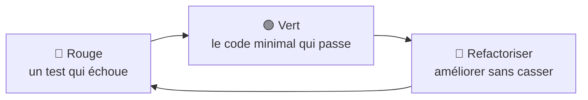

# TDD (Test-Driven Development)

> [!abstract] En bref
> Le **TDD**, c'est écrire le **test avant le code**. Trois temps qui se répètent : **rouge** (écrire un test qui échoue), **vert** (écrire le minimum de code pour qu'il passe), **refactoriser** (améliorer le code, les tests restent verts). Idéal pour la logique métier : tu réfléchis d'abord à **ce que** le code doit faire.

## Le cycle



## Exemple : la règle « une note de 1 à 10, entière »

**1. Rouge** : le test, avant la fonction.

```ts
describe('isValidRating', () => {
  it('accepte 1 et 10', () => {
    expect(isValidRating(1)).toBe(true);
    expect(isValidRating(10)).toBe(true);
  });
});
```

Il échoue : la fonction n'existe pas encore.

**2. Vert** : le minimum.

```ts
export const isValidRating = (n: number) => n >= 1 && n <= 10;
```

**3. On ajoute un cas** (rouge à nouveau) :

```ts
it('refuse les décimales', () => {
  expect(isValidRating(7.5)).toBe(false);
});
```

```ts
export const isValidRating = (n: number) => Number.isInteger(n) && n >= 1 && n <= 10;   // vert
```

**4. Refactoriser** si besoin : les tests garantissent que rien ne casse.

## Pourquoi c'est utile

- Tu **réfléchis aux cas** (limites, erreurs) avant de coder.
- Le code est **testable par construction** : petites fonctions, dépendances séparées.
- Les tests servent de **documentation** : ils décrivent ce que fait le code.
- Tu t'arrêtes quand les tests passent : pas de code « au cas où ».

## Quand l'utiliser

| Bien adapté | Moins adapté |
|---|---|
| règles métier, calculs, validations | l'apparence d'un écran |
| correction d'un bug (écrire d'abord le test qui le reproduit) | un prototype qu'on va jeter |
| fonctions utilitaires (filtres, mappers, formatage) | explorer une librairie inconnue |

**Le réflexe le plus rentable :** pour chaque bug, **écris d'abord un test qui échoue** à cause du bug, puis corrige. Le bug ne reviendra jamais sans qu'un test le signale.

## Pièges

- **Écrire trop de code d'un coup** à l'étape verte : reste minimal.
- **Sauter l'étape de refactorisation** : le code devient vite désordonné.
- **Faire du TDD dogmatique partout** : c'est un outil, pas une religion.
