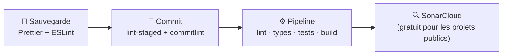

# Qualité, Lint et SonarQube

> [!abstract] En bref
> La qualité du code se mesure et s'automatise. **ESLint** et **TypeScript** vérifient chaque fichier, **SonarQube** analyse tout le projet (bugs probables, duplications, complexité, failles, couverture de tests) et peut **bloquer** une MR qui fait baisser la qualité. En entreprise, c'est souvent une étape obligatoire du pipeline.

## Les outils et leur rôle

| Outil | Vérifie | Quand |
|---|---|---|
| **Prettier** | la mise en forme | à la sauvegarde |
| **ESLint** | erreurs et mauvaises pratiques | sauvegarde, pré-commit, CI |
| **TypeScript** (`tsc --noEmit`, `vue-tsc`) | les types | CI |
| **Tests + couverture** | le comportement | CI |
| **SonarQube / SonarCloud** | vue d'ensemble du projet | CI, à chaque MR |
| **npm audit** / analyse des dépendances | failles dans les librairies | CI |

Configuration d'ESLint et Prettier : [[OUT-03-ESLint-Prettier-Qualite|ESLint et Prettier]].

## Ce que mesure SonarQube

| Mesure | Sens |
|---|---|
| **Bugs** | code probablement faux (condition toujours vraie, valeur jamais utilisée) |
| **Vulnérabilités** / *Security Hotspots* | failles possibles à vérifier |
| **Code smells** | code difficile à maintenir (fonction trop longue, trop de paramètres) |
| **Duplications** | copier-coller |
| **Couverture** | pourcentage de code exécuté par les tests |
| **Complexité cognitive** | à quel point une fonction est difficile à comprendre |

## Le « Quality Gate »

Des seuils que **le nouveau code** doit respecter pour que la MR passe, par exemple :
- 0 nouveau bug ni nouvelle vulnérabilité ;
- couverture du nouveau code ≥ 80 % ;
- duplication du nouveau code ≤ 3 %.

Le principe *« Clean as you code »* : on n'exige pas de corriger tout l'existant d'un coup, mais **tout ce qui est ajouté ou modifié** doit être propre. La qualité remonte progressivement.

## Ta chaîne qualité (projets perso)

## Pièges

- **Viser un score parfait** en désactivant des règles ou en écrivant des tests vides pour la couverture : le chiffre monte, la qualité non.
- **Ignorer les alertes** parce qu'il y en a trop : traite d'abord les bugs et vulnérabilités.
- **Un pipeline qui ne bloque rien** : si la qualité n'est jamais bloquante, elle finit par être ignorée.
