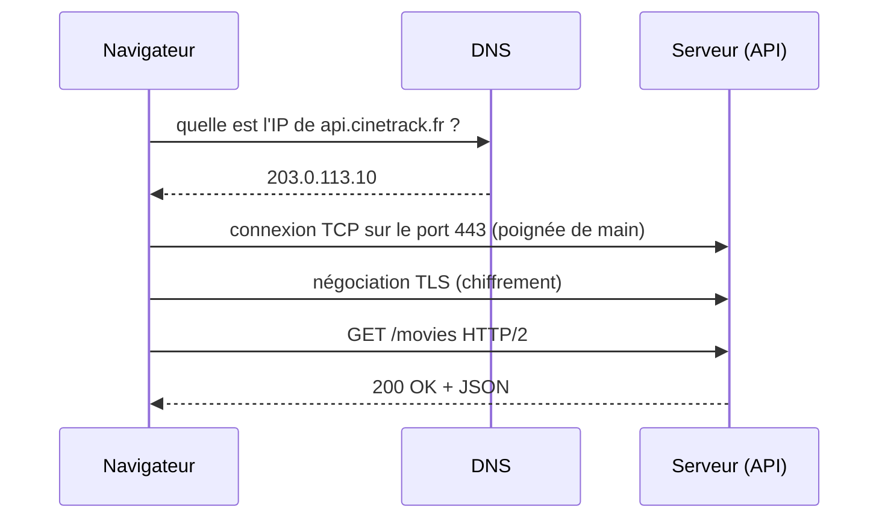

# Fondamentaux Réseau OSI et TCP/IP

> [!abstract] En bref
> Quand ton front appelle ton API, le message traverse plusieurs **couches**, chacune avec un rôle précis : trouver la machine (IP), transporter les données de façon fiable (TCP), comprendre le message (HTTP). Connaître ces couches aide à savoir **où** chercher quand « ça ne répond pas ».

## L'image : envoyer un colis

| Couche | Rôle | Colis | Exemple |
|---|---|---|---|
| **Application** | le contenu et sa langue | la lettre dans le colis | HTTP, DNS, SSH |
| **Transport** | livrer entier et dans l'ordre, au bon destinataire dans le bâtiment | le suivi, le numéro d'appartement | TCP, UDP + **port** |
| **Réseau** | trouver le chemin jusqu'à la bonne adresse | l'adresse postale | IP |
| **Liaison / physique** | le transport concret | le camion, la route | Wi-Fi, Ethernet, fibre |

## Le parcours d'une requête

1. **DNS** traduit le nom en adresse IP (voir [[NET-04-DNS|DNS]]).
2. **TCP** établit une connexion fiable (voir [[NET-03-TCP-vs-UDP|TCP et UDP]]).
3. **TLS** chiffre la communication (HTTPS, voir [[SEC-09-HTTPS-TLS|HTTPS]]).
4. **HTTP** transporte la requête et la réponse (voir [[NET-05-HTTP-Approfondi|HTTP]]).

## Le modèle OSI (7 couches)

On parle aussi du modèle **OSI**, plus détaillé. Tu l'entendras en entretien, retiens surtout :

| Couche OSI | Nom | Tu y trouves |
|---|---|---|
| 7 | Application | HTTP, DNS |
| 6 | Présentation | chiffrement, encodage (TLS) |
| 5 | Session | |
| 4 | Transport | TCP, UDP, ports |
| 3 | Réseau | IP, routeurs |
| 2 | Liaison | Ethernet, Wi-Fi, adresses MAC |
| 1 | Physique | câbles, ondes |

Un « load balancer de niveau 4 » travaille sur TCP ; « de niveau 7 », il lit les requêtes HTTP.

## Pourquoi ça t'est utile

Quand une requête échoue, demande-toi **quelle couche** coince :

| Symptôme | Couche probable | Outil |
|---|---|---|
| « nom introuvable » | DNS | `nslookup`, `dig` |
| « connexion refusée » / délai dépassé | réseau / transport (serveur éteint, port fermé, pare-feu) | `ping`, `curl -v` |
| erreur de certificat | TLS | le navigateur, `curl -v` |
| 404, 500, CORS | application (HTTP) | onglet Network, logs du serveur |

Voir [[NET-11-Outils-Diagnostic|Outils de diagnostic]].
