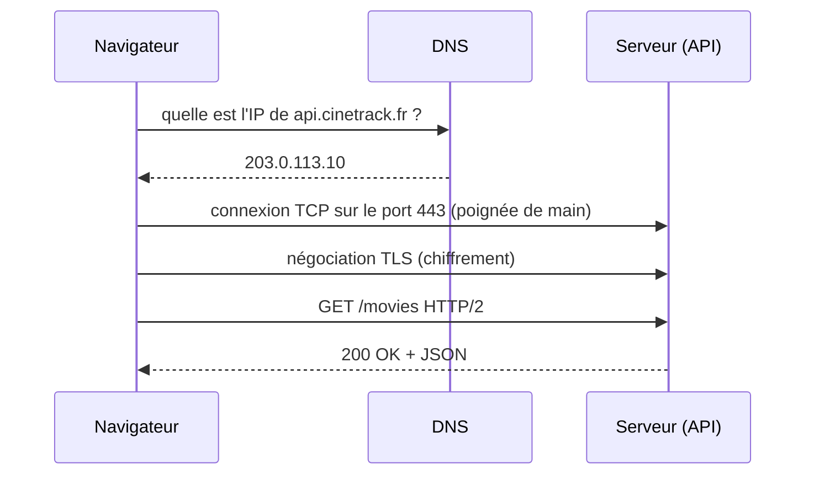

# Fondamentaux Réseau OSI et TCP/IP

> [!abstract] En bref
> Quand ton front appelle ton API, le message traverse plusieurs **couches**, chacune avec un rôle précis : trouver la machine (IP), transporter les données de façon fiable (TCP), comprendre le message (HTTP). Connaître ces couches aide à savoir **où** chercher quand « ça ne répond pas ».

## L'image : envoyer un colis

| Couche | Rôle | Colis | Exemple |
|---|---|---|---|
| **Application** | le contenu et sa langue | la lettre dans le colis | HTTP, DNS, SSH |
| **Transport** | livrer entier et dans l'ordre, au bon destinataire dans le bâtiment | le suivi, le numéro d'appartement | TCP, UDP + **port** |
| **Réseau** | trouver le chemin jusqu'à la bonne adresse | l'adresse postale | IP |
| **Liaison / physique** | le transport concret | le camion, la route | Wi-Fi, Ethernet, fibre |

## Le parcours d'une requête


```mermaid
sequenceDiagram
  participant N as Navigateur
  participant D as DNS
  participant S as Serveur (API)
  N->>D: quelle est l'IP de api.cinetrack.fr ?
  D-->>N: 203.0.113.10
  N->>S: connexion TCP sur le port 443 (poignée de main)
  N->>S: négociation TLS (chiffrement)
  N->>S: GET /movies HTTP/2
  S-->>N: 200 OK + JSON
```

1. **DNS** traduit le nom en adresse IP (voir [[NET-04-DNS|DNS]]).
2. **TCP** établit une connexion fiable (voir [[NET-03-TCP-vs-UDP|TCP et UDP]]).
3. **TLS** chiffre la communication (HTTPS, voir [[SEC-09-HTTPS-TLS|HTTPS]]).
4. **HTTP** transporte la requête et la réponse (voir [[NET-05-HTTP-Approfondi|HTTP]]).

## Le modèle OSI (7 couches)

On parle aussi du modèle **OSI**, plus détaillé. Tu l'entendras en entretien, retiens surtout :

| Couche OSI | Nom | Tu y trouves |
|---|---|---|
| 7 | Application | HTTP, DNS |
| 6 | Présentation | chiffrement, encodage (TLS) |
| 5 | Session | |
| 4 | Transport | TCP, UDP, ports |
| 3 | Réseau | IP, routeurs |
| 2 | Liaison | Ethernet, Wi-Fi, adresses MAC |
| 1 | Physique | câbles, ondes |

Un « load balancer de niveau 4 » travaille sur TCP ; « de niveau 7 », il lit les requêtes HTTP.

## Pourquoi ça t'est utile

Quand une requête échoue, demande-toi **quelle couche** coince :

| Symptôme | Couche probable | Outil |
|---|---|---|
| « nom introuvable » | DNS | `nslookup`, `dig` |
| « connexion refusée » / délai dépassé | réseau / transport (serveur éteint, port fermé, pare-feu) | `ping`, `curl -v` |
| erreur de certificat | TLS | le navigateur, `curl -v` |
| 404, 500, CORS | application (HTTP) | onglet Network, logs du serveur |

Voir [[NET-11-Outils-Diagnostic|Outils de diagnostic]].

## Pourquoi ça marche

Le réseau est découpé en couches pour que **chacune ne s'occupe que d'un problème** : trouver la machine (IP), livrer de façon fiable (TCP), comprendre le message (HTTP). Chaque couche s'appuie sur celle du dessous sans savoir comment elle fonctionne : HTTP ne se soucie pas de savoir si le message passe par le Wi-Fi ou la fibre.

Conséquence pratique : une couche ne peut marcher que si **toutes celles en dessous** marchent. Pour diagnostiquer, on vérifie donc de bas en haut : si le DNS échoue, inutile de chercher un problème dans le code HTTP.

## Contre-exemple

**Intuition fausse : « une erreur CORS, c'est un problème de réseau ».**

```text
Access to fetch at 'https://api.cinetrack.fr' has been blocked by CORS policy
```

Le DNS, TCP, TLS et HTTP ont **tous fonctionné** : la requête est partie et la réponse est revenue. C'est une règle de la couche **application** (le serveur n'a pas autorisé ton domaine), pas une panne réseau.

## Vérifie sans tes notes

Réponds de tête, à voix haute ou par écrit, **avant** d’ouvrir la réponse.

**1. Quel est le rôle de chacune des 4 couches simplifiées ?**

> [!check]- Réponse
> Application : le contenu (HTTP) ; transport : livrer entier et au bon programme (TCP, ports) ; réseau : trouver la machine (IP) ; liaison/physique : le transport concret (Wi-Fi, câble).

**2. Dans quel ordre se passent les étapes d'un appel `https://api.cinetrack.fr/movies` ?**

> [!check]- Réponse
> DNS (nom → IP), connexion TCP, négociation TLS, puis requête et réponse HTTP.

**3. Que travaille un load balancer « de niveau 7 » ?**

> [!check]- Réponse
> Il lit les requêtes HTTP (couche application), par exemple pour aiguiller selon l'URL.

## Exercices

> [!info] Comment t’entraîner
> 1. Cherche seul, sans regarder la note.
> 2. Bloqué ? Ouvre l’**indice 1**, puis l’**indice 2**.
> 3. Seulement ensuite, la **solution**.
> 4. Referme tout et **refais l’exercice sans regarder**.

### Exercice 1 · Quelle couche ?

Pour chaque symptôme, indique la couche en cause et l'outil pour vérifier :
1. `Could not resolve host: api.cinetrack.fr`
2. Le navigateur affiche « Votre connexion n'est pas privée » (certificat).
3. L'API répond `404` sur `/movie/42`.
4. `Connection timed out` en appelant le serveur.

> [!tip]- Indice 1
> Reprends le tableau « Symptôme / couche / outil » de la note.

> [!tip]- Indice 2
> Un nom introuvable concerne l'annuaire ; une réponse 404 prouve que tout le reste a fonctionné.

> [!success]- Solution
> 1. **DNS** (application) : `nslookup` ou `dig`.
> 2. **TLS** : le navigateur, `curl -v`.
> 3. **HTTP** (application) : l'URL est fausse ou la ressource n'existe pas → onglet Network, logs du serveur.
> 4. **Réseau / transport** : serveur éteint ou pare-feu → `ping`, `curl -v`.

### Exercice 2 · Le parcours d'une requête

Raconte, étape par étape et en une phrase chacune, ce qui se passe entre le moment où CinéTrack appelle `https://api.themoviedb.org/3/movie/popular` et l'affichage des films.

> [!tip]- Indice 1
> Il y a 4 étapes réseau avant que le JSON arrive, puis le traitement par le front.

> [!tip]- Indice 2
> Nom → adresse, connexion, chiffrement, requête / réponse.

> [!success]- Solution
> 1. **DNS** : le navigateur demande l'adresse IP de `api.themoviedb.org`.
> 2. **TCP** : il ouvre une connexion vers cette IP, sur le port 443.
> 3. **TLS** : ils négocient le chiffrement (HTTPS).
> 4. **HTTP** : le navigateur envoie `GET /3/movie/popular` ; le serveur répond `200` avec du JSON.
> 5. Le front lit le JSON et affiche les films.

### Transfert · Diagnostiquer de bas en haut

Un problème différent : il vérifie que tu as compris le principe, pas seulement l’exemple.

Ton collègue dit : « l'API de recette ne marche pas ». Tu as accès à un terminal. Décris, dans l'ordre, les vérifications que tu fais et ce que chacune t'apprend, jusqu'à trouver la couche en cause.

> [!tip]- Indice 1
> On part de la couche la plus basse : est-ce qu'on trouve la machine ?

> [!tip]- Indice 2
> Ensuite : la machine répond-elle, le port est-il ouvert, et que dit la réponse HTTP ?

> [!success]- Solution
> 1. `dig api.recette.fr +short` : le nom donne-t-il une IP ? Sinon → **DNS**.
> 2. `ping` (s'il n'est pas bloqué) : la machine répond-elle ? Sinon → réseau, pare-feu, serveur éteint.
> 3. `curl -v https://api.recette.fr/health` : connexion TCP ? TLS ? Quel code HTTP ?
> 4. Si la réponse est 5xx → lire les **logs de l'API** ; si 4xx → vérifier la requête envoyée.
>
> L'échec se trouve juste après la dernière étape qui a réussi.

## Je maîtrise quand…

Coche quand tu sais le faire **sans aide**. Une notion n’est maîtrisée que si les 6 cases sont cochées (voir [[Methode-du-coach|Méthode du coach]]).

- [ ] **Expliquer** : Expliquer le rôle des couches avec l'image du colis
- [ ] **Rappeler** : Dire de mémoire les étapes DNS, TCP, TLS, HTTP d'une requête
- [ ] **Utiliser** : Associer un symptôme à sa couche et à son outil
- [ ] **Résoudre un problème nouveau** : Prévoir quelles couches ont fonctionné quand on reçoit une erreur donnée
- [ ] **Repérer les erreurs** : Diagnostiquer une panne de bas en haut au lieu de deviner
- [ ] **Savoir quand ne pas l’utiliser** : Savoir quand le modèle OSI détaillé n'est pas utile au quotidien : les 4 couches suffisent
