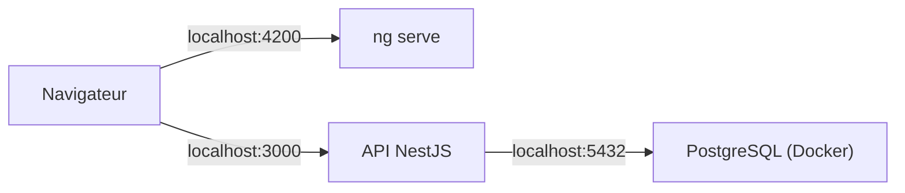

# Adresses IP et Ports

> [!abstract] En bref
> Une **adresse IP** identifie une **machine** sur un réseau (l'immeuble). Un **port** identifie un **programme** sur cette machine (l'appartement). `localhost:4200` = « ma propre machine, le programme qui écoute sur le port 4200 », c'est-à-dire ton `ng serve`.

## Les adresses IP

| Type | Exemple | Sens |
|---|---|---|
| IPv4 | `203.0.113.10` | 4 nombres de 0 à 255 |
| IPv6 | `2001:db8::1` | le format moderne, bien plus d'adresses |
| **localhost** | `127.0.0.1` / `::1` | **ta propre machine** |
| privée | `192.168.x.x`, `10.x.x.x`, `172.16-31.x.x` | réseau local (box, entreprise, Docker), invisible d'Internet |
| publique | le reste | visible sur Internet |
| `0.0.0.0` | | « écouter sur toutes les interfaces » (utile dans Docker) |

## Les ports

Un port est un numéro de 0 à 65535. Un programme **écoute** sur un port, et on l'appelle avec `adresse:port`.

| Port | Qui l'utilise |
|---|---|
| **80** | HTTP |
| **443** | HTTPS |
| **22** | SSH |
| **5432** | PostgreSQL |
| **6379** | Redis |
| **3000** | ton API NestJS (par convention) |
| **4200** | Angular (`ng serve`) |
| **5173** | Vite (Vue) |

`https://cinetrack.fr` utilise le port 443 sans l'écrire : c'est le port par défaut de HTTPS.

## En développement



Dans Docker, les conteneurs se parlent par leur **nom de service** (`db:5432`), pas par `localhost`. Voir [[DK-05-Reseaux|Réseaux Docker]].

## « Port déjà utilisé »

```text
Error: listen EADDRINUSE: address already in use :::3000
```

Un autre programme utilise déjà ce port (souvent une ancienne instance de ton API).

```bash
lsof -i :3000          # qui utilise le port 3000 ?
kill <PID>             # l'arrêter
```

Ou lance sur un autre port : `ng serve --port 4300`.

## Pièges

- **`localhost` dans un conteneur Docker** = le conteneur lui-même, pas ta machine.
- **Un serveur qui écoute sur `127.0.0.1`** dans un conteneur n'est pas joignable de l'extérieur : il doit écouter sur `0.0.0.0`.
- **Exposer une base de données sur une IP publique** : seuls les services internes doivent pouvoir s'y connecter.
