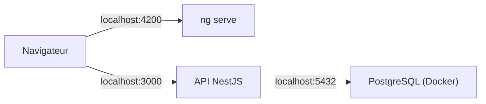

# Adresses IP et Ports

> [!abstract] En bref
> Une **adresse IP** identifie une **machine** sur un réseau (l'immeuble). Un **port** identifie un **programme** sur cette machine (l'appartement). `localhost:4200` = « ma propre machine, le programme qui écoute sur le port 4200 », c'est-à-dire ton `ng serve`.

## Les adresses IP

| Type | Exemple | Sens |
|---|---|---|
| IPv4 | `203.0.113.10` | 4 nombres de 0 à 255 |
| IPv6 | `2001:db8::1` | le format moderne, bien plus d'adresses |
| **localhost** | `127.0.0.1` / `::1` | **ta propre machine** |
| privée | `192.168.x.x`, `10.x.x.x`, `172.16-31.x.x` | réseau local (box, entreprise, Docker), invisible d'Internet |
| publique | le reste | visible sur Internet |
| `0.0.0.0` | | « écouter sur toutes les interfaces » (utile dans Docker) |

## Les ports

Un port est un numéro de 0 à 65535. Un programme **écoute** sur un port, et on l'appelle avec `adresse:port`.

| Port | Qui l'utilise |
|---|---|
| **80** | HTTP |
| **443** | HTTPS |
| **22** | SSH |
| **5432** | PostgreSQL |
| **6379** | Redis |
| **3000** | ton API NestJS (par convention) |
| **4200** | Angular (`ng serve`) |
| **5173** | Vite (Vue) |

`https://cinetrack.fr` utilise le port 443 sans l'écrire : c'est le port par défaut de HTTPS.

## En développement


```mermaid
flowchart LR
  N["Navigateur"] -->|"localhost:4200"| A["ng serve"]
  N -->|"localhost:3000"| B["API NestJS"]
  B -->|"localhost:5432"| P["PostgreSQL (Docker)"]
```

Dans Docker, les conteneurs se parlent par leur **nom de service** (`db:5432`), pas par `localhost`. Voir [[DK-05-Reseaux|Réseaux Docker]].

## « Port déjà utilisé »

```text
Error: listen EADDRINUSE: address already in use :::3000
```

Un autre programme utilise déjà ce port (souvent une ancienne instance de ton API).

```bash
lsof -i :3000          # qui utilise le port 3000 ?
kill <PID>             # l'arrêter
```

Ou lance sur un autre port : `ng serve --port 4300`.

## Pourquoi ça marche

Une machine peut faire tourner **plusieurs programmes réseau** en même temps (ton front, ton API, ta base). L'adresse IP amène les données à la bonne machine ; le **port** les amène au bon programme. Un seul programme peut écouter sur un port donné : d'où l'erreur « port déjà utilisé ».

`127.0.0.1` (localhost) est une adresse spéciale qui **ne sort jamais** de la machine : chaque machine (et chaque conteneur) a son propre localhost. Écouter sur `0.0.0.0` signifie « accepter les connexions venant de toutes les interfaces », y compris de l'extérieur.

## Contre-exemple

**Intuition fausse : « `localhost` désigne toujours mon PC ».**

```text
Ton navigateur      → localhost:3000  = ton PC
Un conteneur Docker → localhost:3000  = le conteneur lui-même
Le serveur de prod  → localhost:3000  = le serveur
```

`localhost` désigne toujours **la machine sur laquelle le code s'exécute**, pas celle où tu l'as écrit.

## Pièges

- **`localhost` dans un conteneur Docker** = le conteneur lui-même, pas ta machine.
- **Un serveur qui écoute sur `127.0.0.1`** dans un conteneur n'est pas joignable de l'extérieur : il doit écouter sur `0.0.0.0`.
- **Exposer une base de données sur une IP publique** : seuls les services internes doivent pouvoir s'y connecter.

## Vérifie sans tes notes

Réponds de tête, à voix haute ou par écrit, **avant** d’ouvrir la réponse.

**1. Quelle différence entre une adresse IP et un port ?**

> [!check]- Réponse
> L'IP identifie la machine (l'immeuble), le port identifie le programme sur cette machine (l'appartement).

**2. Quels sont les ports de HTTPS, SSH et PostgreSQL ?**

> [!check]- Réponse
> 443, 22 et 5432.

**3. Que signifie `EADDRINUSE` ?**

> [!check]- Réponse
> Le port est déjà utilisé par un autre programme (souvent une ancienne instance de ton serveur).

## Exercices

> [!info] Comment t’entraîner
> 1. Cherche seul, sans regarder la note.
> 2. Bloqué ? Ouvre l’**indice 1**, puis l’**indice 2**.
> 3. Seulement ensuite, la **solution**.
> 4. Referme tout et **refais l’exercice sans regarder**.

### Exercice 1 · Les bons ports

Complète l'adresse pour chaque cas, en développement sur ta machine :
1. ton front Angular lancé avec `ng serve` ;
2. ton front Vue lancé avec Vite ;
3. ton API NestJS ;
4. PostgreSQL lancé dans Docker avec `-p 5432:5432` ;
5. Redis lancé dans Docker avec `-p 6380:6379`.

> [!tip]- Indice 1
> Les ports par défaut sont dans le tableau de la note.

> [!tip]- Indice 2
> Avec Docker, depuis ta machine, c'est le **premier** nombre de `-p` qui compte (machine:conteneur).

> [!success]- Solution
> 1. `localhost:4200`
> 2. `localhost:5173`
> 3. `localhost:3000`
> 4. `localhost:5432`
> 5. `localhost:6380` (le port 6379 est celui **dans** le conteneur)

### Exercice 2 · Le port déjà pris

Tu lances ton API et tu obtiens `Error: listen EADDRINUSE: address already in use :::3000`. Écris les commandes pour trouver le programme qui utilise le port, puis l'arrêter. Donne aussi une solution sans l'arrêter.

> [!tip]- Indice 1
> Il existe une commande qui liste le programme qui écoute sur un port précis.

> [!tip]- Indice 2
> `lsof -i :3000` donne un numéro de processus (PID) ; une autre commande arrête un processus avec son PID.

> [!success]- Solution
> ```bash
> lsof -i :3000     # repère le PID dans la colonne PID
> kill <PID>
> ```
>
> Sans l'arrêter : lancer ton API sur un autre port (par exemple `PORT=3001`).

### Transfert · Tester sur ton téléphone

Un problème différent : il vérifie que tu as compris le principe, pas seulement l’exemple.

Tu veux ouvrir ton front Vite (qui tourne sur ton PC) depuis ton téléphone, connecté au même Wi-Fi. `http://localhost:5173` ne marche pas sur le téléphone. Pourquoi, et que faire ?

> [!tip]- Indice 1
> Sur le téléphone, `localhost` désigne quelle machine ?

> [!tip]- Indice 2
> Il faut que Vite écoute sur toutes les interfaces, puis utiliser l'IP de ton PC sur le réseau local.

> [!success]- Solution
> Sur le téléphone, `localhost` = **le téléphone**, pas ton PC.
>
> 1. Lancer Vite en écoutant sur toutes les interfaces : `npm run dev -- --host`.
> 2. Trouver l'IP locale du PC (Vite l'affiche, par exemple `192.168.1.20`).
> 3. Ouvrir `http://192.168.1.20:5173` sur le téléphone.

## Je maîtrise quand…

Coche quand tu sais le faire **sans aide**. Une notion n’est maîtrisée que si les 6 cases sont cochées (voir [[Methode-du-coach|Méthode du coach]]).

- [ ] **Expliquer** : Expliquer la différence entre IP et port avec l'image de l'immeuble
- [ ] **Rappeler** : Dire de mémoire les ports courants (80, 443, 22, 5432, 3000, 4200, 5173)
- [ ] **Utiliser** : Trouver et libérer un port déjà utilisé sans aide
- [ ] **Résoudre un problème nouveau** : Prévoir ce que désigne `localhost` selon l'endroit où le code s'exécute
- [ ] **Repérer les erreurs** : Repérer un service qui écoute sur 127.0.0.1 alors qu'il doit être joignable
- [ ] **Savoir quand ne pas l’utiliser** : Savoir quand ne pas exposer un port : base de données sur une IP publique
