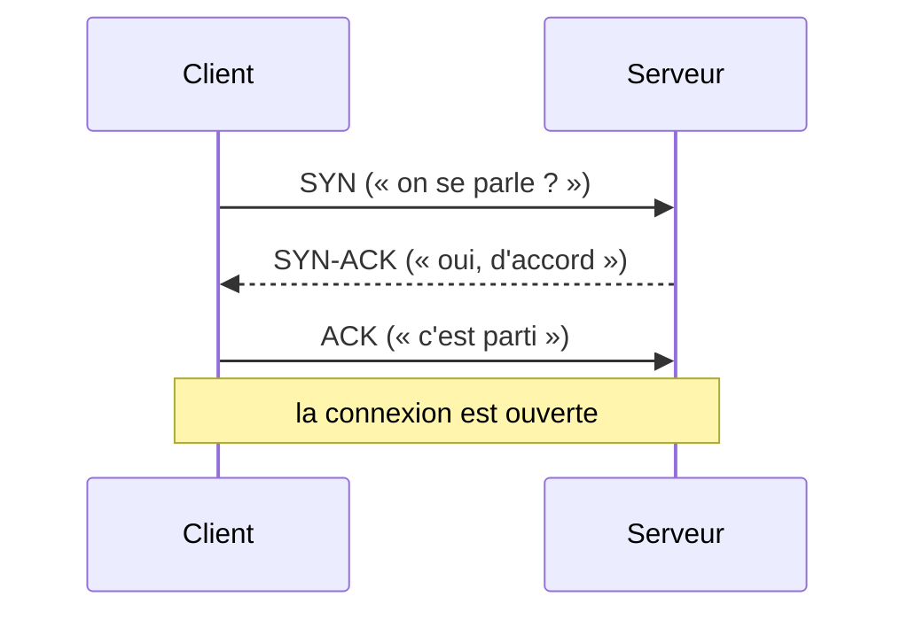

# TCP vs UDP

> [!abstract] En bref
> Deux façons de transporter des données. **TCP** vérifie que **tout arrive, en entier et dans l'ordre** (utilisé par le web, HTTP, les bases de données). **UDP** envoie **vite, sans vérifier** (utilisé pour la vidéo en direct, les jeux, les appels). Tes applications web utilisent TCP.

## L'image

- **TCP** = une **lettre recommandée** avec accusé de réception : plus lent, mais garanti.
- **UDP** = un **haut-parleur** : rapide, mais si quelqu'un n'a pas entendu, tant pis.

## La comparaison

| | TCP | UDP |
|---|---|---|
| Connexion préalable | oui (poignée de main) | non |
| Tout arrive | **garanti** (renvoi si perte) | pas garanti |
| Dans l'ordre | **garanti** | pas garanti |
| Vitesse | plus lent | plus rapide |
| Utilisé par | HTTP/1.1, HTTP/2, SSH, PostgreSQL, WebSocket | DNS, visio, jeux en ligne, streaming live, **HTTP/3 (QUIC)** |

## La poignée de main TCP

Avant d'échanger, les deux machines se mettent d'accord :

Cet aller-retour prend du temps : c'est pour ça qu'on **réutilise** les connexions (HTTP garde la connexion ouverte, les ORM utilisent un *pool* de connexions à la base).

## Et HTTP/3 ?

HTTP/3 fonctionne sur **QUIC**, un protocole construit sur UDP qui réimplémente la fiabilité de façon plus rapide (moins d'allers-retours, meilleur sur mobile). Voir [[NET-07-HTTP2-HTTP3|HTTP/2 et HTTP/3]].

## Ce que tu dois retenir

- Le web, tes API et tes bases utilisent **TCP**.
- Les « connexion refusée » et « délai dépassé » sont des erreurs de connexion TCP : le serveur n'écoute pas, ou un pare-feu bloque.
