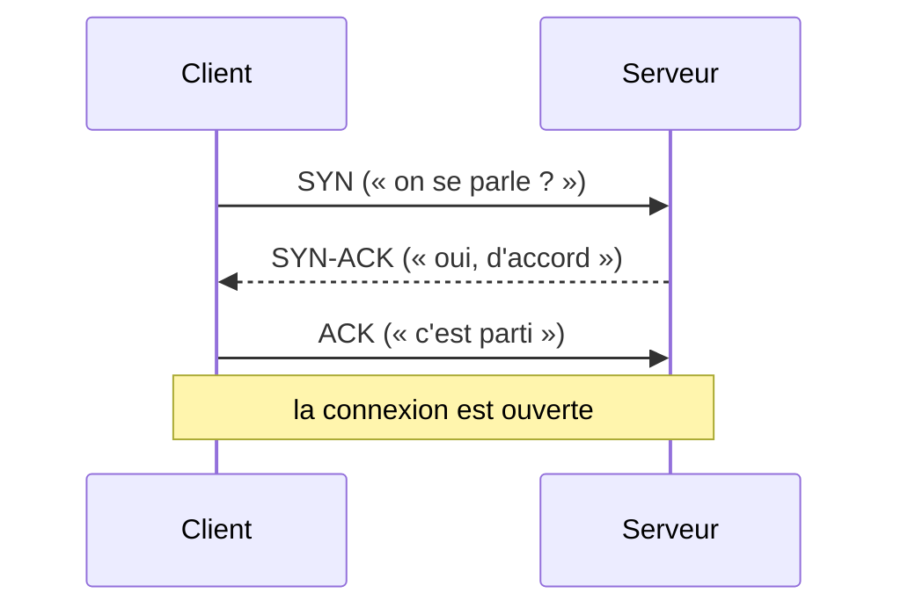

# TCP vs UDP

> [!abstract] En bref
> Deux façons de transporter des données. **TCP** vérifie que **tout arrive, en entier et dans l'ordre** (utilisé par le web, HTTP, les bases de données). **UDP** envoie **vite, sans vérifier** (utilisé pour la vidéo en direct, les jeux, les appels). Tes applications web utilisent TCP.

## L'image

- **TCP** = une **lettre recommandée** avec accusé de réception : plus lent, mais garanti.
- **UDP** = un **haut-parleur** : rapide, mais si quelqu'un n'a pas entendu, tant pis.

## La comparaison

| | TCP | UDP |
|---|---|---|
| Connexion préalable | oui (poignée de main) | non |
| Tout arrive | **garanti** (renvoi si perte) | pas garanti |
| Dans l'ordre | **garanti** | pas garanti |
| Vitesse | plus lent | plus rapide |
| Utilisé par | HTTP/1.1, HTTP/2, SSH, PostgreSQL, WebSocket | DNS, visio, jeux en ligne, streaming live, **HTTP/3 (QUIC)** |

## La poignée de main TCP

Avant d'échanger, les deux machines se mettent d'accord :


```mermaid
sequenceDiagram
  participant C as Client
  participant S as Serveur
  C->>S: SYN (« on se parle ? »)
  S-->>C: SYN-ACK (« oui, d'accord »)
  C->>S: ACK (« c'est parti »)
  Note over C,S: la connexion est ouverte
```

Cet aller-retour prend du temps : c'est pour ça qu'on **réutilise** les connexions (HTTP garde la connexion ouverte, les ORM utilisent un *pool* de connexions à la base).

## Et HTTP/3 ?

HTTP/3 fonctionne sur **QUIC**, un protocole construit sur UDP qui réimplémente la fiabilité de façon plus rapide (moins d'allers-retours, meilleur sur mobile). Voir [[NET-07-HTTP2-HTTP3|HTTP/2 et HTTP/3]].

## Ce que tu dois retenir

- Le web, tes API et tes bases utilisent **TCP**.
- Les « connexion refusée » et « délai dépassé » sont des erreurs de connexion TCP : le serveur n'écoute pas, ou un pare-feu bloque.

## Pourquoi ça marche

Sur Internet, des paquets se **perdent** ou arrivent **dans le désordre**. TCP numérote chaque paquet, attend un accusé de réception et renvoie ce qui manque : c'est fiable, mais chaque vérification coûte du temps.

UDP ne vérifie rien : il envoie et continue. Pour une visio, un paquet en retard ne sert plus à rien (l'image est déjà passée) : mieux vaut le perdre que tout ralentir.

La **poignée de main** (SYN, SYN-ACK, ACK) ajoute un aller-retour avant chaque nouvelle connexion : d'où l'intérêt de **réutiliser** les connexions (pool de connexions à la base, connexion HTTP gardée ouverte).

## Contre-exemple

**Intuition fausse : « UDP est forcément moins bien, car il perd des données ».**

```text
Appel vidéo avec TCP : un paquet perdu → tout attend son renvoi → l'image se fige
Appel vidéo avec UDP : un paquet perdu → une image un peu dégradée → l'appel continue
```

Pour le temps réel, la **rapidité** compte plus que la perfection. Et HTTP/3 utilise UDP (via QUIC), en réimplémentant la fiabilité de façon plus rapide.

## Vérifie sans tes notes

Réponds de tête, à voix haute ou par écrit, **avant** d’ouvrir la réponse.

**1. Que garantit TCP que UDP ne garantit pas ?**

> [!check]- Réponse
> Que tout arrive, en entier et dans l'ordre (avec renvoi des paquets perdus).

**2. Quelles sont les 3 étapes de la poignée de main TCP ?**

> [!check]- Réponse
> SYN (« on se parle ? »), SYN-ACK (« oui »), ACK (« c'est parti »).

**3. Sur quoi fonctionne HTTP/3 ?**

> [!check]- Réponse
> Sur QUIC, un protocole construit sur UDP.

## Exercices

> [!info] Comment t’entraîner
> 1. Cherche seul, sans regarder la note.
> 2. Bloqué ? Ouvre l’**indice 1**, puis l’**indice 2**.
> 3. Seulement ensuite, la **solution**.
> 4. Referme tout et **refais l’exercice sans regarder**.

### Exercice 1 · TCP ou UDP ?

Pour chaque usage, dis s'il utilise TCP ou UDP, et pourquoi :
1. ton API NestJS ;
2. un appel vidéo ;
3. une requête DNS simple ;
4. la connexion de Prisma à PostgreSQL ;
5. un jeu en ligne rapide.

> [!tip]- Indice 1
> Question à se poser : vaut-il mieux tout recevoir dans l'ordre, ou recevoir vite ?

> [!tip]- Indice 2
> Les données d'une base ou d'une API ne doivent jamais arriver incomplètes.

> [!success]- Solution
> 1. **TCP** : la réponse doit être complète.
> 2. **UDP** : la rapidité compte plus qu'une image parfaite.
> 3. **UDP** : une petite question, une petite réponse, on redemande si besoin.
> 4. **TCP** : les données de la base doivent être exactes.
> 5. **UDP** : un retard est pire qu'une perte.

### Exercice 2 · Pourquoi un pool de connexions ?

Prisma garde plusieurs connexions ouvertes vers PostgreSQL au lieu d'en ouvrir une nouvelle à chaque requête. Explique pourquoi, avec ce que tu sais de TCP.

> [!tip]- Indice 1
> Que faut-il faire avant d'échanger des données sur une nouvelle connexion TCP ?

> [!tip]- Indice 2
> La poignée de main ajoute un aller-retour (et la base doit aussi authentifier la connexion).

> [!success]- Solution
> Ouvrir une connexion TCP demande une **poignée de main** (un aller-retour), plus l'authentification auprès de la base. Le refaire à chaque requête ajouterait ce délai partout.
>
> Un **pool** garde des connexions déjà ouvertes et les réutilise : les requêtes partent tout de suite.

### Transfert · Connexion refusée ou délai dépassé

Un problème différent : il vérifie que tu as compris le principe, pas seulement l’exemple.

Ton API n'arrive pas à joindre la base. Dans un cas, l'erreur arrive **immédiatement** : `Connection refused`. Dans un autre, elle arrive **après 30 secondes** : `Connection timed out`. Que t'apprend chaque message sur ce qui se passe au niveau TCP ?

> [!tip]- Indice 1
> Dans un cas, la machine a répondu « non » ; dans l'autre, personne n'a répondu.

> [!tip]- Indice 2
> Un pare-feu qui ignore les paquets ne renvoie rien ; une machine sans programme sur ce port répond « refusé ».

> [!success]- Solution
> - **`Connection refused`** (immédiat) : la machine est joignable et a **répondu** que rien n'écoute sur ce port → service arrêté, mauvais port, ou écoute sur 127.0.0.1.
> - **`Connection timed out`** (après un délai) : **aucune réponse** à la poignée de main → pare-feu qui bloque, mauvaise adresse IP, machine injoignable.

## Je maîtrise quand…

Coche quand tu sais le faire **sans aide**. Une notion n’est maîtrisée que si les 6 cases sont cochées (voir [[Methode-du-coach|Méthode du coach]]).

- [ ] **Expliquer** : Expliquer la différence entre TCP et UDP avec l'image de la lettre recommandée et du haut-parleur
- [ ] **Rappeler** : Dire de mémoire les étapes de la poignée de main TCP
- [ ] **Utiliser** : Choisir TCP ou UDP pour un usage donné et le justifier
- [ ] **Résoudre un problème nouveau** : Prévoir le coût d'ouvrir une nouvelle connexion à chaque requête
- [ ] **Repérer les erreurs** : Distinguer une connexion refusée d'un délai dépassé
- [ ] **Savoir quand ne pas l’utiliser** : Savoir quand UDP est le meilleur choix malgré la perte de données
