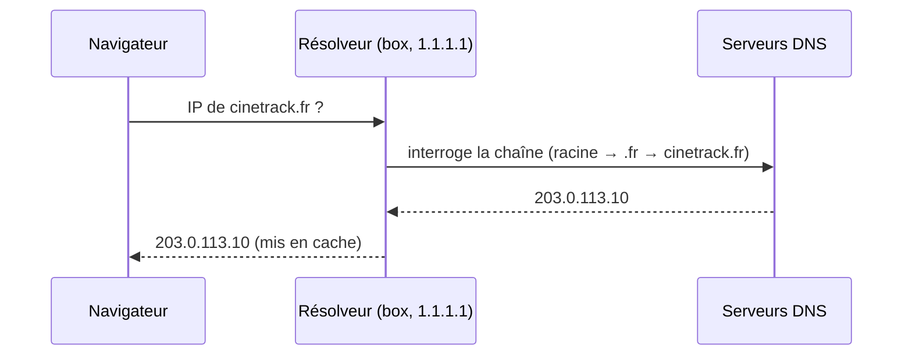

# DNS

> [!abstract] En bref
> Le **DNS** est l'**annuaire** d'Internet : il traduit un nom lisible (`cinetrack.fr`) en adresse IP (`203.0.113.10`). Tu t'en occuperas en mettant tes projets en ligne : relier ton nom de domaine à ton hébergeur.

## Le fonctionnement



La réponse est gardée en **cache** pendant une durée appelée **TTL** : c'est pour ça qu'un changement DNS peut mettre de quelques minutes à quelques heures à être visible partout.

## Les enregistrements à connaître

| Type | Sert à | Exemple |
|---|---|---|
| **A** | nom → adresse IPv4 | `cinetrack.fr → 203.0.113.10` |
| **AAAA** | nom → adresse IPv6 | |
| **CNAME** | nom → **autre nom** (alias) | `www.cinetrack.fr → cinetrack.fr` |
| **MX** | serveurs d'e-mail | |
| **TXT** | texte libre (vérification de domaine, sécurité e-mail) | preuve de propriété pour GitLab Pages |

## Mettre ton Portfolio sur ton nom de domaine

1. Achète un domaine (OVH, Gandi, Cloudflare…).
2. Chez ton hébergeur (GitLab Pages, Netlify…), ajoute ton domaine : il te donne une adresse IP ou un nom cible.
3. Chez le registraire, crée l'enregistrement **A** (vers l'IP) ou **CNAME** (vers le nom cible).
4. Ajoute le **TXT** de vérification si l'hébergeur le demande.
5. Attends la propagation, puis active le **HTTPS** (souvent automatique).

## Vérifier

```bash
nslookup cinetrack.fr
dig cinetrack.fr +short
dig www.cinetrack.fr CNAME
```

## En développement

Le fichier `hosts` permet de forcer un nom vers une IP sur ta machine (`/etc/hosts` sous Linux / WSL, `C:\Windows\System32\drivers\etc\hosts` sous Windows).

## Pièges

- **« Le site ne marche pas »** juste après une modification DNS : c'est souvent le cache. Attends, ou teste avec `dig @1.1.1.1`.
- **Un CNAME à la racine du domaine** (`cinetrack.fr` sans `www`) : interdit par la norme ; certains fournisseurs proposent un équivalent (ALIAS / flattening).
