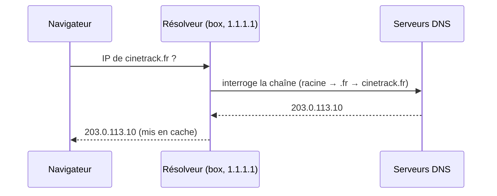

# DNS

> [!abstract] En bref
> Le **DNS** est l'**annuaire** d'Internet : il traduit un nom lisible (`cinetrack.fr`) en adresse IP (`203.0.113.10`). Tu t'en occuperas en mettant tes projets en ligne : relier ton nom de domaine à ton hébergeur.

## Le fonctionnement


```mermaid
sequenceDiagram
  participant N as Navigateur
  participant R as Résolveur (box, 1.1.1.1)
  participant A as Serveurs DNS
  N->>R: IP de cinetrack.fr ?
  R->>A: interroge la chaîne (racine → .fr → cinetrack.fr)
  A-->>R: 203.0.113.10
  R-->>N: 203.0.113.10 (mis en cache)
```

La réponse est gardée en **cache** pendant une durée appelée **TTL** : c'est pour ça qu'un changement DNS peut mettre de quelques minutes à quelques heures à être visible partout.

## Les enregistrements à connaître

| Type | Sert à | Exemple |
|---|---|---|
| **A** | nom → adresse IPv4 | `cinetrack.fr → 203.0.113.10` |
| **AAAA** | nom → adresse IPv6 | |
| **CNAME** | nom → **autre nom** (alias) | `www.cinetrack.fr → cinetrack.fr` |
| **MX** | serveurs d'e-mail | |
| **TXT** | texte libre (vérification de domaine, sécurité e-mail) | preuve de propriété pour GitLab Pages |

## Mettre ton Portfolio sur ton nom de domaine

1. Achète un domaine (OVH, Gandi, Cloudflare…).
2. Chez ton hébergeur (GitLab Pages, Netlify…), ajoute ton domaine : il te donne une adresse IP ou un nom cible.
3. Chez le registraire, crée l'enregistrement **A** (vers l'IP) ou **CNAME** (vers le nom cible).
4. Ajoute le **TXT** de vérification si l'hébergeur le demande.
5. Attends la propagation, puis active le **HTTPS** (souvent automatique).

## Vérifier

```bash
nslookup cinetrack.fr
dig cinetrack.fr +short
dig www.cinetrack.fr CNAME
```

## En développement

Le fichier `hosts` permet de forcer un nom vers une IP sur ta machine (`/etc/hosts` sous Linux / WSL, `C:\Windows\System32\drivers\etc\hosts` sous Windows).

## Pourquoi ça marche

Les machines communiquent avec des **adresses IP**, mais personne ne retient `203.0.113.10`. Le DNS fait le lien entre un **nom** stable et une **adresse** qui peut changer : si ton site change d'hébergeur, tu modifies l'enregistrement, et le nom reste le même.

Pour éviter de redemander sans arrêt, chaque réponse est mise en **cache** pendant sa durée de vie (TTL). C'est efficace… mais c'est aussi pour ça qu'un changement met du temps à être vu partout : les anciens résolveurs gardent l'ancienne réponse jusqu'à la fin du TTL.

## Contre-exemple

**Intuition fausse : « j'ai modifié mon DNS, si le site ne s'affiche pas, c'est que c'est mal configuré ».**

```bash
dig cinetrack.fr +short            # ancienne IP (ton résolveur a encore l'ancienne réponse en cache)
dig @1.1.1.1 cinetrack.fr +short   # nouvelle IP
```

La configuration est peut-être correcte : c'est le **cache** qui n'a pas encore expiré.

## Pièges

- **« Le site ne marche pas »** juste après une modification DNS : c'est souvent le cache. Attends, ou teste avec `dig @1.1.1.1`.
- **Un CNAME à la racine du domaine** (`cinetrack.fr` sans `www`) : interdit par la norme ; certains fournisseurs proposent un équivalent (ALIAS / flattening).

## Vérifie sans tes notes

Réponds de tête, à voix haute ou par écrit, **avant** d’ouvrir la réponse.

**1. Quelle différence entre un enregistrement A et un enregistrement CNAME ?**

> [!check]- Réponse
> A associe un nom à une adresse IPv4 ; CNAME associe un nom à un autre nom (alias).

**2. Qu'est-ce que le TTL ?**

> [!check]- Réponse
> La durée pendant laquelle une réponse DNS peut être gardée en cache.

**3. À quoi sert le fichier `hosts` ?**

> [!check]- Réponse
> À forcer, sur ta machine seulement, un nom vers une IP précise.

## Exercices

> [!info] Comment t’entraîner
> 1. Cherche seul, sans regarder la note.
> 2. Bloqué ? Ouvre l’**indice 1**, puis l’**indice 2**.
> 3. Seulement ensuite, la **solution**.
> 4. Referme tout et **refais l’exercice sans regarder**.

### Exercice 1 · Choisir l'enregistrement

Quel enregistrement DNS crées-tu ?
1. `cinetrack.fr` doit pointer vers le serveur `203.0.113.10`.
2. `www.cinetrack.fr` doit pointer vers `cinetrack.fr`.
3. GitLab Pages demande de prouver que tu possèdes le domaine avec un texte de vérification.
4. `docs.cinetrack.fr` doit pointer vers `mon-projet.netlify.app`.

> [!tip]- Indice 1
> Vers une adresse IP, ou vers un autre nom ?

> [!tip]- Indice 2
> La preuve de propriété se fait avec un enregistrement de texte libre.

> [!success]- Solution
> 1. **A** : `cinetrack.fr → 203.0.113.10`
> 2. **CNAME** : `www → cinetrack.fr`
> 3. **TXT** : le texte donné par GitLab
> 4. **CNAME** : `docs → mon-projet.netlify.app`

### Exercice 2 · Vérifier un domaine

Écris les commandes pour : obtenir seulement l'IP de `cinetrack.fr`, voir vers quoi pointe le CNAME de `www.cinetrack.fr`, et interroger directement le résolveur `1.1.1.1` pour contourner ton cache.

> [!tip]- Indice 1
> Tout se fait avec `dig`.

> [!tip]- Indice 2
> `+short` pour une réponse courte, le type (`CNAME`) après le nom, et `@serveur` pour choisir le résolveur.

> [!success]- Solution
> ```bash
> dig cinetrack.fr +short
> dig www.cinetrack.fr CNAME +short
> dig @1.1.1.1 cinetrack.fr +short
> ```

### Transfert · Le site d'un collègue mais pas le tien

Un problème différent : il vérifie que tu as compris le principe, pas seulement l’exemple.

Tu viens de changer l'IP de `cinetrack.fr` chez ton registraire. Ton collègue voit déjà la nouvelle version du site, toi encore l'ancienne. Explique pourquoi, et donne deux façons de voir la nouvelle version tout de suite.

> [!tip]- Indice 1
> Ton résolveur et celui de ton collègue n'ont pas forcément interrogé le DNS au même moment.

> [!tip]- Indice 2
> On peut interroger un autre résolveur, ou forcer le nom localement.

> [!success]- Solution
> Ton résolveur (ou ton navigateur) a encore **l'ancienne réponse en cache**, tant que son TTL n'est pas expiré ; celui de ton collègue a récupéré la nouvelle.
>
> 1. Vérifier avec un autre résolveur : `dig @1.1.1.1 cinetrack.fr +short`, ou changer temporairement de DNS.
> 2. Forcer le nom dans ton fichier `hosts` : `203.0.113.20 cinetrack.fr` (à retirer ensuite).
>
> Sinon, attendre la fin du TTL. Astuce pour la prochaine fois : baisser le TTL quelques heures **avant** un changement.

## Je maîtrise quand…

Coche quand tu sais le faire **sans aide**. Une notion n’est maîtrisée que si les 6 cases sont cochées (voir [[Methode-du-coach|Méthode du coach]]).

- [ ] **Expliquer** : Expliquer à quoi sert le DNS et pourquoi les changements mettent du temps
- [ ] **Rappeler** : Dire de mémoire les enregistrements A, AAAA, CNAME, MX, TXT
- [ ] **Utiliser** : Relier un nom de domaine à un hébergeur sans tutoriel
- [ ] **Résoudre un problème nouveau** : Prévoir l'effet du cache et du TTL après une modification
- [ ] **Repérer les erreurs** : Vérifier un domaine avec `dig` et repérer un problème de cache
- [ ] **Savoir quand ne pas l’utiliser** : Savoir quand un CNAME ne peut pas être utilisé : à la racine du domaine
