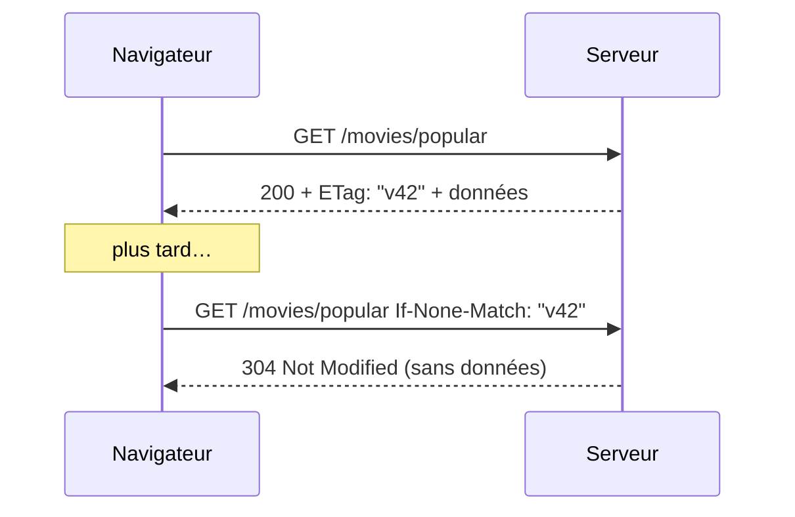

# Cookies et Cache HTTP

> [!abstract] En bref
> Deux mécanismes HTTP que tu croiseras souvent. Les **cookies** : de petites données que le navigateur **renvoie automatiquement** au serveur à chaque requête (idéal pour une session). Le **cache** : le navigateur **garde une copie** d'une réponse pour ne pas la redemander (le site charge plus vite).

## Les cookies

Le serveur dépose un cookie avec une réponse :

```http
Set-Cookie: refresh_token=abc123; HttpOnly; Secure; SameSite=Lax; Path=/auth; Max-Age=604800
```

Le navigateur le renvoie ensuite **tout seul** sur les requêtes concernées :

```http
Cookie: refresh_token=abc123
```

| Option | Effet | Pourquoi |
|---|---|---|
| `HttpOnly` | JavaScript ne peut pas le lire | un script malveillant (XSS) ne peut pas le voler |
| `Secure` | envoyé seulement en HTTPS | pas lisible sur un Wi-Fi public |
| `SameSite=Lax` / `Strict` | pas envoyé depuis un autre site | protège contre le CSRF |
| `Max-Age` / `Expires` | durée de vie | |
| `Path` / `Domain` | sur quelles URL il est envoyé | |

Pour un jeton de connexion, ces trois options (`HttpOnly`, `Secure`, `SameSite`) sont indispensables. Voir [[SEC-06-XSS-CSRF|XSS et CSRF]] et [[JS-11-Stockage-Navigateur|Stockage navigateur]].

## Le cache HTTP

Le serveur dit au navigateur combien de temps il peut garder une réponse :

| En-tête | Sens | Pour |
|---|---|---|
| `Cache-Control: public, max-age=31536000, immutable` | garde-le 1 an, ne redemande jamais | fichiers avec empreinte (`main-4f3a2b.js`) |
| `Cache-Control: no-cache` | garde-le, mais **vérifie** à chaque fois s'il a changé | `index.html` |
| `Cache-Control: no-store` | ne garde **rien** | données sensibles, réponses privées |
| `Cache-Control: private, max-age=60` | seulement le navigateur, 1 minute | données d'un utilisateur |

### La vérification avec ETag



Si rien n'a changé, le serveur répond `304` sans renvoyer les données : économie de bande passante.

## La stratégie classique d'une application Angular / Vue

- Fichiers JS / CSS avec empreinte dans le nom : **cache 1 an** (le nom change à chaque build).
- `index.html` : **`no-cache`**, pour que les utilisateurs récupèrent toujours la dernière version.
- Réponses de l'API : au cas par cas, souvent `no-store` pour les données privées.

## Pièges

- **« J'ai déployé mais les utilisateurs voient l'ancienne version »** : `index.html` mis en cache trop longtemps.
- **Un cookie de session sans `HttpOnly`** : lisible et volable par un script.
- **Mettre en cache public une réponse personnelle** : un proxy pourrait la servir à quelqu'un d'autre.
