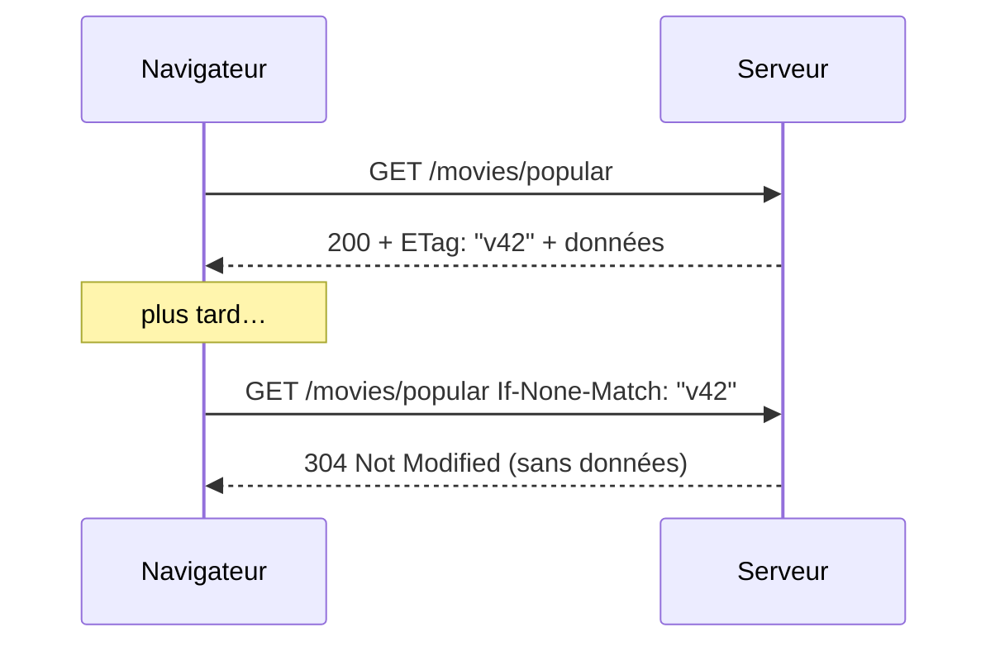

# Cookies et Cache HTTP

> [!abstract] En bref
> Deux mécanismes HTTP que tu croiseras souvent. Les **cookies** : de petites données que le navigateur **renvoie automatiquement** au serveur à chaque requête (idéal pour une session). Le **cache** : le navigateur **garde une copie** d'une réponse pour ne pas la redemander (le site charge plus vite).

## Les cookies

Le serveur dépose un cookie avec une réponse :

```http
Set-Cookie: refresh_token=abc123; HttpOnly; Secure; SameSite=Lax; Path=/auth; Max-Age=604800
```

Le navigateur le renvoie ensuite **tout seul** sur les requêtes concernées :

```http
Cookie: refresh_token=abc123
```

| Option | Effet | Pourquoi |
|---|---|---|
| `HttpOnly` | JavaScript ne peut pas le lire | un script malveillant (XSS) ne peut pas le voler |
| `Secure` | envoyé seulement en HTTPS | pas lisible sur un Wi-Fi public |
| `SameSite=Lax` / `Strict` | pas envoyé depuis un autre site | protège contre le CSRF |
| `Max-Age` / `Expires` | durée de vie | |
| `Path` / `Domain` | sur quelles URL il est envoyé | |

Pour un jeton de connexion, ces trois options (`HttpOnly`, `Secure`, `SameSite`) sont indispensables. Voir [[SEC-06-XSS-CSRF|XSS et CSRF]] et [[JS-11-Stockage-Navigateur|Stockage navigateur]].

## Le cache HTTP

Le serveur dit au navigateur combien de temps il peut garder une réponse :

| En-tête | Sens | Pour |
|---|---|---|
| `Cache-Control: public, max-age=31536000, immutable` | garde-le 1 an, ne redemande jamais | fichiers avec empreinte (`main-4f3a2b.js`) |
| `Cache-Control: no-cache` | garde-le, mais **vérifie** à chaque fois s'il a changé | `index.html` |
| `Cache-Control: no-store` | ne garde **rien** | données sensibles, réponses privées |
| `Cache-Control: private, max-age=60` | seulement le navigateur, 1 minute | données d'un utilisateur |

### La vérification avec ETag


```mermaid
sequenceDiagram
  participant N as Navigateur
  participant S as Serveur
  N->>S: GET /movies/popular
  S-->>N: 200 + ETag: "v42" + données
  Note over N: plus tard…
  N->>S: GET /movies/popular  If-None-Match: "v42"
  S-->>N: 304 Not Modified (sans données)
```

Si rien n'a changé, le serveur répond `304` sans renvoyer les données : économie de bande passante.

## La stratégie classique d'une application Angular / Vue

- Fichiers JS / CSS avec empreinte dans le nom : **cache 1 an** (le nom change à chaque build).
- `index.html` : **`no-cache`**, pour que les utilisateurs récupèrent toujours la dernière version.
- Réponses de l'API : au cas par cas, souvent `no-store` pour les données privées.

## Pourquoi ça marche

Comme HTTP est sans mémoire, le serveur a besoin d'un moyen de reconnaître le navigateur à chaque requête. Le **cookie** le permet : le navigateur le **renvoie tout seul**. Les options (`HttpOnly`, `Secure`, `SameSite`) limitent **qui** peut le lire et **quand** il est envoyé.

Le **cache** évite de retélécharger ce qui n'a pas changé. Les fichiers avec une **empreinte** dans le nom (`main-4f3a2b.js`) peuvent être gardés un an : à chaque nouveau build, leur nom change, donc le navigateur demande forcément les nouveaux. `index.html` garde toujours le même nom : il doit donc être **revérifié** à chaque fois, sinon il continue de pointer vers les anciens fichiers.

## Contre-exemple

**Intuition fausse : « `no-cache` veut dire : ne rien mettre en cache ».**

```http
Cache-Control: no-cache
```

`no-cache` veut dire : **garde-le, mais revérifie avant de l'utiliser** (avec l'ETag, le serveur peut répondre 304). Pour ne rien garder du tout, c'est `no-store`.

## Pièges

- **« J'ai déployé mais les utilisateurs voient l'ancienne version »** : `index.html` mis en cache trop longtemps.
- **Un cookie de session sans `HttpOnly`** : lisible et volable par un script.
- **Mettre en cache public une réponse personnelle** : un proxy pourrait la servir à quelqu'un d'autre.

## Vérifie sans tes notes

Réponds de tête, à voix haute ou par écrit, **avant** d’ouvrir la réponse.

**1. Que protègent les options `HttpOnly`, `Secure` et `SameSite` d'un cookie ?**

> [!check]- Réponse
> `HttpOnly` : JavaScript ne peut pas le lire (vol par XSS) ; `Secure` : envoyé seulement en HTTPS ; `SameSite` : pas envoyé depuis un autre site (CSRF).

**2. Pourquoi peut-on mettre en cache `main-4f3a2b.js` pendant un an, mais pas `index.html` ?**

> [!check]- Réponse
> Le nom du fichier JS change à chaque build ; `index.html` garde le même nom et doit être revérifié pour pointer vers les nouveaux fichiers.

**3. Que répond le serveur quand une ressource n'a pas changé depuis l'ETag connu ?**

> [!check]- Réponse
> `304 Not Modified`, sans renvoyer les données.

## Exercices

> [!info] Comment t’entraîner
> 1. Cherche seul, sans regarder la note.
> 2. Bloqué ? Ouvre l’**indice 1**, puis l’**indice 2**.
> 3. Seulement ensuite, la **solution**.
> 4. Referme tout et **refais l’exercice sans regarder**.

### Exercice 1 · Le bon `Cache-Control`

Quel en-tête `Cache-Control` choisis-tu ?
1. `main-4f3a2b.js` (fichier du build Angular) ;
2. `index.html` ;
3. `GET /me` (le profil de l'utilisateur connecté) ;
4. le logo `logo.svg`, dont le nom ne change jamais.

> [!tip]- Indice 1
> Le nom change-t-il quand le contenu change ? La donnée est-elle personnelle ?

> [!tip]- Indice 2
> Un fichier sans empreinte doit être revérifié ; une donnée personnelle ne doit pas être gardée par des intermédiaires.

> [!success]- Solution
> 1. `public, max-age=31536000, immutable`
> 2. `no-cache`
> 3. `no-store` (ou `private, no-cache`) : donnée personnelle
> 4. `no-cache`, ou une durée courte : sans empreinte, un cache long empêcherait de voir un nouveau logo

### Exercice 2 · Un cookie de session sûr

Écris l'en-tête `Set-Cookie` d'un cookie `session=abc123` : illisible par JavaScript, envoyé seulement en HTTPS, pas envoyé depuis d'autres sites, valable 1 jour.

> [!tip]- Indice 1
> Trois options de sécurité, plus une durée de vie.

> [!tip]- Indice 2
> 1 jour = 86 400 secondes, avec l'option `Max-Age`.

> [!success]- Solution
> ```http
> Set-Cookie: session=abc123; HttpOnly; Secure; SameSite=Lax; Max-Age=86400
> ```

### Transfert · « Le correctif n'apparaît pas »

Un problème différent : il vérifie que tu as compris le principe, pas seulement l’exemple.

Tu as déployé un correctif de CinéTrack. Certains utilisateurs voient la nouvelle version, d'autres l'ancienne pendant plusieurs heures, même après avoir rechargé la page. Le serveur envoie `Cache-Control: public, max-age=86400` pour **tous** les fichiers. Explique et corrige.

> [!tip]- Indice 1
> Quel fichier, toujours au même nom, indique au navigateur quels fichiers JS charger ?

> [!tip]- Indice 2
> Les fichiers à empreinte peuvent garder un cache long ; ce fichier-là doit être revérifié.

> [!success]- Solution
> `index.html` est gardé en cache **24 h** : il continue de pointer vers les anciens fichiers JS, donc l'ancienne version reste affichée.
>
> - `index.html` → `Cache-Control: no-cache`
> - fichiers JS / CSS avec empreinte → `public, max-age=31536000, immutable`

## Je maîtrise quand…

Coche quand tu sais le faire **sans aide**. Une notion n’est maîtrisée que si les 6 cases sont cochées (voir [[Methode-du-coach|Méthode du coach]]).

- [ ] **Expliquer** : Expliquer le rôle des cookies et du cache dans un HTTP sans mémoire
- [ ] **Rappeler** : Dire de mémoire les options de sécurité d'un cookie et les valeurs de `Cache-Control`
- [ ] **Utiliser** : Configurer le cache d'une application Angular ou Vue sans modèle
- [ ] **Résoudre un problème nouveau** : Prévoir ce que le navigateur redemande, et quand
- [ ] **Repérer les erreurs** : Diagnostiquer une ancienne version qui reste affichée, ou un cookie volable
- [ ] **Savoir quand ne pas l’utiliser** : Savoir quand ne rien mettre en cache : données personnelles ou sensibles
