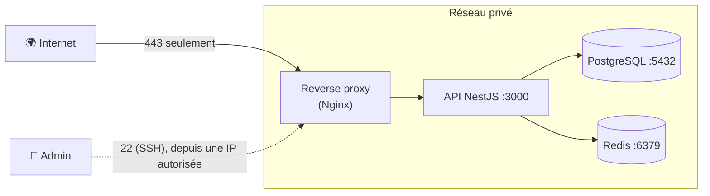

# Pare-feu et Sécurité Réseau

> [!abstract] En bref
> Un **pare-feu** décide quelles connexions sont autorisées à entrer ou sortir d'une machine ou d'un réseau. La règle d'or : **tout fermer par défaut, n'ouvrir que le strict nécessaire**. Pour une application web, seuls les ports HTTP (80) et HTTPS (443) sont ouverts au public ; la base de données, elle, reste cachée.

## L'image

Un **videur à l'entrée d'un bâtiment** avec une liste : « le public entre par la porte principale (443) ; la porte de service (22) seulement pour le personnel ; la salle des coffres (5432) n'a aucune porte vers la rue ».

## L'architecture typique



| Port | Ouvert à |
|---|---|
| 443 (HTTPS), 80 (redirige vers 443) | tout le monde |
| 22 (SSH) | seulement les administrateurs (IP autorisées, clé SSH) |
| 3000 (API), 5432 (PostgreSQL), 6379 (Redis) | **personne** de l'extérieur, seulement le réseau interne |

## Sur un serveur Linux (ufw)

```bash
sudo ufw default deny incoming       # tout refuser en entrée
sudo ufw default allow outgoing
sudo ufw allow 22/tcp                # SSH (idéalement limité à ton IP)
sudo ufw allow 80,443/tcp            # web
sudo ufw enable
sudo ufw status
```

Chez un hébergeur cloud, on règle souvent ça dans des **groupes de sécurité** au lieu du serveur lui-même.

## Les autres protections réseau

| Protection | Contre |
|---|---|
| **HTTPS** partout | l'écoute et la modification des échanges (voir [[SEC-09-HTTPS-TLS\|HTTPS]]) |
| **Limitation de débit** (*rate limiting*) | les attaques par force brute, les abus |
| **WAF** (pare-feu applicatif) | les requêtes malveillantes connues (injections…) |
| **Protection DDoS** (Cloudflare…) | l'inondation de requêtes |
| **VPN / bastion** | l'accès d'administration |

## Pièges

- **PostgreSQL ou Redis ouverts sur Internet** : des robots scannent Internet en permanence et les trouvent en quelques heures.
- **SSH avec mot de passe** : utilise des clés SSH et désactive la connexion par mot de passe.
- **Docker qui ouvre un port** (`-p 5432:5432`) sur un serveur : il peut contourner le pare-feu du système. Sur un serveur, n'expose pas les ports de la base.
