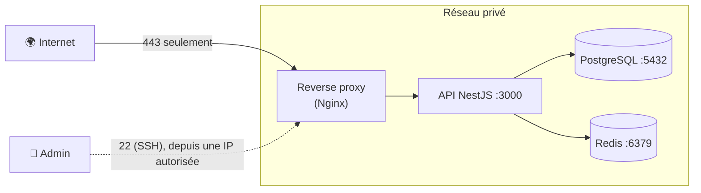

# Pare-feu et Sécurité Réseau

> [!abstract] En bref
> Un **pare-feu** décide quelles connexions sont autorisées à entrer ou sortir d'une machine ou d'un réseau. La règle d'or : **tout fermer par défaut, n'ouvrir que le strict nécessaire**. Pour une application web, seuls les ports HTTP (80) et HTTPS (443) sont ouverts au public ; la base de données, elle, reste cachée.

## L'image

Un **videur à l'entrée d'un bâtiment** avec une liste : « le public entre par la porte principale (443) ; la porte de service (22) seulement pour le personnel ; la salle des coffres (5432) n'a aucune porte vers la rue ».

## L'architecture typique


```mermaid
flowchart LR
  I["🌍 Internet"] -->|"443 seulement"| RP["Reverse proxy<br/>(Nginx)"]
  subgraph Réseau privé
    RP --> API["API NestJS :3000"]
    API --> DB[("PostgreSQL :5432")]
    API --> R[("Redis :6379")]
  end
  Admin["👤 Admin"] -.->|"22 (SSH), depuis une IP autorisée"| RP
```

| Port | Ouvert à |
|---|---|
| 443 (HTTPS), 80 (redirige vers 443) | tout le monde |
| 22 (SSH) | seulement les administrateurs (IP autorisées, clé SSH) |
| 3000 (API), 5432 (PostgreSQL), 6379 (Redis) | **personne** de l'extérieur, seulement le réseau interne |

## Sur un serveur Linux (ufw)

```bash
sudo ufw default deny incoming       # tout refuser en entrée
sudo ufw default allow outgoing
sudo ufw allow 22/tcp                # SSH (idéalement limité à ton IP)
sudo ufw allow 80,443/tcp            # web
sudo ufw enable
sudo ufw status
```

Chez un hébergeur cloud, on règle souvent ça dans des **groupes de sécurité** au lieu du serveur lui-même.

## Les autres protections réseau

| Protection | Contre |
|---|---|
| **HTTPS** partout | l'écoute et la modification des échanges (voir [[SEC-09-HTTPS-TLS\|HTTPS]]) |
| **Limitation de débit** (*rate limiting*) | les attaques par force brute, les abus |
| **WAF** (pare-feu applicatif) | les requêtes malveillantes connues (injections…) |
| **Protection DDoS** (Cloudflare…) | l'inondation de requêtes |
| **VPN / bastion** | l'accès d'administration |

## Pourquoi ça marche

Chaque port ouvert est une **porte** qu'un attaquant peut essayer. Des robots scannent Internet en permanence : un service exposé par erreur est trouvé en quelques heures. Tout fermer par défaut réduit la **surface d'attaque** aux seules portes nécessaires.

Le **reverse proxy** devient la seule entrée publique : il gère HTTPS et transmet au reste. L'API et la base restent dans un réseau privé, joignables uniquement par les services qui en ont besoin.

## Contre-exemple

**Intuition fausse : « mon pare-feu bloque le port 5432, donc ma base Docker est protégée ».**

```bash
sudo ufw deny 5432
docker run -p 5432:5432 postgres:17   # le port est quand même joignable depuis Internet
```

Docker modifie lui-même les règles réseau du système : un port publié avec `-p` peut **contourner** `ufw`. Sur un serveur, on ne publie pas le port de la base.

## Pièges

- **PostgreSQL ou Redis ouverts sur Internet** : des robots scannent Internet en permanence et les trouvent en quelques heures.
- **SSH avec mot de passe** : utilise des clés SSH et désactive la connexion par mot de passe.
- **Docker qui ouvre un port** (`-p 5432:5432`) sur un serveur : il peut contourner le pare-feu du système. Sur un serveur, n'expose pas les ports de la base.

## Vérifie sans tes notes

Réponds de tête, à voix haute ou par écrit, **avant** d’ouvrir la réponse.

**1. Quelle est la règle d'or d'un pare-feu ?**

> [!check]- Réponse
> Tout fermer par défaut, n'ouvrir que le strict nécessaire.

**2. Quels ports sont ouverts au public pour une application web ?**

> [!check]- Réponse
> 443 (HTTPS) et 80 (qui redirige vers 443) ; le 22 (SSH) seulement pour les administrateurs.

**3. Pourquoi désactiver la connexion SSH par mot de passe ?**

> [!check]- Réponse
> Les mots de passe peuvent être devinés par force brute ; une clé SSH est bien plus sûre.

## Exercices

> [!info] Comment t’entraîner
> 1. Cherche seul, sans regarder la note.
> 2. Bloqué ? Ouvre l’**indice 1**, puis l’**indice 2**.
> 3. Seulement ensuite, la **solution**.
> 4. Referme tout et **refais l’exercice sans regarder**.

### Exercice 1 · Les règles ufw

Écris les commandes `ufw` pour un serveur qui héberge CinéTrack : tout refuser en entrée par défaut, autoriser tout en sortie, autoriser SSH, HTTP et HTTPS, puis activer le pare-feu.

> [!tip]- Indice 1
> On définit d'abord les règles par défaut, puis les exceptions, puis on active.

> [!tip]- Indice 2
> `ufw default deny incoming`, `ufw allow <ports>/tcp`, `ufw enable`.

> [!success]- Solution
> ```bash
> sudo ufw default deny incoming
> sudo ufw default allow outgoing
> sudo ufw allow 22/tcp
> sudo ufw allow 80,443/tcp
> sudo ufw enable
> ```
>
> Toujours autoriser le 22 **avant** `enable`, sinon tu perds l'accès SSH.

### Exercice 2 · Ouvert ou fermé ?

Pour chaque port de ce serveur de production, dis s'il doit être ouvert à tout Internet, aux administrateurs seulement, ou à personne de l'extérieur : 443, 80, 22, 3000 (API), 5432 (PostgreSQL), 6379 (Redis).

> [!tip]- Indice 1
> Seul le reverse proxy doit être joignable par le public.

> [!tip]- Indice 2
> L'API, la base et Redis sont joints par le proxy ou l'API, sur le réseau interne.

> [!success]- Solution
> | Port | Ouvert à |
> |---|---|
> | 443, 80 | tout le monde |
> | 22 | administrateurs seulement (IP autorisées, clé SSH) |
> | 3000, 5432, 6379 | personne de l'extérieur : réseau interne seulement |

### Transfert · Accéder à la base de production

Un problème différent : il vérifie que tu as compris le principe, pas seulement l’exemple.

Tu dois lancer une requête SQL sur la base PostgreSQL de production depuis IntelliJ. Le port 5432 est (à raison) fermé au public. Comment t'y connecter sans ouvrir ce port ?

> [!tip]- Indice 1
> Le seul accès d'administration ouvert est SSH (port 22).

> [!tip]- Indice 2
> SSH peut faire passer une connexion à travers lui : c'est un tunnel.

> [!success]- Solution
> Un **tunnel SSH** :
>
> ```bash
> ssh -L 5433:localhost:5432 ubuntu@serveur
> ```
>
> Puis, dans IntelliJ, connexion à `localhost:5433` : le trafic passe chiffré par SSH jusqu'au serveur, puis vers sa base locale. Le port 5432 reste fermé à Internet.

## Je maîtrise quand…

Coche quand tu sais le faire **sans aide**. Une notion n’est maîtrisée que si les 6 cases sont cochées (voir [[Methode-du-coach|Méthode du coach]]).

- [ ] **Expliquer** : Expliquer pourquoi on ferme tout par défaut
- [ ] **Rappeler** : Dire de mémoire quels ports ouvrir à qui sur un serveur web
- [ ] **Utiliser** : Écrire les règles ufw de base sans couper son accès SSH
- [ ] **Résoudre un problème nouveau** : Prévoir qu'un port Docker publié peut contourner le pare-feu
- [ ] **Repérer les erreurs** : Repérer une base ou un Redis exposé sur Internet
- [ ] **Savoir quand ne pas l’utiliser** : Savoir quand un pare-feu ne suffit pas : il faut aussi HTTPS, limitation de débit, WAF
