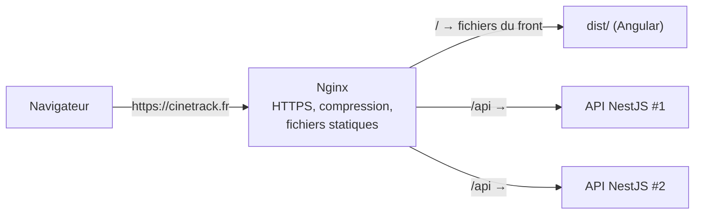

# Proxy Reverse Proxy et Load Balancer

> [!abstract] En bref
> Un **reverse proxy** (Nginx, Traefik) se place **devant** tes applications : il reçoit toutes les requêtes et les envoie au bon endroit (le front ou l'API), gère le HTTPS et peut répartir la charge entre plusieurs serveurs (**load balancer**). C'est la porte d'entrée de toute application en production.

## Proxy ou reverse proxy ?

| | Proxy (direct) | **Reverse proxy** |
|---|---|---|
| Se place devant | les **clients** | les **serveurs** |
| Exemple | le proxy de l'entreprise qui filtre ta navigation | Nginx devant ton API |
| Qui le connaît | le client | le client ne le voit même pas |

## Le rôle du reverse proxy



| Rôle | En clair |
|---|---|
| **Aiguillage** | `/` → le front, `/api` → l'API, même nom de domaine (plus de problème de CORS) |
| **HTTPS** | il gère le certificat ; les applications derrière parlent en HTTP simple |
| **Fichiers statiques** | il sert le front Angular / Vue très efficacement |
| **Compression** | gzip / brotli des réponses |
| **Répartition de charge** | envoie les requêtes à plusieurs instances de l'API |
| **Protection** | limitation de débit, en-têtes de sécurité |

## Une configuration Nginx

```nginx
server {
  listen 443 ssl;
  server_name cinetrack.fr;
  ssl_certificate     /etc/letsencrypt/live/cinetrack.fr/fullchain.pem;
  ssl_certificate_key /etc/letsencrypt/live/cinetrack.fr/privkey.pem;

  root /usr/share/nginx/html;             # le build du front
  location / {
    try_files $uri $uri/ /index.html;     # routes Angular / Vue
  }

  location /api/ {
    proxy_pass http://api:3000/;          # vers le conteneur de l'API
    proxy_set_header Host $host;
    proxy_set_header X-Forwarded-For $proxy_add_x_forwarded_for;
    proxy_set_header X-Forwarded-Proto $scheme;
  }
}
```

## Le load balancer

Quand une seule instance de l'API ne suffit plus, on en lance plusieurs, et le load balancer répartit :

| Stratégie | Principe |
|---|---|
| tourniquet (*round robin*) | chacun son tour |
| moins de connexions | vers le serveur le moins occupé |
| par IP | un même client va toujours au même serveur |

Pour que ça marche, l'API doit être **sans état** : pas de session gardée en mémoire (utilise un JWT ou Redis). Voir [[ARCH-06-Scalabilite|Scalabilité]].

## Pièges

- **L'API voit l'IP du proxy** au lieu de celle du client : lire `X-Forwarded-For` (dans NestJS / Express : `app.set('trust proxy', 1)`).
- **Oublier `try_files … /index.html`** : les routes du front renvoient 404 au rafraîchissement.
- **Des WebSockets** derrière Nginx : il faut ajouter les en-têtes `Upgrade` et `Connection`.
