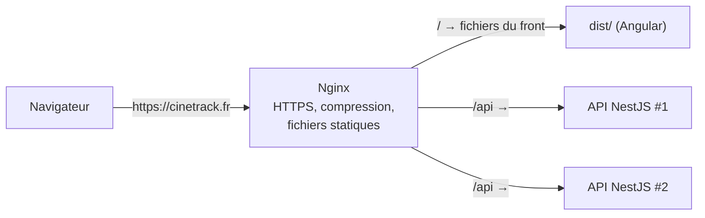

# Proxy Reverse Proxy et Load Balancer

> [!abstract] En bref
> Un **reverse proxy** (Nginx, Traefik) se place **devant** tes applications : il reçoit toutes les requêtes et les envoie au bon endroit (le front ou l'API), gère le HTTPS et peut répartir la charge entre plusieurs serveurs (**load balancer**). C'est la porte d'entrée de toute application en production.

## Proxy ou reverse proxy ?

| | Proxy (direct) | **Reverse proxy** |
|---|---|---|
| Se place devant | les **clients** | les **serveurs** |
| Exemple | le proxy de l'entreprise qui filtre ta navigation | Nginx devant ton API |
| Qui le connaît | le client | le client ne le voit même pas |

## Le rôle du reverse proxy


```mermaid
flowchart LR
  U["Navigateur"] -->|"https://cinetrack.fr"| N["Nginx<br/>HTTPS, compression,<br/>fichiers statiques"]
  N -->|"/ → fichiers du front"| F["dist/ (Angular)"]
  N -->|"/api → "| A1["API NestJS #1"]
  N -->|"/api → "| A2["API NestJS #2"]
```

| Rôle | En clair |
|---|---|
| **Aiguillage** | `/` → le front, `/api` → l'API, même nom de domaine (plus de problème de CORS) |
| **HTTPS** | il gère le certificat ; les applications derrière parlent en HTTP simple |
| **Fichiers statiques** | il sert le front Angular / Vue très efficacement |
| **Compression** | gzip / brotli des réponses |
| **Répartition de charge** | envoie les requêtes à plusieurs instances de l'API |
| **Protection** | limitation de débit, en-têtes de sécurité |

## Une configuration Nginx

```nginx
server {
  listen 443 ssl;
  server_name cinetrack.fr;
  ssl_certificate     /etc/letsencrypt/live/cinetrack.fr/fullchain.pem;
  ssl_certificate_key /etc/letsencrypt/live/cinetrack.fr/privkey.pem;

  root /usr/share/nginx/html;             # le build du front
  location / {
    try_files $uri $uri/ /index.html;     # routes Angular / Vue
  }

  location /api/ {
    proxy_pass http://api:3000/;          # vers le conteneur de l'API
    proxy_set_header Host $host;
    proxy_set_header X-Forwarded-For $proxy_add_x_forwarded_for;
    proxy_set_header X-Forwarded-Proto $scheme;
  }
}
```

## Le load balancer

Quand une seule instance de l'API ne suffit plus, on en lance plusieurs, et le load balancer répartit :

| Stratégie | Principe |
|---|---|
| tourniquet (*round robin*) | chacun son tour |
| moins de connexions | vers le serveur le moins occupé |
| par IP | un même client va toujours au même serveur |

Pour que ça marche, l'API doit être **sans état** : pas de session gardée en mémoire (utilise un JWT ou Redis). Voir [[ARCH-06-Scalabilite|Scalabilité]].

## Pourquoi ça marche

Le reverse proxy est **un seul point d'entrée** devant plusieurs applications : il peut donc s'occuper une fois pour toutes de ce qui est commun (HTTPS, compression, fichiers statiques, protection) et aiguiller chaque requête selon son URL.

Comme le front et l'API sont servis depuis **le même domaine** (`/` et `/api`), le navigateur ne voit qu'une seule origine : plus de problème de CORS.

Le load balancer ne peut répartir les requêtes entre plusieurs instances que si **n'importe quelle instance** peut répondre à n'importe quelle requête : l'API doit donc être sans état (la session n'est pas gardée en mémoire d'une instance).

## Contre-exemple

**Intuition fausse : « l'API voit l'adresse IP du visiteur ».**

```ts
console.log(req.ip);   // 172.18.0.5 : l'IP du reverse proxy, pour tous les visiteurs
```

Derrière un proxy, toutes les requêtes viennent du proxy. La vraie IP est dans l'en-tête `X-Forwarded-For` : il faut dire à l'application de lui faire confiance (`app.set('trust proxy', 1)`), sinon la limitation de débit bloque tout le monde à la fois.

## Pièges

- **L'API voit l'IP du proxy** au lieu de celle du client : lire `X-Forwarded-For` (dans NestJS / Express : `app.set('trust proxy', 1)`).
- **Oublier `try_files … /index.html`** : les routes du front renvoient 404 au rafraîchissement.
- **Des WebSockets** derrière Nginx : il faut ajouter les en-têtes `Upgrade` et `Connection`.

## Vérifie sans tes notes

Réponds de tête, à voix haute ou par écrit, **avant** d’ouvrir la réponse.

**1. Quelle différence entre un proxy et un reverse proxy ?**

> [!check]- Réponse
> Le proxy se place devant les clients (filtre leur navigation) ; le reverse proxy se place devant les serveurs (reçoit les requêtes et les aiguille).

**2. Pourquoi servir le front et l'API sur le même domaine évite-t-il le CORS ?**

> [!check]- Réponse
> Le navigateur voit une seule origine : la requête n'est plus « cross-origin ».

**3. Quelle condition l'API doit-elle remplir pour être répartie sur plusieurs instances ?**

> [!check]- Réponse
> Être sans état : pas de session en mémoire ; utiliser un JWT ou Redis.

## Exercices

> [!info] Comment t’entraîner
> 1. Cherche seul, sans regarder la note.
> 2. Bloqué ? Ouvre l’**indice 1**, puis l’**indice 2**.
> 3. Seulement ensuite, la **solution**.
> 4. Referme tout et **refais l’exercice sans regarder**.

### Exercice 1 · Aiguiller avec Nginx

Écris le bloc `location` Nginx qui envoie toutes les requêtes commençant par `/api/` vers le conteneur `api` sur le port 3000, en transmettant le nom de domaine et l'IP du visiteur.

> [!tip]- Indice 1
> `proxy_pass` indique où envoyer ; `proxy_set_header` ajoute des en-têtes.

> [!tip]- Indice 2
> Les en-têtes à transmettre : `Host` et `X-Forwarded-For`.

> [!success]- Solution
> ```nginx
> location /api/ {
>   proxy_pass http://api:3000/;
>   proxy_set_header Host $host;
>   proxy_set_header X-Forwarded-For $proxy_add_x_forwarded_for;
>   proxy_set_header X-Forwarded-Proto $scheme;
> }
> ```

### Exercice 2 · Le 404 au rafraîchissement

Sur CinéTrack en production, aller sur `/movies/42` depuis l'accueil fonctionne. Mais rafraîchir la page sur `/movies/42` donne une erreur 404 de Nginx. Pourquoi ? Corrige.

> [!tip]- Indice 1
> Au rafraîchissement, c'est Nginx (et non Angular) qui reçoit l'URL `/movies/42`. Existe-t-il un fichier à ce chemin ?

> [!tip]- Indice 2
> Nginx doit renvoyer `index.html` pour toutes les routes du front, puis Angular affiche la bonne page.

> [!success]- Solution
> Il n'existe **aucun fichier** `/movies/42` sur le serveur : c'est une route gérée par Angular dans le navigateur.
>
> ```nginx
> location / {
>   try_files $uri $uri/ /index.html;
> }
> ```

### Transfert · Les sessions qui disparaissent

Un problème différent : il vérifie que tu as compris le principe, pas seulement l’exemple.

Tu passes de 1 à 3 instances de ton API derrière un load balancer en tourniquet. Depuis, les utilisateurs sont déconnectés au hasard. L'API garde les sessions dans un objet en mémoire. Explique et propose deux solutions.

> [!tip]- Indice 1
> Où est stockée la session, et quelle instance reçoit la requête suivante ?

> [!tip]- Indice 2
> Il faut que n'importe quelle instance puisse reconnaître l'utilisateur.

> [!success]- Solution
> La session est en **mémoire d'une seule instance**. Le tourniquet envoie la requête suivante à une **autre** instance, qui ne la connaît pas : l'utilisateur semble déconnecté.
>
> 1. **Stocker les sessions dans Redis**, partagé par toutes les instances.
> 2. **Utiliser un JWT** : l'information est dans le jeton, chaque instance peut le vérifier seule.
>
> (Une répartition « par IP » masquerait le problème, mais l'API resterait fragile.)

## Je maîtrise quand…

Coche quand tu sais le faire **sans aide**. Une notion n’est maîtrisée que si les 6 cases sont cochées (voir [[Methode-du-coach|Méthode du coach]]).

- [ ] **Expliquer** : Expliquer le rôle du reverse proxy avec le schéma front / API
- [ ] **Rappeler** : Dire de mémoire ses rôles (aiguillage, HTTPS, statiques, compression, répartition, protection)
- [ ] **Utiliser** : Écrire une configuration Nginx front + API sans modèle
- [ ] **Résoudre un problème nouveau** : Prévoir l'IP vue par l'API et le comportement des sessions derrière un load balancer
- [ ] **Repérer les erreurs** : Diagnostiquer un 404 au rafraîchissement ou un 502 Bad Gateway
- [ ] **Savoir quand ne pas l’utiliser** : Savoir quand un load balancer est inutile : une seule instance suffit à la charge
