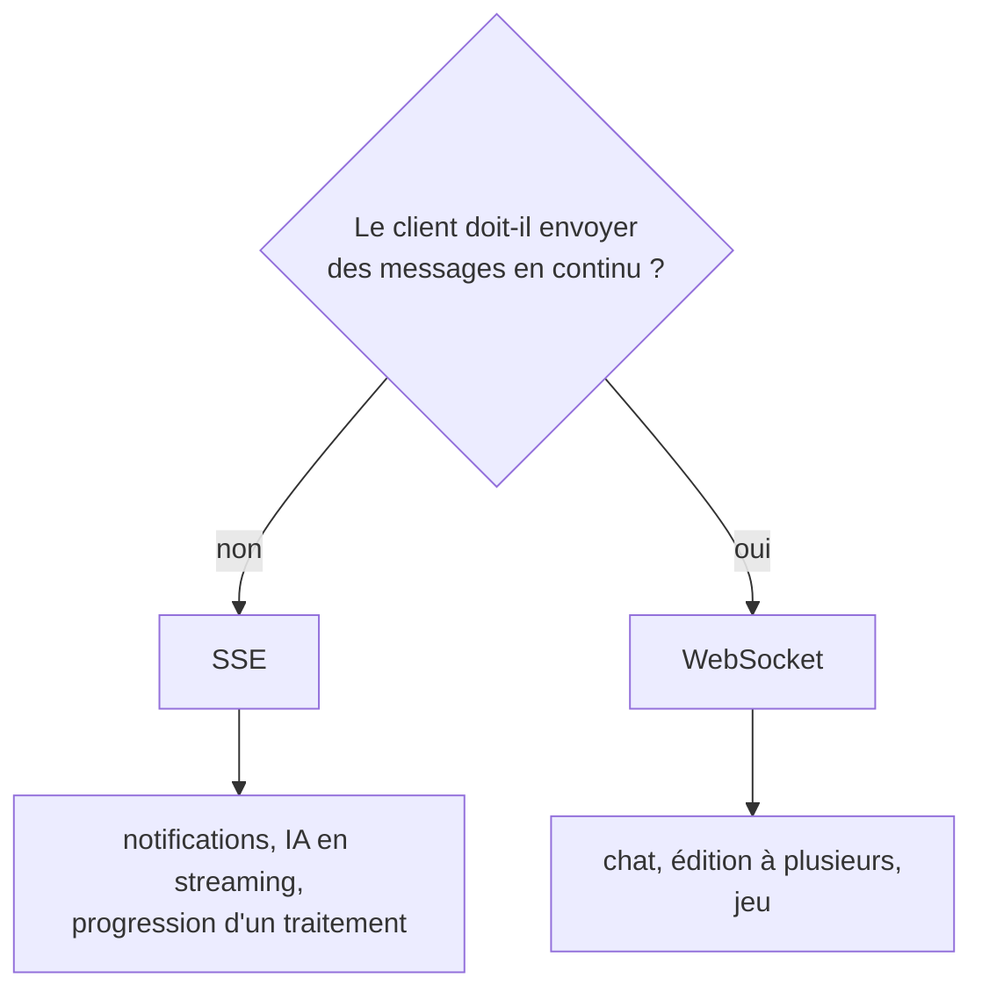

# WebSockets et SSE

> [!abstract] En bref
> En HTTP classique, le serveur ne peut **que répondre**. Pour qu'il puisse **envoyer une information de lui-même** (nouvelle notification, réponse d'une IA mot par mot), il existe deux solutions : **SSE**, un canal où seul le serveur parle, simple ; et **WebSocket**, une ligne ouverte dans les deux sens.

## Les options

| Technique | Sens | Principe | Pour |
|---|---|---|---|
| **Polling** | client → serveur | redemander toutes les X secondes | simple, mais gaspille |
| **SSE** (*Server-Sent Events*) | serveur → client | une réponse HTTP qui ne se termine jamais, le serveur écrit dedans | notifications, suivi de progression, **réponses d'IA en streaming** |
| **WebSocket** | les deux | une connexion permanente et bidirectionnelle | chat, collaboration en direct, jeux |

## SSE : le plus simple quand seul le serveur parle

```ts
// NestJS
@Sse('notifications')
notifications(): Observable<MessageEvent> {
  return this.events.stream$.pipe(map(data => ({ data })));
}
```

```ts
// Front (natif, sans librairie)
const source = new EventSource('/api/notifications');
source.onmessage = (e) => console.log(JSON.parse(e.data));
```

Avantages : c'est du HTTP normal (passe partout, reconnexion automatique). Limite : le client ne peut pas répondre par le même canal.

## WebSocket : la ligne téléphonique

```ts
const socket = new WebSocket('wss://api.cinetrack.fr/ws');
socket.onmessage = (e) => console.log(e.data);
socket.send(JSON.stringify({ type: 'follow-movie', movieId: 27205 }));
```

La connexion commence par une requête HTTP qui demande à « passer en WebSocket » (`Upgrade: websocket`), puis reste ouverte. En pratique on utilise **Socket.IO**, qui ajoute la reconnexion et les « salles ». Voir [[NEST-14-WebSockets-Temps-Reel|WebSockets NestJS]].

## Choisir



Pour le Capstone (assistant IA), **SSE** suffit pour afficher la réponse au fur et à mesure.

## Pièges

- **WebSocket pour tout** : plus complexe à faire passer derrière un proxy et à répartir sur plusieurs serveurs.
- **Oublier l'authentification** de la connexion.
- **Garder la connexion ouverte** après avoir quitté la page : ferme-la dans `onUnmounted` / `ngOnDestroy`.
