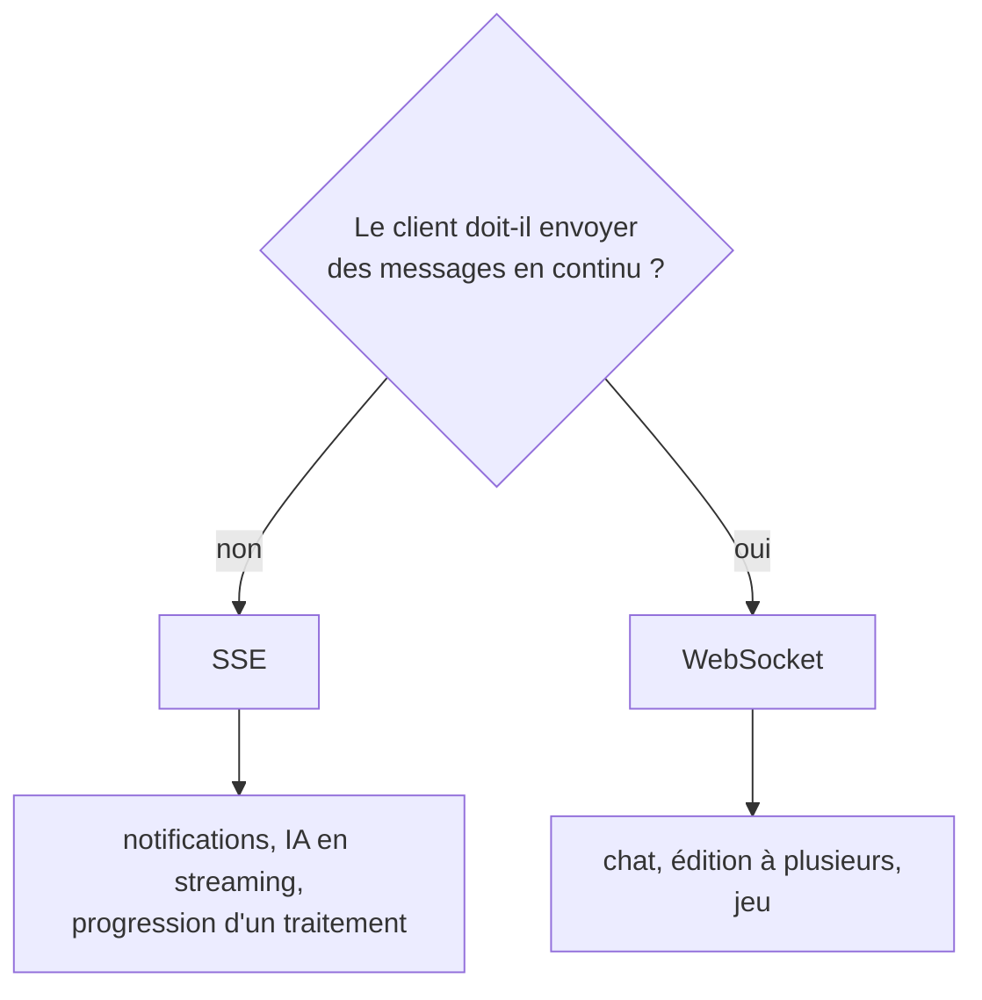

# WebSockets et SSE

> [!abstract] En bref
> En HTTP classique, le serveur ne peut **que répondre**. Pour qu'il puisse **envoyer une information de lui-même** (nouvelle notification, réponse d'une IA mot par mot), il existe deux solutions : **SSE**, un canal où seul le serveur parle, simple ; et **WebSocket**, une ligne ouverte dans les deux sens.

## Les options

| Technique | Sens | Principe | Pour |
|---|---|---|---|
| **Polling** | client → serveur | redemander toutes les X secondes | simple, mais gaspille |
| **SSE** (*Server-Sent Events*) | serveur → client | une réponse HTTP qui ne se termine jamais, le serveur écrit dedans | notifications, suivi de progression, **réponses d'IA en streaming** |
| **WebSocket** | les deux | une connexion permanente et bidirectionnelle | chat, collaboration en direct, jeux |

## SSE : le plus simple quand seul le serveur parle

```ts
// NestJS
@Sse('notifications')
notifications(): Observable<MessageEvent> {
  return this.events.stream$.pipe(map(data => ({ data })));
}
```

```ts
// Front (natif, sans librairie)
const source = new EventSource('/api/notifications');
source.onmessage = (e) => console.log(JSON.parse(e.data));
```

Avantages : c'est du HTTP normal (passe partout, reconnexion automatique). Limite : le client ne peut pas répondre par le même canal.

## WebSocket : la ligne téléphonique

```ts
const socket = new WebSocket('wss://api.cinetrack.fr/ws');
socket.onmessage = (e) => console.log(e.data);
socket.send(JSON.stringify({ type: 'follow-movie', movieId: 27205 }));
```

La connexion commence par une requête HTTP qui demande à « passer en WebSocket » (`Upgrade: websocket`), puis reste ouverte. En pratique on utilise **Socket.IO**, qui ajoute la reconnexion et les « salles ». Voir [[NEST-14-WebSockets-Temps-Reel|WebSockets NestJS]].

## Choisir


```mermaid
flowchart TD
  A{"Le client doit-il envoyer<br/>des messages en continu ?"} -- non --> S["SSE"]
  A -- oui --> W["WebSocket"]
  S --> X["notifications, IA en streaming,<br/>progression d'un traitement"]
  W --> Y["chat, édition à plusieurs,<br/>jeu"]
```

Pour le Capstone (assistant IA), **SSE** suffit pour afficher la réponse au fur et à mesure.

## Pourquoi ça marche

HTTP suit le modèle **question → réponse** : le serveur ne peut pas parler le premier. Pour qu'il envoie une information de lui-même, il faut garder un canal ouvert.

**SSE** garde ouverte une réponse HTTP **ordinaire**, dans laquelle le serveur écrit des messages au fil du temps : c'est simple, et ça passe partout où HTTP passe. **WebSocket** transforme la connexion en une ligne permanente dans **les deux sens** : plus puissant, mais c'est un autre protocole, plus délicat à faire passer derrière un proxy et à répartir.

## Contre-exemple

**Intuition fausse : « pour du temps réel, il faut forcément des WebSockets ».**

```text
Afficher la réponse d'une IA mot par mot  → seul le serveur parle → SSE suffit
Afficher une notification « nouveau film »  → seul le serveur parle → SSE suffit
```

WebSocket n'est utile que si **le client** doit aussi envoyer des messages en continu (chat, jeu, édition à plusieurs).

## Pièges

- **WebSocket pour tout** : plus complexe à faire passer derrière un proxy et à répartir sur plusieurs serveurs.
- **Oublier l'authentification** de la connexion.
- **Garder la connexion ouverte** après avoir quitté la page : ferme-la dans `onUnmounted` / `ngOnDestroy`.

## Vérifie sans tes notes

Réponds de tête, à voix haute ou par écrit, **avant** d’ouvrir la réponse.

**1. Quelle différence entre SSE et WebSocket ?**

> [!check]- Réponse
> SSE : seul le serveur envoie, sur une réponse HTTP qui reste ouverte ; WebSocket : connexion permanente dans les deux sens.

**2. Quel objet natif du navigateur reçoit des SSE ?**

> [!check]- Réponse
> `EventSource`.

**3. Que faut-il faire quand l'utilisateur quitte la page ?**

> [!check]- Réponse
> Fermer la connexion (dans `ngOnDestroy` ou `onUnmounted`), sinon elle reste ouverte.

## Exercices

> [!info] Comment t’entraîner
> 1. Cherche seul, sans regarder la note.
> 2. Bloqué ? Ouvre l’**indice 1**, puis l’**indice 2**.
> 3. Seulement ensuite, la **solution**.
> 4. Referme tout et **refais l’exercice sans regarder**.

### Exercice 1 · SSE, WebSocket ou polling ?

Quelle technique choisis-tu ?
1. Afficher la réponse de l'assistant IA au fur et à mesure.
2. Un chat entre utilisateurs qui regardent le même film.
3. Vérifier toutes les 10 minutes si de nouveaux films sont sortis.
4. Suivre la progression d'un import de 10 000 films.

> [!tip]- Indice 1
> Question clé : le client doit-il envoyer des messages en continu ?

> [!tip]- Indice 2
> Si l'information change rarement, redemander de temps en temps suffit.

> [!success]- Solution
> 1. **SSE** : seul le serveur parle.
> 2. **WebSocket** : les deux parlent en continu.
> 3. **Polling** : une question toutes les 10 minutes suffit.
> 4. **SSE** : le serveur envoie la progression.

### Exercice 2 · Écouter et fermer un flux SSE

Dans un composant Angular, ouvre un flux SSE sur `/api/import/progress`, mets chaque message reçu (un nombre en JSON) dans un signal `progress`, et ferme le flux quand le composant est détruit.

> [!tip]- Indice 1
> `new EventSource(url)` ouvre le flux ; `onmessage` reçoit chaque message.

> [!tip]- Indice 2
> Pour fermer à la destruction : `inject(DestroyRef).onDestroy(...)` et `source.close()`.

> [!success]- Solution
> ```ts
> export class ImportProgress {
>   progress = signal(0);
>
>   constructor() {
>     const source = new EventSource('/api/import/progress');
>     source.onmessage = (e) => this.progress.set(JSON.parse(e.data));
>     inject(DestroyRef).onDestroy(() => source.close());
>   }
> }
> ```

### Transfert · Le chat qui ne passe pas en production

Un problème différent : il vérifie que tu as compris le principe, pas seulement l’exemple.

Ton chat WebSocket fonctionne en local, mais en production (derrière Nginx), la connexion échoue. Les requêtes HTTP classiques, elles, passent. Quelle est la cause probable et que faut-il ajouter ?

> [!tip]- Indice 1
> Comment commence une connexion WebSocket ? Avec une requête HTTP qui demande quoi ?

> [!tip]- Indice 2
> Nginx doit transmettre les en-têtes de cette demande de « montée en WebSocket ».

> [!success]- Solution
> Une connexion WebSocket commence par une requête HTTP avec `Upgrade: websocket`. Par défaut, Nginx **ne transmet pas** ces en-têtes : la montée en WebSocket échoue.
>
> ```nginx
> location /ws/ {
>   proxy_pass http://api:3000;
>   proxy_http_version 1.1;
>   proxy_set_header Upgrade $http_upgrade;
>   proxy_set_header Connection "upgrade";
> }
> ```

## Je maîtrise quand…

Coche quand tu sais le faire **sans aide**. Une notion n’est maîtrisée que si les 6 cases sont cochées (voir [[Methode-du-coach|Méthode du coach]]).

- [ ] **Expliquer** : Expliquer pourquoi HTTP seul ne permet pas au serveur de parler le premier
- [ ] **Rappeler** : Dire de mémoire la différence entre polling, SSE et WebSocket
- [ ] **Utiliser** : Ouvrir et fermer proprement un flux SSE sans modèle
- [ ] **Résoudre un problème nouveau** : Choisir la technique adaptée à un besoin et la justifier
- [ ] **Repérer les erreurs** : Diagnostiquer une connexion WebSocket bloquée par un proxy
- [ ] **Savoir quand ne pas l’utiliser** : Savoir quand WebSocket est inutile : seul le serveur envoie des données
