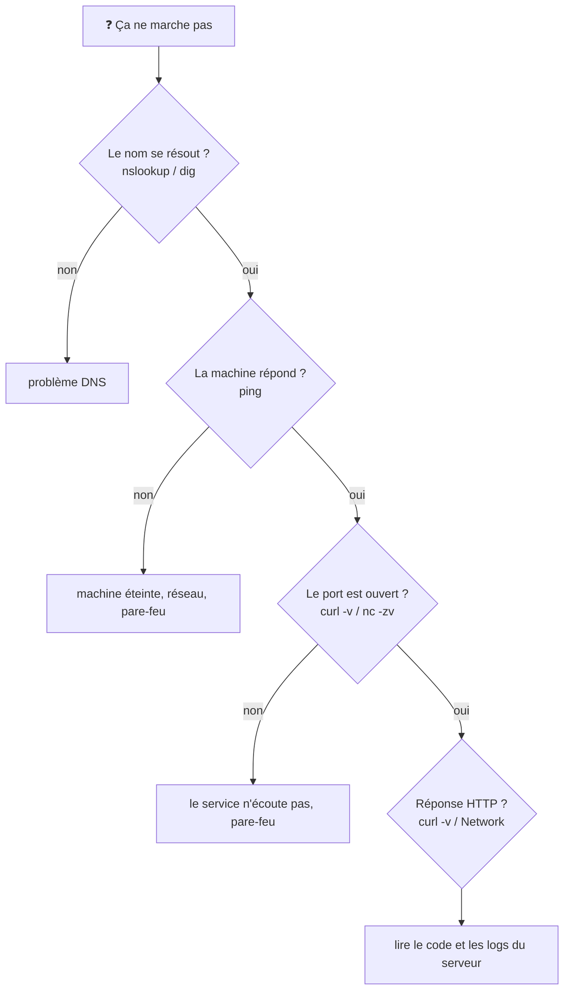

# Outils de Diagnostic Réseau

> [!abstract] En bref
> Quand « l'API ne répond pas », ces outils te disent **où** ça bloque : le nom ne se résout pas, la machine est injoignable, le port est fermé, ou la requête HTTP échoue. Commence toujours par le plus simple : **l'onglet Network** du navigateur, puis **`curl -v`**.

## La méthode : de bas en haut



## Les outils

| Outil | Question | Exemple |
|---|---|---|
| **Onglet Network (F12)** | quelle requête part, quelle réponse revient ? | statut, en-têtes, corps, temps |
| **`curl -v`** | la requête HTTP complète, étape par étape | `curl -v https://api.cinetrack.fr/health` |
| `nslookup` / `dig` | quelle IP pour ce nom ? | `dig cinetrack.fr +short` |
| `ping` | la machine répond-elle ? | `ping cinetrack.fr` (parfois bloqué) |
| `nc -zv` | ce port est-il ouvert ? | `nc -zv localhost 5432` |
| `lsof -i :3000` / `ss -tlnp` | qui écoute sur ce port, chez moi ? | port déjà utilisé |
| `traceroute` | par où passent les paquets ? | lenteur réseau |
| `docker logs` | que dit le conteneur ? | `docker logs -f api` |

## Lire `curl -v`

```text
* Trying 203.0.113.10:443...             ← DNS OK, tentative de connexion
* Connected to api.cinetrack.fr          ← TCP OK
* SSL connection using TLSv1.3           ← HTTPS OK
> GET /health HTTP/2                     ← ce que tu envoies (>)
> Authorization: Bearer …
< HTTP/2 503                             ← ce que tu reçois (<)
< content-type: application/json
```

Chaque ligne te dit quelle étape a réussi. L'échec est **juste après la dernière ligne qui a marché**.

## Les messages classiques

| Message | Signification |
|---|---|
| `Could not resolve host` | DNS : nom inconnu ou faute de frappe |
| `Connection refused` | la machine répond, mais rien n'écoute sur ce port (service arrêté, mauvais port) |
| `Connection timed out` | pas de réponse du tout (pare-feu, machine injoignable) |
| `SSL certificate problem` | certificat expiré ou pour un autre nom |
| `CORS error` dans la console | la requête est partie ; le **serveur** doit autoriser ton domaine |
| `502 Bad Gateway` | le reverse proxy n'arrive pas à joindre l'application derrière |

## Pièges

- **Tester depuis le mauvais endroit** : `localhost` depuis ton PC n'est pas `localhost` dans un conteneur ou sur le serveur.
- **Conclure trop vite « c'est le réseau »** : 90 % du temps, c'est la configuration de l'application (URL, port, variable d'environnement).
