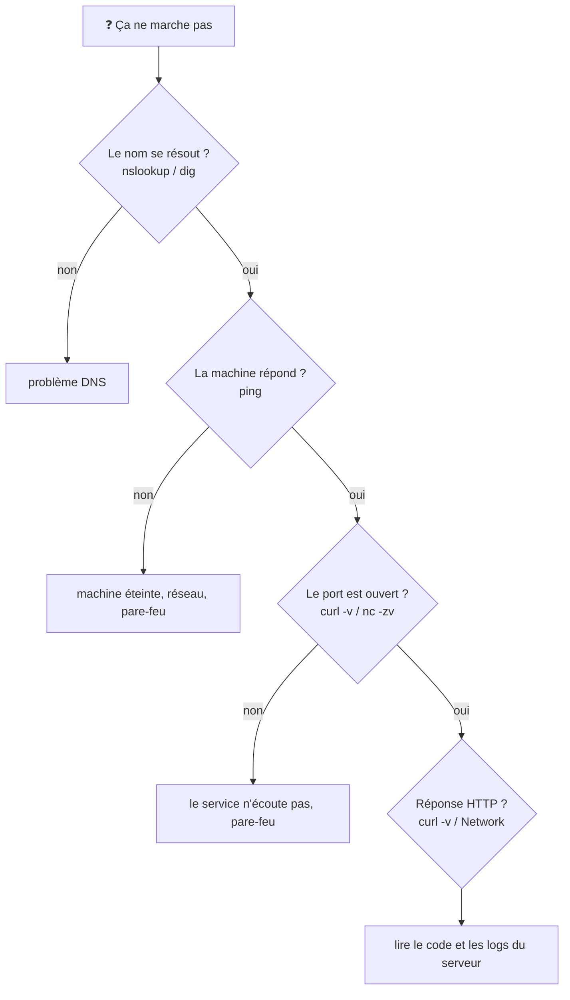

# Outils de Diagnostic Réseau

> [!abstract] En bref
> Quand « l'API ne répond pas », ces outils te disent **où** ça bloque : le nom ne se résout pas, la machine est injoignable, le port est fermé, ou la requête HTTP échoue. Commence toujours par le plus simple : **l'onglet Network** du navigateur, puis **`curl -v`**.

## La méthode : de bas en haut


```mermaid
flowchart TD
  A["❓ Ça ne marche pas"] --> B{"Le nom se résout ?<br/>nslookup / dig"}
  B -- non --> B1["problème DNS"]
  B -- oui --> C{"La machine répond ?<br/>ping"}
  C -- non --> C1["machine éteinte, réseau, pare-feu"]
  C -- oui --> D{"Le port est ouvert ?<br/>curl -v / nc -zv"}
  D -- non --> D1["le service n'écoute pas, pare-feu"]
  D -- oui --> E{"Réponse HTTP ?<br/>curl -v / Network"}
  E --> E1["lire le code et les logs du serveur"]
```

## Les outils

| Outil | Question | Exemple |
|---|---|---|
| **Onglet Network (F12)** | quelle requête part, quelle réponse revient ? | statut, en-têtes, corps, temps |
| **`curl -v`** | la requête HTTP complète, étape par étape | `curl -v https://api.cinetrack.fr/health` |
| `nslookup` / `dig` | quelle IP pour ce nom ? | `dig cinetrack.fr +short` |
| `ping` | la machine répond-elle ? | `ping cinetrack.fr` (parfois bloqué) |
| `nc -zv` | ce port est-il ouvert ? | `nc -zv localhost 5432` |
| `lsof -i :3000` / `ss -tlnp` | qui écoute sur ce port, chez moi ? | port déjà utilisé |
| `traceroute` | par où passent les paquets ? | lenteur réseau |
| `docker logs` | que dit le conteneur ? | `docker logs -f api` |

## Lire `curl -v`

```text
* Trying 203.0.113.10:443...             ← DNS OK, tentative de connexion
* Connected to api.cinetrack.fr          ← TCP OK
* SSL connection using TLSv1.3           ← HTTPS OK
> GET /health HTTP/2                     ← ce que tu envoies (>)
> Authorization: Bearer …
< HTTP/2 503                             ← ce que tu reçois (<)
< content-type: application/json
```

Chaque ligne te dit quelle étape a réussi. L'échec est **juste après la dernière ligne qui a marché**.

## Les messages classiques

| Message | Signification |
|---|---|
| `Could not resolve host` | DNS : nom inconnu ou faute de frappe |
| `Connection refused` | la machine répond, mais rien n'écoute sur ce port (service arrêté, mauvais port) |
| `Connection timed out` | pas de réponse du tout (pare-feu, machine injoignable) |
| `SSL certificate problem` | certificat expiré ou pour un autre nom |
| `CORS error` dans la console | la requête est partie ; le **serveur** doit autoriser ton domaine |
| `502 Bad Gateway` | le reverse proxy n'arrive pas à joindre l'application derrière |

## Pourquoi ça marche

Les couches réseau dépendent les unes des autres : DNS, puis TCP, puis TLS, puis HTTP. Vérifier **de bas en haut** permet d'éliminer chaque couche à tour de rôle, au lieu de modifier le code au hasard.

`curl -v` affiche **chaque étape** de la connexion. La dernière étape réussie dit exactement jusqu'où la requête est allée : le problème est juste après.

## Contre-exemple

**Intuition fausse : « `ping` ne répond pas, donc le serveur est éteint ».**

```bash
ping cinetrack.fr                          # aucune réponse
curl -I https://cinetrack.fr              # HTTP/2 200 : le site marche !
```

Beaucoup de serveurs et d'hébergeurs **bloquent** le ping (protocole ICMP) pour se protéger. Un ping sans réponse ne prouve rien : teste le vrai service avec `curl` ou `nc -zv`.

## Pièges

- **Tester depuis le mauvais endroit** : `localhost` depuis ton PC n'est pas `localhost` dans un conteneur ou sur le serveur.
- **Conclure trop vite « c'est le réseau »** : 90 % du temps, c'est la configuration de l'application (URL, port, variable d'environnement).

## Vérifie sans tes notes

Réponds de tête, à voix haute ou par écrit, **avant** d’ouvrir la réponse.

**1. Dans quel ordre vérifier une API qui ne répond pas ?**

> [!check]- Réponse
> Le nom se résout (dig), la machine répond (ping), le port est ouvert (curl -v / nc), puis la réponse HTTP (code et logs).

**2. Que signifie `Connection refused` ?**

> [!check]- Réponse
> La machine répond, mais rien n'écoute sur ce port.

**3. Que signifie `502 Bad Gateway` ?**

> [!check]- Réponse
> Le reverse proxy fonctionne, mais n'arrive pas à joindre l'application derrière lui.

## Exercices

> [!info] Comment t’entraîner
> 1. Cherche seul, sans regarder la note.
> 2. Bloqué ? Ouvre l’**indice 1**, puis l’**indice 2**.
> 3. Seulement ensuite, la **solution**.
> 4. Referme tout et **refais l’exercice sans regarder**.

### Exercice 1 · Lire `curl -v`

Voici une sortie de `curl -v`. Jusqu'où la requête est-elle allée, et où chercher le problème ?

```text
* Trying 203.0.113.10:443...
* Connected to api.cinetrack.fr
* SSL connection using TLSv1.3
> GET /movies HTTP/2
< HTTP/2 500
```

> [!tip]- Indice 1
> Repère chaque étape réussie : DNS, TCP, TLS, requête envoyée, réponse reçue.

> [!tip]- Indice 2
> Quelle famille de code est 500, et qui en est responsable ?

> [!success]- Solution
> DNS, TCP, TLS et HTTP ont **tous fonctionné** : le serveur a répondu **500**, une erreur **du serveur**.
>
> Il faut regarder les **logs de l'API** (`docker logs -f api`) pour trouver l'exception.

### Exercice 2 · Associer message et cause

Associe chaque message à sa cause :
1. `Could not resolve host`
2. `Connection timed out`
3. `Connection refused`
4. `SSL certificate problem: certificate has expired`

Causes : A. le certificat HTTPS n'a pas été renouvelé ; B. une faute de frappe dans le nom de domaine ; C. un pare-feu ignore les connexions ; D. l'API est arrêtée.

> [!tip]- Indice 1
> Le DNS échoue avant tout le reste ; un refus est une vraie réponse de la machine.

> [!tip]- Indice 2
> Un délai dépassé signifie que personne n'a répondu du tout.

> [!success]- Solution
> 1. → **B** (DNS)
> 2. → **C** (aucune réponse)
> 3. → **D** (la machine répond « rien n'écoute ici »)
> 4. → **A** (TLS)

### Transfert · « L'API ne répond pas » en local

Un problème différent : il vérifie que tu as compris le principe, pas seulement l’exemple.

Ton front Angular affiche une erreur réseau en appelant `http://localhost:3000/movies`. L'API est censée tourner dans Docker Compose. Décris tes vérifications, de la plus simple à la plus poussée, avec les commandes.

> [!tip]- Indice 1
> Commence par l'onglet Network : quel est le message exact ? Puis vérifie que le conteneur tourne.

> [!tip]- Indice 2
> Ensuite : le port est-il publié ? L'API écoute-t-elle sur `0.0.0.0` ? Que disent ses logs ?

> [!success]- Solution
> 1. **Onglet Network** : message exact (refusé ? CORS ? 500 ?).
> 2. `docker compose ps` : le service `api` tourne-t-il ?
> 3. `docker compose logs -f api` : a-t-il planté au démarrage ?
> 4. `curl -v http://localhost:3000/movies` depuis le terminal : connexion refusée ou réponse HTTP ?
> 5. Vérifier le port publié (`ports: ["3000:3000"]`) et que l'API écoute sur `0.0.0.0`.
> 6. Si `curl` marche mais pas le navigateur : c'est probablement **CORS** côté API.

## Je maîtrise quand…

Coche quand tu sais le faire **sans aide**. Une notion n’est maîtrisée que si les 6 cases sont cochées (voir [[Methode-du-coach|Méthode du coach]]).

- [ ] **Expliquer** : Expliquer pourquoi on diagnostique de bas en haut
- [ ] **Rappeler** : Dire de mémoire l'outil adapté à chaque couche
- [ ] **Utiliser** : Lire une sortie `curl -v` et trouver où ça bloque
- [ ] **Résoudre un problème nouveau** : Prévoir la cause probable à partir d'un message d'erreur
- [ ] **Repérer les erreurs** : Mener un diagnostic complet sans conclure trop vite « c'est le réseau »
- [ ] **Savoir quand ne pas l’utiliser** : Savoir quand un outil ne prouve rien : un ping bloqué
