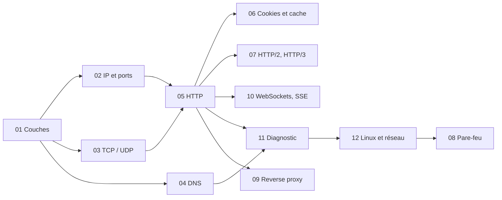

# 🗂️ Réseaux

> [!abstract] Pourquoi ce domaine
> Comprendre ce qui se passe entre le navigateur et le serveur : IP, TCP, DNS, HTTP, cache, proxies, temps réel, diagnostic.

> [!tip] Quand l'étudier
> M07 (NET-01 à 07, 10, 11), M11 (NET-08, 09, 12).

← [[Accueil]] · [[Roadmap-12-mois|Roadmap 12 mois]]

---

> [!tip] Le but
> Pas « j'ai lu les notes », mais : **« donne-moi un problème nouveau et laisse-moi le résoudre »**. Méthode : [[Methode-du-coach|Méthode du coach]].

## Carte du domaine

### 1. Connaissances fondamentales
- Les couches et le parcours d'une requête → [[NET-01-Fondamentaux-OSI-TCP-IP|Fondamentaux]]
- Adresses IP, ports, `localhost` → [[NET-02-Adresses-IP-Ports|Adresses IP et ports]]

### 2. Concepts indispensables
- Méthodes, codes, en-têtes → [[NET-05-HTTP-Approfondi|HTTP]]
- Trouver où ça bloque → [[NET-11-Outils-Diagnostic|Outils de diagnostic]]
- Nom → adresse → [[NET-04-DNS|DNS]]

### 3. Concepts intermédiaires
- Cookies et cache → [[NET-06-Cookies-Cache-HTTP|Cookies et cache]]
- Fiable ou rapide → [[NET-03-TCP-vs-UDP|TCP et UDP]]
- Le serveur qui parle le premier → [[NET-10-WebSockets-SSE|WebSockets et SSE]]
- Les commandes réseau d'un serveur, SSH → [[NET-12-Linux-et-Reseau|Linux et réseau]]

### 4. Concepts avancés
- La porte d'entrée de la production → [[NET-09-Proxy-Reverse-Proxy-Load-Balancer|Reverse proxy et load balancer]]
- Protéger un serveur → [[NET-08-Pare-feu-Securite-Reseau|Pare-feu]]
- Les versions de HTTP → [[NET-07-HTTP2-HTTP3|HTTP/2 et HTTP/3]]

### 5. Compétences pratiques
- lire une requête et sa réponse dans l'onglet Network ;
- choisir la bonne méthode et le bon code pour une route d'API ;
- diagnostiquer de bas en haut avec `dig`, `curl -v`, `nc`, `ss` ;
- relier un nom de domaine à un hébergeur ;
- configurer un reverse proxy front + API.

### 6. Erreurs et confusions fréquentes

| Confusion | La bonne idée | Note |
|---|---|---|
| `localhost` = mon PC | = la machine où le code s'exécute | [[NET-02-Adresses-IP-Ports\|IP et ports]] |
| CORS = panne réseau | règle côté serveur, tout le réseau a marché | [[NET-01-Fondamentaux-OSI-TCP-IP\|Fondamentaux]] |
| 401 / 403 | « qui es-tu ? » / « c'est non » | [[NET-05-HTTP-Approfondi\|HTTP]] |
| `no-cache` = rien en cache | = garder mais revérifier ; rien = `no-store` | [[NET-06-Cookies-Cache-HTTP\|Cache]] |
| refusé / délai dépassé | rien n'écoute / personne ne répond | [[NET-03-TCP-vs-UDP\|TCP]] |
| ping muet = serveur éteint | le ping est souvent bloqué | [[NET-11-Outils-Diagnostic\|Diagnostic]] |
| temps réel = WebSocket | SSE suffit si seul le serveur parle | [[NET-10-WebSockets-SSE\|SSE]] |

### 7. Prérequis
- Le terminal → [[OUT-01-Terminal-Bash|Terminal]]
- Appeler une API en JavaScript → [[JS-10-Fetch-JSON-HTTP|Fetch et JSON]]

### 8. Ce que tu peux ignorer au début
- le détail des 7 couches OSI (les 4 couches suffisent) ;
- les masques de sous-réseau et le routage ;
- IPv6 en détail ;
- le fonctionnement interne de TLS et de QUIC.

## Les dépendances



## Ordre de lecture

1. [[NET-01-Fondamentaux-OSI-TCP-IP|Fondamentaux Réseau OSI et TCP/IP]] — Fondamental · M07
2. [[NET-02-Adresses-IP-Ports|Adresses IP et Ports]] — Fondamental · M07
3. [[NET-03-TCP-vs-UDP|TCP vs UDP]] — Fondamental · M07
4. [[NET-04-DNS|DNS]] — Fondamental · M07
5. [[NET-05-HTTP-Approfondi|HTTP Approfondi]] — Fondamental · M07
6. [[NET-06-Cookies-Cache-HTTP|Cookies et Cache HTTP]] — Intermédiaire · M07
7. [[NET-07-HTTP2-HTTP3|HTTP/2 et HTTP/3]] — Intermédiaire · M07
8. [[NET-08-Pare-feu-Securite-Reseau|Pare-feu et Sécurité Réseau]] — Intermédiaire · M11
9. [[NET-09-Proxy-Reverse-Proxy-Load-Balancer|Proxy Reverse Proxy et Load Balancer]] — Intermédiaire · M11
10. [[NET-10-WebSockets-SSE|WebSockets et SSE]] — Intermédiaire · M09
11. [[NET-11-Outils-Diagnostic|Outils de Diagnostic Réseau]] — Fondamental · M07
12. [[NET-12-Linux-et-Reseau|Linux et Réseau]] — Intermédiaire · M11

## Comment travailler une note

1. **Lire** « En bref », puis te poser les [[Methode-du-coach#Les 7 questions|7 questions]].
2. **Lire** les exemples, « Pourquoi ça marche » et le contre-exemple.
3. **Fermer la note** et répondre à « Vérifie sans tes notes ».
4. **Faire les exercices** : seul, puis indice 1, indice 2, solution. Refaire ensuite sans regarder.
5. **Faire le transfert**.
6. **Pratiquer pour de vrai** (sur ta machine, dans un projet).
7. **Cocher** « Je maîtrise quand… » quand les 6 cases sont vraies.
8. **Revenir** à J+1, J+3, J+7, J+21 : rappel et transfert de mémoire.

---

## Progression

```dataview
TABLE WITHOUT ID file.link AS "Note", level AS "Niveau", month AS "Mois", status AS "Statut"
FROM "11-Reseaux"
WHERE type = "knowledge"
SORT file.name ASC
```
