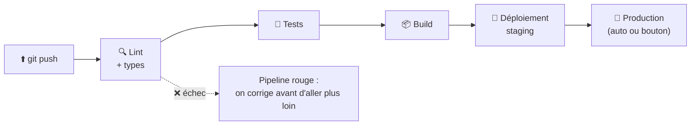

# CI/CD Fondamentaux

> [!abstract] En bref
> **CI** (intégration continue) : à chaque push, le code est **automatiquement vérifié** (lint, types, tests, build). **CD** (livraison / déploiement continu) : s'il est bon, il est **automatiquement mis en ligne**. Le but : livrer souvent, par petits morceaux, sans peur, et sans étapes manuelles oubliées.

## Le principe

| Terme | Signification |
|---|---|
| **Intégration continue (CI)** | chaque modification est intégrée et vérifiée automatiquement, plusieurs fois par jour |
| **Livraison continue** | le code est toujours **prêt** à partir en production ; un humain appuie sur le bouton |
| **Déploiement continu** | tout ce qui passe les vérifications part **automatiquement** en production |

## Pourquoi c'est indispensable

| Sans CI/CD | Avec CI/CD |
|---|---|
| « ça marche chez moi » | vérifié dans un environnement neutre |
| on oublie de lancer les tests | ils tournent à chaque push |
| mise en production manuelle, stressante, rare | automatique, fréquente, banale |
| un bug découvert une semaine plus tard | découvert en quelques minutes |
| impossible de savoir ce qui est en production | chaque déploiement est tracé |

## Les étapes d'un bon pipeline

1. **Installer** : `npm ci` (versions exactes).
2. **Vérifier vite** : lint, formatage, types. Échoue en quelques secondes si besoin.
3. **Tester** : unitaires, puis intégration (avec une base de test).
4. **Construire** : le build de production, l'image Docker.
5. **Analyser** : sécurité, qualité (SonarQube).
6. **Déployer** : staging automatiquement, production sur `main` (automatique ou manuel).

**Principe :** les étapes **rapides d'abord**, pour avoir un retour vite.

## Les règles d'équipe

- **Un pipeline rouge sur `main` est la priorité n°1** de l'équipe.
- **On ne fusionne pas** une MR avec un pipeline rouge.
- **Le pipeline est rapide** (idéalement moins de 10 minutes) : sinon, on arrête de l'attendre.
- **Même image, du test à la production** : on déploie exactement ce qui a été testé.

## Les outils

| Outil | Remarque |
|---|---|
| **GitLab CI** | celui de ton entreprise (voir [[03-CI-CD\|GitLab CI/CD]]) |
| GitHub Actions | équivalent sur GitHub |
| Jenkins | ancien, encore très présent en entreprise |

Le pipeline complet de CinéTrack : [[CICD-02-Pipeline-Full-Stack|Pipeline full stack]].
