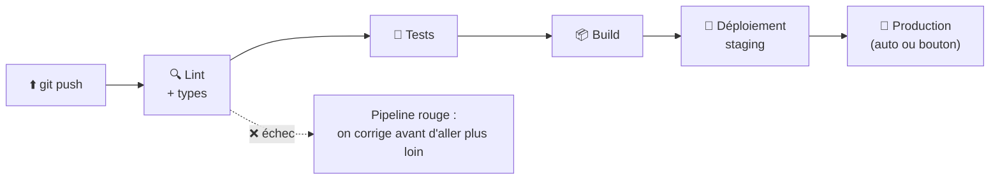

# CI/CD Fondamentaux

> [!abstract] En bref
> **CI** (intégration continue) : à chaque push, le code est **automatiquement vérifié** (lint, types, tests, build). **CD** (livraison / déploiement continu) : s'il est bon, il est **automatiquement mis en ligne**. Le but : livrer souvent, par petits morceaux, sans peur, et sans étapes manuelles oubliées.

## Le principe


```mermaid
flowchart LR
  P["⬆️ git push"] --> L["🔍 Lint<br/>+ types"]
  L --> T["🧪 Tests"]
  T --> B["📦 Build"]
  B --> S["🚦 Déploiement<br/>staging"]
  S --> PR["🚀 Production<br/>(auto ou bouton)"]
  L -. "❌ échec" .-> X["Pipeline rouge :<br/>on corrige avant d'aller plus loin"]
```

| Terme | Signification |
|---|---|
| **Intégration continue (CI)** | chaque modification est intégrée et vérifiée automatiquement, plusieurs fois par jour |
| **Livraison continue** | le code est toujours **prêt** à partir en production ; un humain appuie sur le bouton |
| **Déploiement continu** | tout ce qui passe les vérifications part **automatiquement** en production |

## Pourquoi c'est indispensable

| Sans CI/CD | Avec CI/CD |
|---|---|
| « ça marche chez moi » | vérifié dans un environnement neutre |
| on oublie de lancer les tests | ils tournent à chaque push |
| mise en production manuelle, stressante, rare | automatique, fréquente, banale |
| un bug découvert une semaine plus tard | découvert en quelques minutes |
| impossible de savoir ce qui est en production | chaque déploiement est tracé |

## Les étapes d'un bon pipeline

1. **Installer** : `npm ci` (versions exactes).
2. **Vérifier vite** : lint, formatage, types. Échoue en quelques secondes si besoin.
3. **Tester** : unitaires, puis intégration (avec une base de test).
4. **Construire** : le build de production, l'image Docker.
5. **Analyser** : sécurité, qualité (SonarQube).
6. **Déployer** : staging automatiquement, production sur `main` (automatique ou manuel).

**Principe :** les étapes **rapides d'abord**, pour avoir un retour vite.

## Les règles d'équipe

- **Un pipeline rouge sur `main` est la priorité n°1** de l'équipe.
- **On ne fusionne pas** une MR avec un pipeline rouge.
- **Le pipeline est rapide** (idéalement moins de 10 minutes) : sinon, on arrête de l'attendre.
- **Même image, du test à la production** : on déploie exactement ce qui a été testé.

## Les outils

| Outil | Remarque |
|---|---|
| **GitLab CI** | celui de ton entreprise (voir [[03-CI-CD\|GitLab CI/CD]]) |
| GitHub Actions | équivalent sur GitHub |
| Jenkins | ancien, encore très présent en entreprise |

Le pipeline complet de CinéTrack : [[CICD-02-Pipeline-Full-Stack|Pipeline full stack]].

## Pourquoi ça marche

Plus on attend pour intégrer et vérifier du code, plus les problèmes s'accumulent et se mélangent : un bug trouvé 5 minutes après le push se corrige en 5 minutes, le même bug trouvé une semaine plus tard demande une enquête.

La CI vérifie **chaque** modification dans un environnement **neutre** (une machine propre, pas ton PC) : ce qui passe en CI ne dépend pas de ta configuration personnelle.

La CD rend le déploiement **répétable** : un script fait toujours les mêmes étapes dans le même ordre. Ce qui est automatique et fréquent devient banal, donc moins risqué.

## Contre-exemple

**Intuition fausse : « un pipeline vert, ça veut dire que l'application marche ».**

```text
lint ✅  tests ✅  build ✅
```

Le pipeline ne vérifie **que ce qu'on lui demande**. S'il n'y a pas de test sur la connexion, une connexion cassée passe au vert. La CI vaut ce que valent les tests qu'elle lance.

## Vérifie sans tes notes

Réponds de tête, à voix haute ou par écrit, **avant** d’ouvrir la réponse.

**1. Quelle différence entre livraison continue et déploiement continu ?**

> [!check]- Réponse
> En livraison continue, le code est toujours prêt et un humain déclenche la mise en production ; en déploiement continu, tout ce qui passe les vérifications part automatiquement.

**2. Pourquoi mettre les étapes rapides en premier ?**

> [!check]- Réponse
> Pour avoir un retour en quelques secondes : inutile de lancer 5 minutes de tests si le lint échoue déjà.

**3. Que fait l'équipe quand le pipeline de `main` est rouge ?**

> [!check]- Réponse
> C'est la priorité n°1 : on le répare avant tout le reste, et on ne fusionne rien tant qu'il est rouge.

## Exercices

> [!info] Comment t’entraîner
> 1. Cherche seul, sans regarder la note.
> 2. Bloqué ? Ouvre l’**indice 1**, puis l’**indice 2**.
> 3. Seulement ensuite, la **solution**.
> 4. Referme tout et **refais l’exercice sans regarder**.

### Exercice 1 · Ordonner les étapes

Remets ces étapes dans le bon ordre de pipeline : déploiement en production, `npm ci`, tests unitaires, lint, build, déploiement en staging, tests d'intégration.

> [!tip]- Indice 1
> On installe d'abord, on déploie à la fin.

> [!tip]- Indice 2
> Entre les deux : du plus rapide au plus lent, et on ne construit que ce qui est vérifié.

> [!success]- Solution
> 1. `npm ci`
> 2. lint (et types)
> 3. tests unitaires
> 4. tests d'intégration
> 5. build
> 6. déploiement en staging
> 7. déploiement en production

### Exercice 2 · CI, livraison ou déploiement continu ?

Pour chaque équipe, dis si elle fait seulement de la CI, de la livraison continue ou du déploiement continu :
1. Les tests tournent à chaque push ; la mise en production se fait à la main avec un script, une fois par mois.
2. Chaque fusion sur `main` est testée puis mise en ligne automatiquement.
3. Chaque fusion sur `main` produit une version prête ; le chef de projet clique sur « Déployer » quand il veut.

> [!tip]- Indice 1
> La question clé : après les tests, qui déclenche la mise en production, et est-elle prête automatiquement ?

> [!tip]- Indice 2
> CI seule : la mise en production n'est pas automatisée du tout.

> [!success]- Solution
> 1. **CI seulement** : le déploiement n'est ni prêt automatiquement ni automatisé.
> 2. **Déploiement continu** : tout part automatiquement.
> 3. **Livraison continue** : prêt automatiquement, un humain appuie sur le bouton.

### Transfert · Le pipeline trop lent

Un problème différent : il vérifie que tu as compris le principe, pas seulement l’exemple.

Ton pipeline prend 25 minutes : `npm install` sans cache (4 min), puis tests E2E Playwright (15 min), puis lint (30 s), puis build (5 min). Les développeurs n'attendent plus son résultat avant de fusionner. Propose 3 améliorations.

> [!tip]- Indice 1
> Quelle étape échoue le plus souvent et le plus vite ? Où devrait-elle être placée ?

> [!tip]- Indice 2
> Pense aussi au cache des dépendances et aux tests lents qui n'ont pas besoin de tourner à chaque push.

> [!success]- Solution
> 1. **Lint en premier** : retour en 30 secondes au lieu d'attendre 19 minutes.
> 2. **`npm ci` avec un cache** des dépendances : l'installation passe de 4 minutes à quelques secondes.
> 3. **Les E2E seulement quand il faut** (sur `main` ou la nuit), ou en parallèle des autres jobs ; garder les tests unitaires rapides sur chaque MR.

## Je maîtrise quand…

Coche quand tu sais le faire **sans aide**. Une notion n’est maîtrisée que si les 6 cases sont cochées (voir [[Methode-du-coach|Méthode du coach]]).

- [ ] **Expliquer** : Expliquer ce que résolvent CI et CD, et pourquoi livrer souvent réduit le risque
- [ ] **Rappeler** : Dire de mémoire la différence entre intégration, livraison et déploiement continus
- [ ] **Utiliser** : Ordonner les étapes d'un pipeline sans modèle
- [ ] **Résoudre un problème nouveau** : Prévoir ce qu'un pipeline vert garantit, et ce qu'il ne garantit pas
- [ ] **Repérer les erreurs** : Repérer un pipeline trop lent ou mal ordonné
- [ ] **Savoir quand ne pas l’utiliser** : Savoir quand le déploiement continu n'est pas adapté : pas assez de tests, ou validation humaine obligatoire
