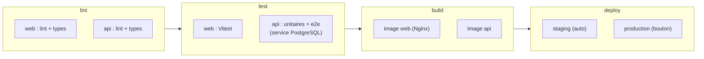

# Pipeline CI/CD Full Stack

> [!abstract] En bref
> Le pipeline complet de **CinéTrack Full Stack** (monorepo : front Angular + API NestJS) : vérifications, tests avec une vraie base PostgreSQL, construction des images Docker, déploiement. C'est le livrable du M11, et une excellente pièce de portfolio.

## Le schéma



## Le fichier `.gitlab-ci.yml`

```yaml
stages: [lint, test, build, deploy]

default:
  image: node:22-alpine
  cache:
    key: { files: [package-lock.json] }
    paths: [.npm/]
  before_script:
    - npm ci --cache .npm --prefer-offline

# ── Vérifications rapides ──
lint:
  stage: lint
  script:
    - npm run lint --workspaces
    - npx tsc -p apps/api --noEmit

# ── Tests ──
test-web:
  stage: test
  script:
    - npm run test --workspace apps/web -- --no-watch

test-api:
  stage: test
  services:
    - name: postgres:17
      alias: db
  variables:
    POSTGRES_USER: test
    POSTGRES_PASSWORD: test
    POSTGRES_DB: cinetrack_test
    DATABASE_URL: postgresql://test:test@db:5432/cinetrack_test
    JWT_SECRET: secret-de-test-assez-long-pour-la-validation-32c
  script:
    - npx prisma migrate deploy --schema apps/api/prisma/schema.prisma
    - npm run test:e2e --workspace apps/api

# ── Images Docker ──
.build-image:
  stage: build
  image: docker:27
  services: [docker:27-dind]
  before_script:
    - echo "$CI_REGISTRY_PASSWORD" | docker login -u "$CI_REGISTRY_USER" --password-stdin "$CI_REGISTRY"
  rules:
    - if: $CI_COMMIT_BRANCH == "main"

build-web:
  extends: .build-image
  script:
    - docker build -t $CI_REGISTRY_IMAGE/web:$CI_COMMIT_SHORT_SHA apps/web
    - docker push $CI_REGISTRY_IMAGE/web:$CI_COMMIT_SHORT_SHA

build-api:
  extends: .build-image
  script:
    - docker build -t $CI_REGISTRY_IMAGE/api:$CI_COMMIT_SHORT_SHA apps/api
    - docker push $CI_REGISTRY_IMAGE/api:$CI_COMMIT_SHORT_SHA

# ── Déploiement ──
deploy-staging:
  stage: deploy
  script: ./scripts/deploy.sh staging $CI_COMMIT_SHORT_SHA
  environment: { name: staging, url: https://staging.cinetrack.fr }
  rules:
    - if: $CI_COMMIT_BRANCH == "main"

deploy-prod:
  stage: deploy
  script: ./scripts/deploy.sh production $CI_COMMIT_SHORT_SHA
  environment: { name: production, url: https://cinetrack.fr }
  rules:
    - if: $CI_COMMIT_BRANCH == "main"
      when: manual
```

## Les points importants

| Point | Pourquoi |
|---|---|
| lint et tests sur **toutes** les MR, build et déploiement seulement sur `main` | retour rapide sur les MR, rien ne part en ligne sans fusion |
| **service PostgreSQL** pour les tests d'API | tester avec une vraie base, jetable |
| image étiquetée avec l'**id du commit** | savoir exactement ce qui tourne, pouvoir revenir en arrière |
| production **manuelle** au début | garder le contrôle ; passer en automatique quand la confiance est là |
| secrets dans les **variables GitLab** | jamais dans le fichier |
| **migrations** lancées au déploiement | la base suit le code |

Le script `deploy.sh` dépend de l'hébergement : mettre à jour l'image sur un serveur avec Docker Compose, ou chez un hébergeur (voir [[CLOUD-03-Heberger-API-BDD|Héberger l'API]]).

## Pièges

- **Un pipeline de 30 minutes** : cache les dépendances, parallélise les jobs, lance les tests lents seulement quand il faut.
- **Des tests qui dépendent du réseau** (vraie API TMDB) : instables, simule l'API.
- **Déployer une image reconstruite** au lieu de celle testée : ce n'est plus le même artefact.
