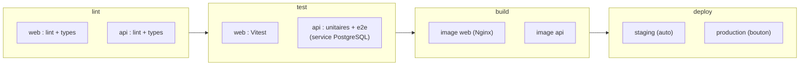

# Pipeline CI/CD Full Stack

> [!abstract] En bref
> Le pipeline complet de **CinéTrack Full Stack** (monorepo : front Angular + API NestJS) : vérifications, tests avec une vraie base PostgreSQL, construction des images Docker, déploiement. C'est le livrable du M11, et une excellente pièce de portfolio.

## Le schéma


```mermaid
flowchart LR
  subgraph lint
    LW["web : lint + types"]
    LA["api : lint + types"]
  end
  subgraph test
    TW["web : Vitest"]
    TA["api : unitaires + e2e<br/>(service PostgreSQL)"]
  end
  subgraph build
    BW["image web (Nginx)"]
    BA["image api"]
  end
  subgraph deploy
    ST["staging (auto)"]
    PR["production (bouton)"]
  end
  lint --> test --> build --> deploy
```

## Le fichier `.gitlab-ci.yml`

```yaml
stages: [lint, test, build, deploy]

default:
  image: node:22-alpine
  cache:
    key: { files: [package-lock.json] }
    paths: [.npm/]
  before_script:
    - npm ci --cache .npm --prefer-offline

# ── Vérifications rapides ──
lint:
  stage: lint
  script:
    - npm run lint --workspaces
    - npx tsc -p apps/api --noEmit

# ── Tests ──
test-web:
  stage: test
  script:
    - npm run test --workspace apps/web -- --no-watch

test-api:
  stage: test
  services:
    - name: postgres:17
      alias: db
  variables:
    POSTGRES_USER: test
    POSTGRES_PASSWORD: test
    POSTGRES_DB: cinetrack_test
    DATABASE_URL: postgresql://test:test@db:5432/cinetrack_test
    JWT_SECRET: secret-de-test-assez-long-pour-la-validation-32c
  script:
    - npx prisma migrate deploy --schema apps/api/prisma/schema.prisma
    - npm run test:e2e --workspace apps/api

# ── Images Docker ──
.build-image:
  stage: build
  image: docker:27
  services: [docker:27-dind]
  before_script:
    - echo "$CI_REGISTRY_PASSWORD" | docker login -u "$CI_REGISTRY_USER" --password-stdin "$CI_REGISTRY"
  rules:
    - if: $CI_COMMIT_BRANCH == "main"

build-web:
  extends: .build-image
  script:
    - docker build -t $CI_REGISTRY_IMAGE/web:$CI_COMMIT_SHORT_SHA apps/web
    - docker push $CI_REGISTRY_IMAGE/web:$CI_COMMIT_SHORT_SHA

build-api:
  extends: .build-image
  script:
    - docker build -t $CI_REGISTRY_IMAGE/api:$CI_COMMIT_SHORT_SHA apps/api
    - docker push $CI_REGISTRY_IMAGE/api:$CI_COMMIT_SHORT_SHA

# ── Déploiement ──
deploy-staging:
  stage: deploy
  script: ./scripts/deploy.sh staging $CI_COMMIT_SHORT_SHA
  environment: { name: staging, url: https://staging.cinetrack.fr }
  rules:
    - if: $CI_COMMIT_BRANCH == "main"

deploy-prod:
  stage: deploy
  script: ./scripts/deploy.sh production $CI_COMMIT_SHORT_SHA
  environment: { name: production, url: https://cinetrack.fr }
  rules:
    - if: $CI_COMMIT_BRANCH == "main"
      when: manual
```

## Les points importants

| Point | Pourquoi |
|---|---|
| lint et tests sur **toutes** les MR, build et déploiement seulement sur `main` | retour rapide sur les MR, rien ne part en ligne sans fusion |
| **service PostgreSQL** pour les tests d'API | tester avec une vraie base, jetable |
| image étiquetée avec l'**id du commit** | savoir exactement ce qui tourne, pouvoir revenir en arrière |
| production **manuelle** au début | garder le contrôle ; passer en automatique quand la confiance est là |
| secrets dans les **variables GitLab** | jamais dans le fichier |
| **migrations** lancées au déploiement | la base suit le code |

Le script `deploy.sh` dépend de l'hébergement : mettre à jour l'image sur un serveur avec Docker Compose, ou chez un hébergeur (voir [[CLOUD-03-Heberger-API-BDD|Héberger l'API]]).

## Pourquoi ça marche

Les **stages** (`lint`, `test`, `build`, `deploy`) s'exécutent dans l'ordre ; les jobs d'un même stage tournent **en parallèle**. Si un stage échoue, les suivants ne démarrent pas : rien n'est construit ni déployé à partir de code cassé.

Les **règles** (`rules`) permettent de faire tourner les vérifications sur toutes les MR, mais de construire et déployer **seulement** depuis `main`.

L'image est étiquetée avec l'**id du commit** et construite **une seule fois** : c'est exactement cet artefact qui va en staging puis en production. Reconstruire à chaque étape produirait un artefact différent de celui qui a été testé.

## Contre-exemple

**Intuition fausse : « les jobs d'un même stage s'exécutent l'un après l'autre ».**

```yaml
test-web:
  stage: test
test-api:
  stage: test
```

`test-web` et `test-api` tournent **en même temps**. S'ils dépendent l'un de l'autre (une base partagée, un fichier produit par l'autre), ils doivent être dans des stages différents, ou liés par `needs`.

## Pièges

- **Un pipeline de 30 minutes** : cache les dépendances, parallélise les jobs, lance les tests lents seulement quand il faut.
- **Des tests qui dépendent du réseau** (vraie API TMDB) : instables, simule l'API.
- **Déployer une image reconstruite** au lieu de celle testée : ce n'est plus le même artefact.

## Vérifie sans tes notes

Réponds de tête, à voix haute ou par écrit, **avant** d’ouvrir la réponse.

**1. Pourquoi le build et le déploiement ne tournent-ils que sur `main` ?**

> [!check]- Réponse
> Pour avoir un retour rapide sur les MR, et pour que rien ne parte en ligne sans avoir été fusionné.

**2. Pourquoi étiqueter l'image avec `$CI_COMMIT_SHORT_SHA` ?**

> [!check]- Réponse
> Pour savoir exactement quel code tourne, et pouvoir revenir à une version précise.

**3. Où mettre les secrets d'un pipeline GitLab ?**

> [!check]- Réponse
> Dans les variables CI/CD du projet GitLab (masquées et protégées), jamais dans `.gitlab-ci.yml`.

## Exercices

> [!info] Comment t’entraîner
> 1. Cherche seul, sans regarder la note.
> 2. Bloqué ? Ouvre l’**indice 1**, puis l’**indice 2**.
> 3. Seulement ensuite, la **solution**.
> 4. Referme tout et **refais l’exercice sans regarder**.

### Exercice 1 · Un job de lint

Écris un job GitLab CI `lint-web` dans le stage `lint`, avec l'image `node:22-alpine`, qui installe les dépendances puis lance `npm run lint` dans le dossier `apps/web`. Il doit tourner sur toutes les branches.

> [!tip]- Indice 1
> Un job = un nom, puis `stage`, `image` et `script`.

> [!tip]- Indice 2
> `script` est une liste de commandes ; sans `rules`, le job tourne partout.

> [!success]- Solution
> ```yaml
> lint-web:
>   stage: lint
>   image: node:22-alpine
>   script:
>     - cd apps/web
>     - npm ci
>     - npm run lint
> ```

### Exercice 2 · Déploiement manuel

Le job `deploy-prod` doit : tourner seulement sur `main`, attendre un clic manuel, et afficher l'URL `https://cinetrack.fr` dans l'onglet Environnements de GitLab. Écris ses `rules` et son `environment`.

> [!tip]- Indice 1
> La condition sur la branche se fait avec `$CI_COMMIT_BRANCH`.

> [!tip]- Indice 2
> Dans la règle, `when: manual` ajoute le bouton ; `environment` prend un `name` et une `url`.

> [!success]- Solution
> ```yaml
> deploy-prod:
>   stage: deploy
>   script: ./scripts/deploy.sh production $CI_COMMIT_SHORT_SHA
>   environment:
>     name: production
>     url: https://cinetrack.fr
>   rules:
>     - if: $CI_COMMIT_BRANCH == "main"
>       when: manual
> ```

### Transfert · Le test qui casse une fois sur trois

Un problème différent : il vérifie que tu as compris le principe, pas seulement l’exemple.

Le job `test-api` échoue de temps en temps sans changement de code. Les tests appellent la vraie API TMDB, et la base PostgreSQL du job n'est parfois pas prête quand les migrations démarrent. Propose une correction pour chaque cause.

> [!tip]- Indice 1
> Un test qui dépend d'un service extérieur dépend aussi de sa disponibilité et de sa vitesse.

> [!tip]- Indice 2
> Pour la base : attendre qu'elle réponde avant de lancer les migrations.

> [!success]- Solution
> 1. **TMDB** : ne pas appeler la vraie API dans les tests ; la **simuler** (réponse enregistrée, faux service injecté) pour des tests rapides et stables.
> 2. **La base** : attendre qu'elle soit prête avant les migrations, par exemple :
>
> ```yaml
> script:
>   - until nc -z db 5432; do sleep 1; done
>   - npx prisma migrate deploy --schema apps/api/prisma/schema.prisma
>   - npm run test:e2e --workspace apps/api
> ```

## Je maîtrise quand…

Coche quand tu sais le faire **sans aide**. Une notion n’est maîtrisée que si les 6 cases sont cochées (voir [[Methode-du-coach|Méthode du coach]]).

- [ ] **Expliquer** : Expliquer le fonctionnement des stages, des jobs et des règles
- [ ] **Rappeler** : Dire de mémoire pourquoi on construit une seule image par commit et où vont les secrets
- [ ] **Utiliser** : Écrire un job GitLab CI avec image, script et règles sans modèle
- [ ] **Résoudre un problème nouveau** : Prévoir quels jobs tournent sur une MR et lesquels sur `main`
- [ ] **Repérer les erreurs** : Diagnostiquer un job instable ou un pipeline qui reconstruit l'artefact
- [ ] **Savoir quand ne pas l’utiliser** : Savoir quand ne pas automatiser la production : tant que les tests ne donnent pas assez confiance
