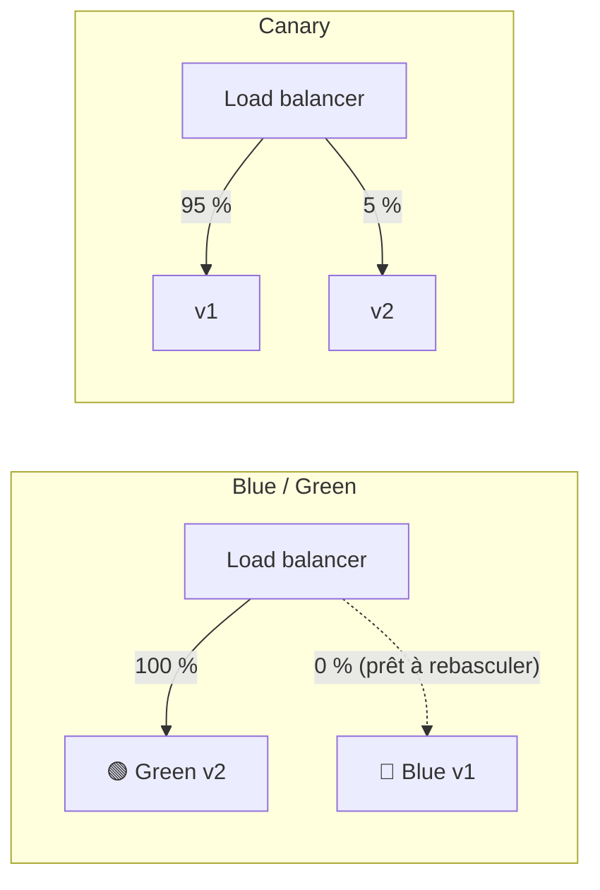

# Stratégies de Déploiement

> [!abstract] En bref
> Mettre une nouvelle version en ligne sans couper le service et sans risquer de tout casser pour tout le monde. Plusieurs stratégies existent, de la plus simple (tout remplacer) à la plus prudente (tester d'abord sur une petite partie des utilisateurs). Et toujours : pouvoir **revenir en arrière** rapidement.

## Les stratégies

| Stratégie | Principe | Image | Retour arrière |
|---|---|---|---|
| **Recréer** | on arrête l'ancienne version, on démarre la nouvelle | fermer le magasin pour refaire la vitrine | redéployer l'ancienne (coupure) |
| **Progressive** (*rolling*) | on remplace les instances **une par une** | changer les pneus un par un | on remet les anciennes une par une |
| **Blue / Green** | deux environnements complets ; on bascule tout le trafic d'un coup | deux scènes de théâtre : on tourne le plateau | **instantané** : on rebascule |
| **Canary** | la nouvelle version reçoit d'abord **5 %** des utilisateurs, puis plus | le canari dans la mine | on coupe les 5 % |
| **Feature flags** | le code est en production mais **désactivé**, on l'active par interrupteur | une pièce construite mais fermée à clé | on éteint l'interrupteur |



## Laquelle choisir ?

| Situation | Choix |
|---|---|
| projet perso, petite application | recréer ou progressive (souvent fait par l'hébergeur) |
| application métier, pas de coupure tolérée | progressive ou blue / green |
| gros trafic, risque important | canary + surveillance |
| fonctionnalité qu'on veut activer à un moment précis | feature flag |

## Les indispensables, quelle que soit la stratégie

1. **Une route de santé** (`GET /health`) : l'hébergeur vérifie que la nouvelle version répond avant de lui envoyer du trafic.
2. **Des migrations compatibles** : la base doit fonctionner avec l'ancienne **et** la nouvelle version pendant la transition (ajouter une colonne, oui ; en supprimer une utilisée par l'ancienne version, pas encore). Voir [[BDD-05-Migrations|Migrations]].
3. **Le retour arrière en une action** : redéployer l'image précédente (d'où l'étiquette par commit).
4. **Surveiller après chaque déploiement** : erreurs, temps de réponse (voir [[MON-02-Metriques-Alerting|Métriques]]).

```ts
// NestJS : route de santé simple
@Public() @Get('health')
async health() {
  await this.prisma.$queryRaw`SELECT 1`;   // la base répond
  return { status: 'ok' };
}
```

## Pièges

- **Supprimer une colonne dans la même version** que le code qui arrête de l'utiliser : l'ancienne version, encore en ligne quelques minutes, plante.
- **Pas de plan de retour arrière** : le jour où ça casse, c'est la panique.
- **Déployer le vendredi soir**.
