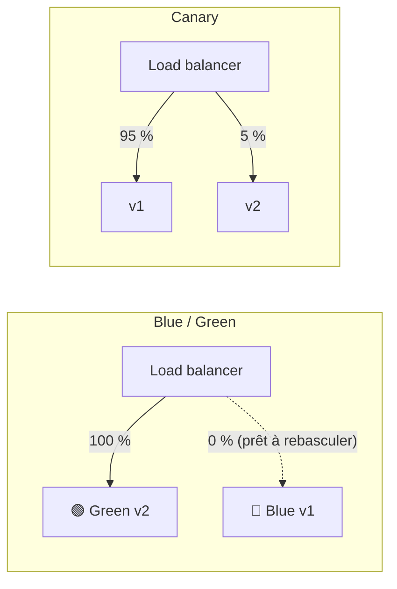

# Stratégies de Déploiement

> [!abstract] En bref
> Mettre une nouvelle version en ligne sans couper le service et sans risquer de tout casser pour tout le monde. Plusieurs stratégies existent, de la plus simple (tout remplacer) à la plus prudente (tester d'abord sur une petite partie des utilisateurs). Et toujours : pouvoir **revenir en arrière** rapidement.

## Les stratégies

| Stratégie | Principe | Image | Retour arrière |
|---|---|---|---|
| **Recréer** | on arrête l'ancienne version, on démarre la nouvelle | fermer le magasin pour refaire la vitrine | redéployer l'ancienne (coupure) |
| **Progressive** (*rolling*) | on remplace les instances **une par une** | changer les pneus un par un | on remet les anciennes une par une |
| **Blue / Green** | deux environnements complets ; on bascule tout le trafic d'un coup | deux scènes de théâtre : on tourne le plateau | **instantané** : on rebascule |
| **Canary** | la nouvelle version reçoit d'abord **5 %** des utilisateurs, puis plus | le canari dans la mine | on coupe les 5 % |
| **Feature flags** | le code est en production mais **désactivé**, on l'active par interrupteur | une pièce construite mais fermée à clé | on éteint l'interrupteur |


```mermaid
flowchart LR
  subgraph "Blue / Green"
    LB1["Load balancer"] -->|"100 %"| G["🟢 Green v2"]
    LB1 -.->|"0 % (prêt à rebasculer)"| B["🔵 Blue v1"]
  end
  subgraph Canary
    LB2["Load balancer"] -->|"95 %"| V1["v1"]
    LB2 -->|"5 %"| V2["v2"]
  end
```

## Laquelle choisir ?

| Situation | Choix |
|---|---|
| projet perso, petite application | recréer ou progressive (souvent fait par l'hébergeur) |
| application métier, pas de coupure tolérée | progressive ou blue / green |
| gros trafic, risque important | canary + surveillance |
| fonctionnalité qu'on veut activer à un moment précis | feature flag |

## Les indispensables, quelle que soit la stratégie

1. **Une route de santé** (`GET /health`) : l'hébergeur vérifie que la nouvelle version répond avant de lui envoyer du trafic.
2. **Des migrations compatibles** : la base doit fonctionner avec l'ancienne **et** la nouvelle version pendant la transition (ajouter une colonne, oui ; en supprimer une utilisée par l'ancienne version, pas encore). Voir [[BDD-05-Migrations|Migrations]].
3. **Le retour arrière en une action** : redéployer l'image précédente (d'où l'étiquette par commit).
4. **Surveiller après chaque déploiement** : erreurs, temps de réponse (voir [[MON-02-Metriques-Alerting|Métriques]]).

```ts
// NestJS : route de santé simple
@Public() @Get('health')
async health() {
  await this.prisma.$queryRaw`SELECT 1`;   // la base répond
  return { status: 'ok' };
}
```

## Pourquoi ça marche

Pendant un déploiement, il existe un moment où l'ancienne et la nouvelle version **coexistent**, ou où aucune ne tourne. Chaque stratégie gère ce moment différemment :
- **recréer** accepte une coupure ;
- **progressive** fait coexister les deux versions un moment ;
- **blue / green** prépare la nouvelle version à côté, puis bascule le trafic d'un coup ;
- **canary** limite le nombre d'utilisateurs exposés au risque.

Comme les deux versions peuvent tourner en même temps, la **base de données** doit convenir aux deux : d'où les migrations compatibles.

## Contre-exemple

**Intuition fausse : « avec blue / green, le retour arrière est toujours instantané ».**

```text
v2 ajoute une migration qui renomme la colonne title en name
→ on rebascule le trafic sur v1
→ v1 cherche la colonne title : erreur
```

Le trafic rebascule en une seconde, mais **la base**, elle, a déjà changé. Sans migrations compatibles avec les deux versions, le retour arrière casse quand même.

## Pièges

- **Supprimer une colonne dans la même version** que le code qui arrête de l'utiliser : l'ancienne version, encore en ligne quelques minutes, plante.
- **Pas de plan de retour arrière** : le jour où ça casse, c'est la panique.
- **Déployer le vendredi soir**.

## Vérifie sans tes notes

Réponds de tête, à voix haute ou par écrit, **avant** d’ouvrir la réponse.

**1. Quelle stratégie expose la nouvelle version à seulement une partie des utilisateurs ?**

> [!check]- Réponse
> Le canary (par exemple 5 % du trafic, puis plus).

**2. À quoi sert une route `/health` pendant un déploiement ?**

> [!check]- Réponse
> À vérifier que la nouvelle version répond (et que la base est joignable) avant de lui envoyer du trafic.

**3. Pourquoi ne pas supprimer une colonne dans la même version que le code qui arrête de l'utiliser ?**

> [!check]- Réponse
> L'ancienne version, encore en ligne pendant la transition, l'utilise toujours et planterait.

## Exercices

> [!info] Comment t’entraîner
> 1. Cherche seul, sans regarder la note.
> 2. Bloqué ? Ouvre l’**indice 1**, puis l’**indice 2**.
> 3. Seulement ensuite, la **solution**.
> 4. Referme tout et **refais l’exercice sans regarder**.

### Exercice 1 · Choisir la stratégie

Quelle stratégie choisis-tu ?
1. Ton portfolio personnel, sur un petit hébergeur.
2. Une application bancaire où chaque erreur coûte cher et qui a beaucoup d'utilisateurs.
3. Une nouvelle page « Recommandations » qui doit apparaître le jour d'un salon, à 9 h précises.
4. Une application métier interne qui ne doit pas être coupée en journée.

> [!tip]- Indice 1
> Relis le tableau « Laquelle choisir ? » : taille, coût d'une erreur, moment d'activation.

> [!tip]- Indice 2
> Activer quelque chose à un moment précis sans redéployer : un interrupteur dans le code.

> [!success]- Solution
> 1. **Recréer** ou progressive (souvent fait par l'hébergeur).
> 2. **Canary** avec une surveillance attentive.
> 3. **Feature flag** : le code est déjà en ligne, on l'active à 9 h.
> 4. **Progressive** ou **blue / green**.

### Exercice 2 · Une migration en deux temps

Tu veux renommer la colonne `title` en `name` dans la table `movies`, sans casser l'ancienne version pendant un déploiement progressif. Décris les étapes, réparties sur plusieurs déploiements.

> [!tip]- Indice 1
> Pendant la transition, l'ancienne version lit `title`, la nouvelle lit `name` : les deux colonnes doivent exister en même temps.

> [!tip]- Indice 2
> On ajoute d'abord, on supprime en dernier, quand plus aucune version n'utilise l'ancienne colonne.

> [!success]- Solution
> 1. **Déploiement 1** : ajouter la colonne `name`, copier les données de `title` ; le code écrit dans les deux colonnes et lit `title`.
> 2. **Déploiement 2** : le code lit et écrit `name` uniquement.
> 3. **Déploiement 3** : supprimer la colonne `title`, que plus personne n'utilise.

### Transfert · Le déploiement du vendredi

Un problème différent : il vérifie que tu as compris le principe, pas seulement l’exemple.

Vendredi 18 h, la v2 est déployée en une fois (stratégie « recréer »), sans route de santé ni surveillance. Lundi, tu découvres que la page de paiement est cassée depuis vendredi. Liste 4 changements pour que cela n'arrive plus, en t'appuyant sur la note.

> [!tip]- Indice 1
> Pense au moment du déploiement, à la vérification automatique, à la détection rapide, et au retour arrière.

> [!tip]- Indice 2
> Les « indispensables » de la note donnent 4 pistes.

> [!success]- Solution
> 1. **Ne pas déployer le vendredi soir** : quand personne ne surveille.
> 2. **Une route `/health`** vérifiée avant d'envoyer le trafic (et des tests E2E sur le paiement en CI).
> 3. **Surveiller après chaque déploiement** : erreurs et alertes (voir [[MON-02-Metriques-Alerting|Métriques]]).
> 4. **Un retour arrière en une action** : redéployer l'image précédente, étiquetée par commit. Et, pour réduire le risque : déploiement progressif ou canary.

## Je maîtrise quand…

Coche quand tu sais le faire **sans aide**. Une notion n’est maîtrisée que si les 6 cases sont cochées (voir [[Methode-du-coach|Méthode du coach]]).

- [ ] **Expliquer** : Expliquer ce que gère chaque stratégie au moment où deux versions coexistent
- [ ] **Rappeler** : Dire de mémoire les 5 stratégies et les 4 indispensables
- [ ] **Utiliser** : Choisir une stratégie adaptée à une situation donnée
- [ ] **Résoudre un problème nouveau** : Prévoir ce qu'une migration fait au retour arrière
- [ ] **Repérer les erreurs** : Repérer un déploiement sans route de santé, sans surveillance ou sans retour arrière
- [ ] **Savoir quand ne pas l’utiliser** : Savoir quand une stratégie avancée est inutile : petit projet perso, coupure acceptable
