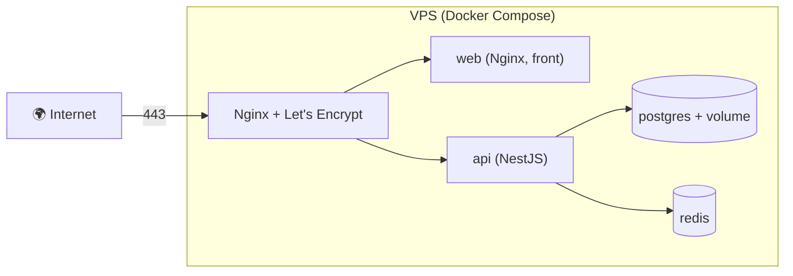

# Héberger une API et une Base de Données

> [!abstract] En bref
> Contrairement au front, une API a besoin d'un **serveur qui tourne en permanence**, d'une **base de données** et de **secrets**. Deux chemins : un **PaaS** (tu donnes ton code ou ton image, il s'occupe du reste) ou un **VPS** avec Docker Compose (tu gères le serveur). Pour CinéTrack-API, les deux sont de bons exercices.

## Les deux chemins

| | PaaS (Render, Railway, Fly.io, Clever Cloud) | VPS + Docker Compose (OVH, Scaleway, Hetzner) |
|---|---|---|
| Mise en route | **rapide** : relier le dépôt, régler les variables | serveur à installer et sécuriser |
| HTTPS, redémarrage, logs | fournis | à mettre en place (Nginx, Let's Encrypt) |
| Base PostgreSQL | proposée, gérée, sauvegardée | un conteneur à sauvegarder toi-même, ou une base gérée à part |
| Contrôle | limité | total |
| Ce que tu apprends | le déploiement | **tout** : Linux, réseau, sécurité, Docker |

## Chemin 1 : un PaaS

1. Crée une base PostgreSQL gérée → récupère son URL.
2. Crée un service web relié au dépôt (ou à l'image du registre).
3. Règle les **variables** : `DATABASE_URL`, `JWT_SECRET`, `TMDB_TOKEN`, `CORS_ORIGINS`.
4. Commande de démarrage : `npx prisma migrate deploy && node dist/main.js`.
5. Route de santé : `/health`.

## Chemin 2 : un VPS

Les étapes :
1. Sécuriser le serveur : utilisateur non root, SSH par clé, pare-feu (ports 22, 80, 443) (voir [[NET-08-Pare-feu-Securite-Reseau|Pare-feu]]).
2. Installer Docker.
3. Un `docker-compose.prod.yml` qui utilise les **images du registre** (pas de `build`).
4. Un reverse proxy pour HTTPS (voir [[NET-09-Proxy-Reverse-Proxy-Load-Balancer|Reverse proxy]]).
5. Le déploiement depuis la CI : `ssh` sur le serveur, `docker compose pull && docker compose up -d`.
6. **Sauvegardes** automatiques de la base (`pg_dump` planifié, copié ailleurs).

## La check-list production

- [ ] HTTPS
- [ ] Variables d'environnement, aucun secret dans le dépôt
- [ ] Migrations appliquées au déploiement
- [ ] Route `/health`
- [ ] Logs consultables (voir [[MON-01-Logs|Logs]])
- [ ] Sauvegardes de la base **testées**
- [ ] CORS limité au domaine du front
- [ ] Base de données non exposée sur Internet

## Pièges

- **Base de données exposée** avec le mot de passe par défaut.
- **Aucune sauvegarde**, ou des sauvegardes jamais restaurées pour vérifier.
- **Un PaaS gratuit qui s'endort** : la première requête prend 30 secondes. Normal sur les offres gratuites.
