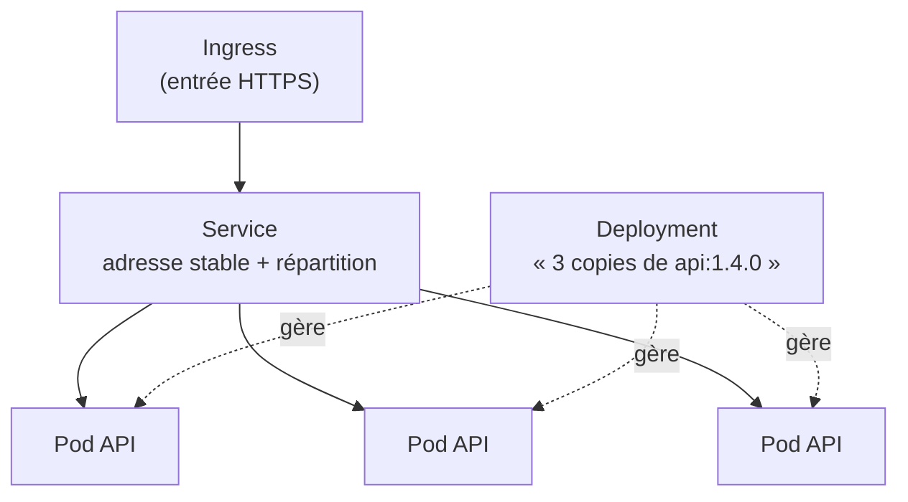

# Kubernetes Introduction

> [!abstract] En bref
> **Kubernetes** (K8s) est un **chef d'orchestre** pour conteneurs : tu lui dis « je veux 3 copies de mon API, toujours en marche », et il s'en charge sur un groupe de machines (redémarre ce qui plante, répartit la charge, met à jour sans coupure). Très utilisé en entreprise, **inutile pour tes projets perso**. L'objectif ici : comprendre le vocabulaire et savoir lire un fichier de configuration.

## Docker Compose ou Kubernetes ?

| | Docker Compose | Kubernetes |
|---|---|---|
| Machines | **une** | un **groupe** (cluster) |
| Un conteneur plante | redémarre (si configuré) | recréé automatiquement, ailleurs si besoin |
| Plus de charge | à la main | ajout automatique de copies |
| Mise à jour sans coupure | limité | natif (progressive) |
| Complexité | faible | **élevée** |
| Pour | développement, petits projets | production en entreprise |

## Le vocabulaire



| Objet | C'est… |
|---|---|
| **Cluster** | le groupe de machines |
| **Node** | une machine du cluster |
| **Pod** | la plus petite unité : un (ou quelques) conteneur(s) |
| **Deployment** | « je veux N copies de cette image » ; gère les mises à jour |
| **Service** | une adresse stable pour joindre les pods (qui vont et viennent) |
| **Ingress** | la porte d'entrée HTTP(S) depuis l'extérieur |
| **ConfigMap / Secret** | la configuration / les secrets injectés dans les pods |
| **Namespace** | un espace séparé (par équipe ou environnement) |

## Lire un Deployment

```yaml
apiVersion: apps/v1
kind: Deployment
metadata:
  name: cinetrack-api
spec:
  replicas: 3                                   # 3 copies
  selector:
    matchLabels: { app: cinetrack-api }
  template:
    metadata:
      labels: { app: cinetrack-api }
    spec:
      containers:
        - name: api
          image: registry.gitlab.com/ton-nom/cinetrack-api:a1b2c3d
          ports: [{ containerPort: 3000 }]
          envFrom: [{ secretRef: { name: cinetrack-secrets } }]
          readinessProbe:                        # prêt à recevoir du trafic ?
            httpGet: { path: /health, port: 3000 }
          resources:
            limits: { memory: 512Mi, cpu: 500m }
```

## Les commandes de base

```bash
kubectl get pods                    # lister les pods
kubectl logs -f deploy/cinetrack-api
kubectl describe pod <nom>          # pourquoi un pod ne démarre pas
kubectl apply -f deployment.yaml    # appliquer une configuration
kubectl rollout undo deploy/cinetrack-api   # revenir à la version précédente
```

## Pour t'entraîner

`kind` ou `minikube` créent un petit cluster sur ta machine. À faire **après** avoir maîtrisé Docker et Compose.

## Pièges

- **Kubernetes pour un projet d'une personne** : des semaines de configuration pour un besoin que Compose couvre.
- **Pas de `readinessProbe`** : du trafic est envoyé à un pod pas encore prêt.
