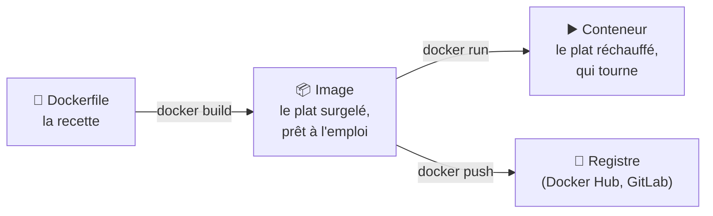

# Docker Fondamentaux

> [!abstract] En bref
> **Docker** emballe une application **avec tout ce dont elle a besoin** (la bonne version de Node, les librairies, la configuration) dans une boîte appelée **conteneur**. Cette boîte fonctionne **pareil partout** : sur ton PC, chez un collègue, dans la CI, en production. Fini le « ça marche sur ma machine ».

## L'image : le conteneur maritime

Avant les conteneurs, on chargeait les bateaux carton par carton, chaque port à sa façon. Le conteneur standard a tout changé : **n'importe quel bateau, grue ou camion** sait le transporter, quel que soit son contenu. Docker fait pareil pour les applications.

## Les 3 mots à connaître



| Mot | C'est… |
|---|---|
| **Dockerfile** | la **recette** : quelle base, quels fichiers copier, quelle commande lancer (voir [[DK-02-Dockerfile\|Dockerfile]]) |
| **Image** | le résultat de la recette, **figé** : on peut en lancer autant de copies qu'on veut |
| **Conteneur** | une image **en train de tourner** |
| **Registre** | la bibliothèque d'images (Docker Hub, registre GitLab) |

## Conteneur ou machine virtuelle ?

| | Machine virtuelle | Conteneur |
|---|---|---|
| Contient | un système d'exploitation complet | seulement l'application et ses dépendances |
| Taille | plusieurs Go | quelques dizaines à centaines de Mo |
| Démarrage | minutes | secondes |

## Ton premier usage : une base de données sans rien installer

```bash
docker run -d --name cinetrack-db \
  -e POSTGRES_PASSWORD=motdepasse -p 5432:5432 postgres:17
```

- `-d` : en arrière-plan.
- `--name` : un nom pour le retrouver.
- `-e` : une variable d'environnement.
- `-p 5432:5432` : le port de ta machine → le port du conteneur.

PostgreSQL tourne, sans l'avoir installé. `docker stop cinetrack-db` pour l'arrêter.

## Ce que Docker t'apporte dans tes projets

| Quand | Usage |
|---|---|
| **M07** (dès CinéTrack-API) | lancer PostgreSQL et Redis en une commande |
| **M11** | emballer ton API et ton front dans des images |
| CI | les jobs tournent dans des images (`node:22`) |
| Production | déployer la même image testée en CI |

Sur Windows, Docker Desktop utilise **WSL2** : active l'intégration Ubuntu (voir [[OUT-01-Terminal-Bash|Terminal]]).

## La suite

[[DK-07-Commandes-CLI|Commandes]] → [[DK-02-Dockerfile|Dockerfile]] → [[DK-03-Docker-Compose|Docker Compose]] → [[DK-08-Multi-stage-Builds|Images légères]].

## Pièges

- **Un conteneur perd ses données** quand on le supprime, sauf avec un **volume** (voir [[DK-04-Volumes|Volumes]]).
- **`localhost` dans un conteneur** désigne le conteneur lui-même, pas ta machine (voir [[DK-05-Reseaux|Réseaux]]).
- **L'étiquette `latest`** : elle change avec le temps. Précise la version (`postgres:17`).
