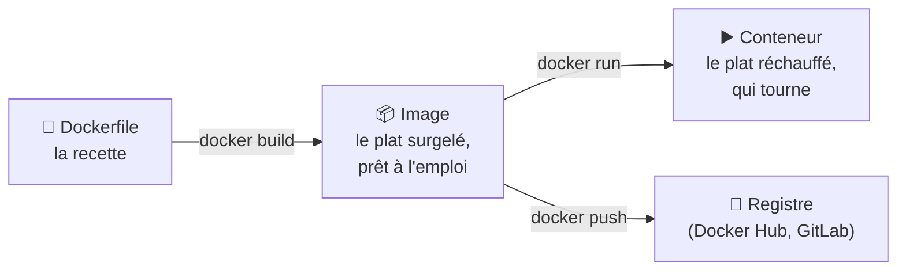

# Docker Fondamentaux

> [!abstract] En bref
> **Docker** emballe une application **avec tout ce dont elle a besoin** (la bonne version de Node, les librairies, la configuration) dans une boîte appelée **conteneur**. Cette boîte fonctionne **pareil partout** : sur ton PC, chez un collègue, dans la CI, en production. Fini le « ça marche sur ma machine ».

## L'image : le conteneur maritime

Avant les conteneurs, on chargeait les bateaux carton par carton, chaque port à sa façon. Le conteneur standard a tout changé : **n'importe quel bateau, grue ou camion** sait le transporter, quel que soit son contenu. Docker fait pareil pour les applications.

## Les 3 mots à connaître


```mermaid
flowchart LR
  D["📝 Dockerfile<br/>la recette"] -->|"docker build"| I["📦 Image<br/>le plat surgelé,<br/>prêt à l'emploi"]
  I -->|"docker run"| C["▶️ Conteneur<br/>le plat réchauffé,<br/>qui tourne"]
  I -->|"docker push"| R["🏪 Registre<br/>(Docker Hub, GitLab)"]
```

| Mot | C'est… |
|---|---|
| **Dockerfile** | la **recette** : quelle base, quels fichiers copier, quelle commande lancer (voir [[DK-02-Dockerfile\|Dockerfile]]) |
| **Image** | le résultat de la recette, **figé** : on peut en lancer autant de copies qu'on veut |
| **Conteneur** | une image **en train de tourner** |
| **Registre** | la bibliothèque d'images (Docker Hub, registre GitLab) |

## Conteneur ou machine virtuelle ?

| | Machine virtuelle | Conteneur |
|---|---|---|
| Contient | un système d'exploitation complet | seulement l'application et ses dépendances |
| Taille | plusieurs Go | quelques dizaines à centaines de Mo |
| Démarrage | minutes | secondes |

## Ton premier usage : une base de données sans rien installer

```bash
docker run -d --name cinetrack-db \
  -e POSTGRES_PASSWORD=motdepasse -p 5432:5432 postgres:17
```

- `-d` : en arrière-plan.
- `--name` : un nom pour le retrouver.
- `-e` : une variable d'environnement.
- `-p 5432:5432` : le port de ta machine → le port du conteneur.

PostgreSQL tourne, sans l'avoir installé. `docker stop cinetrack-db` pour l'arrêter.

## Ce que Docker t'apporte dans tes projets

| Quand | Usage |
|---|---|
| **M07** (dès CinéTrack-API) | lancer PostgreSQL et Redis en une commande |
| **M11** | emballer ton API et ton front dans des images |
| CI | les jobs tournent dans des images (`node:22`) |
| Production | déployer la même image testée en CI |

Sur Windows, Docker Desktop utilise **WSL2** : active l'intégration Ubuntu (voir [[OUT-01-Terminal-Bash|Terminal]]).

## La suite

[[DK-07-Commandes-CLI|Commandes]] → [[DK-02-Dockerfile|Dockerfile]] → [[DK-03-Docker-Compose|Docker Compose]] → [[DK-08-Multi-stage-Builds|Images légères]].

## Pourquoi ça marche

Le « ça marche sur ma machine » vient presque toujours d'une **différence d'environnement** : une autre version de Node, une librairie système absente, une variable oubliée. Docker supprime ces différences en livrant l'application **avec** son environnement.

Un conteneur n'embarque pas de système complet : il **partage le noyau Linux** de la machine hôte, et ne contient que les fichiers de l'application et de ses dépendances. C'est pour ça qu'il démarre en secondes et pèse peu, contrairement à une machine virtuelle.

L'image est **figée** : la même image testée en CI est celle qui tourne en production. Ce qui a marché une fois marche partout.

## Contre-exemple

**Intuition fausse : « un conteneur, c'est comme un petit serveur : ce que j'écris dedans reste ».**

```bash
docker run --name test postgres:17 …   # on crée des tables
docker rm -f test
docker run --name test postgres:17 …   # base vide !
```

Le conteneur est **jetable** : supprimé, ses données disparaissent. Pour garder des données, il faut un **volume** (voir [[DK-04-Volumes|Volumes]]).

## Pièges

- **Un conteneur perd ses données** quand on le supprime, sauf avec un **volume** (voir [[DK-04-Volumes|Volumes]]).
- **`localhost` dans un conteneur** désigne le conteneur lui-même, pas ta machine (voir [[DK-05-Reseaux|Réseaux]]).
- **L'étiquette `latest`** : elle change avec le temps. Précise la version (`postgres:17`).

## Vérifie sans tes notes

Réponds de tête, à voix haute ou par écrit, **avant** d’ouvrir la réponse.

**1. Quelle est la différence entre une image et un conteneur ?**

> [!check]- Réponse
> L'image est le modèle figé (le plat surgelé) ; le conteneur est une image en train de tourner (le plat réchauffé). Une image peut lancer plusieurs conteneurs.

**2. Pourquoi un conteneur démarre-t-il plus vite qu'une machine virtuelle ?**

> [!check]- Réponse
> Il ne contient pas de système d'exploitation complet : il partage le noyau de la machine hôte.

**3. Que fait `-p 5432:5432` dans `docker run` ?**

> [!check]- Réponse
> Il relie le port 5432 de ta machine au port 5432 du conteneur, pour y accéder depuis ta machine.

## Exercices

> [!info] Comment t’entraîner
> 1. Cherche seul, sans regarder la note.
> 2. Bloqué ? Ouvre l’**indice 1**, puis l’**indice 2**.
> 3. Seulement ensuite, la **solution**.
> 4. Referme tout et **refais l’exercice sans regarder**.

### Exercice 1 · Lancer Redis

Lance un conteneur Redis version 7, en arrière-plan, nommé `cinetrack-cache`, accessible sur le port 6379 de ta machine. Puis écris la commande pour l'arrêter.

> [!tip]- Indice 1
> Reprends la commande PostgreSQL de la note : `docker run` + options + image.

> [!tip]- Indice 2
> Les options : `-d`, `--name`, `-p machine:conteneur`, puis l'image avec sa version `redis:7`.

> [!success]- Solution
> ```bash
> docker run -d --name cinetrack-cache -p 6379:6379 redis:7
> docker stop cinetrack-cache
> ```

### Exercice 2 · Image, conteneur ou registre ?

Pour chaque phrase, dis s'il s'agit du Dockerfile, de l'image, du conteneur ou du registre :
1. « Il tourne et répond sur le port 3000. »
2. « Je l'ai téléchargé depuis Docker Hub. »
3. « Il contient les instructions `FROM`, `COPY`, `RUN`. »
4. « J'en ai lancé trois copies à partir du même modèle. »
5. « C'est là que la CI publie l'image de l'API. »

> [!tip]- Indice 1
> Reprends la chaîne : recette → plat surgelé → plat réchauffé, et la bibliothèque où l'on range les plats.

> [!tip]- Indice 2
> Ce qui « tourne », c'est forcément un conteneur ; ce qu'on « télécharge » ou dont on lance des copies, c'est une image.

> [!success]- Solution
> 1. **Conteneur** (il tourne).
> 2. **Image** (on télécharge une image).
> 3. **Dockerfile** (la recette).
> 4. **Image** : un modèle, plusieurs conteneurs.
> 5. **Registre** (Docker Hub, registre GitLab).

### Transfert · Le collègue qui n'a pas Node 22

Un problème différent : il vérifie que tu as compris le principe, pas seulement l’exemple.

Ton collègue a Node 18 sur son PC et ne peut pas l'installer en version 22. Il doit juste lancer `node --version` avec Node 22 pour vérifier un script. Sans rien installer sur sa machine, quelle commande Docker lui donnes-tu ? Le conteneur doit disparaître une fois la commande finie.

> [!tip]- Indice 1
> L'image officielle `node` existe en version 22. Un conteneur peut exécuter une commande précise puis s'arrêter.

> [!tip]- Indice 2
> L'option `--rm` supprime le conteneur à l'arrêt ; la commande à exécuter se met après le nom de l'image.

> [!success]- Solution
> ```bash
> docker run --rm node:22 node --version
> ```
>
> Le conteneur démarre avec Node 22, affiche la version, s'arrête et se supprime. Rien n'est installé sur la machine.

## Je maîtrise quand…

Coche quand tu sais le faire **sans aide**. Une notion n’est maîtrisée que si les 6 cases sont cochées (voir [[Methode-du-coach|Méthode du coach]]).

- [ ] **Expliquer** : Expliquer ce que Docker résout avec l'image du conteneur maritime
- [ ] **Rappeler** : Dire de mémoire la différence entre Dockerfile, image, conteneur et registre
- [ ] **Utiliser** : Lancer un service (PostgreSQL, Redis) avec `docker run` sans modèle
- [ ] **Résoudre un problème nouveau** : Utiliser une image pour exécuter un outil sans l'installer
- [ ] **Repérer les erreurs** : Repérer une donnée perdue faute de volume, ou un `localhost` mal compris
- [ ] **Savoir quand ne pas l’utiliser** : Savoir quand Docker n'est pas utile : un petit script personnel qui tourne déjà sur ta machine
